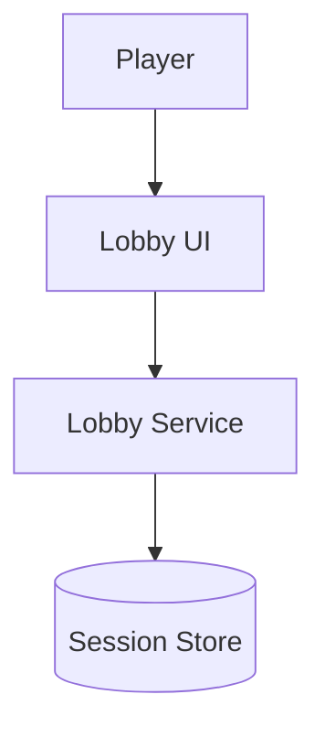

# Spec: Map a Feature's Architecture Before You Build It

Produce the source-of-truth architecture spec for one feature. You run a discovery-forward,
single advocate/contrarian pass over the design — surfacing the unknowns, answering them, and
pressure-testing the architectural decisions — then synthesize a single spec document that
explains the feature in **both plain language and technical detail**, with a **diagram**. Once
the user approves it, that document is the spec the feature gets built against.

A **spec** here is not code and not a debate transcript. It is one durable, tracked document: what
the feature is, why it exists, how it's structured, and the decisions (and cut scope) behind it —
readable by a newcomer and precise enough for an engineer to build from.

This is the front door to a feature. When the user says "let's `/spec` a feature that does X",
"map out the architecture for X", or "write the spec for X", that is an invocation of this command.

## Arguments

- `$ARGUMENTS`: Required. Free-text description of the feature to spec.
- Optional `--ticket <id-or-url>`: the issue / ticket / feature this spec belongs to. Recorded in
  the spec's frontmatter so the spec and its tracker stay linked. If omitted, ask once whether
  there's a ticket; if there isn't, proceed and leave it blank.
- Optional `--id <slug>`: override the spec's filename slug (default: derive a short kebab-case
  slug from the feature description, e.g. `multiplayer-lobby`).
- Optional `--max-iterations N`: total debate budget (default **2**). The tech phase paces this as
  a discovery scope then a depth scope (see below), so 2 gives exactly one unknowns-surfacing pass
  and one finalize pass. Raise it only for genuinely thorny architecture.
- Optional `--plan`: echo the resolved plan (slug, ticket, path, framing) and STOP. No debate.

## The shape of this run

This is a **single advocate / single contrarian** pass (the `tech` phase — *not* the multi-role
scoped studio debate), and it's deliberately **discovery-forward**. The tech phase paces one
advocate/contrarian pair across scopes, which happens to front-load discovery exactly the way a
spec wants:

1. **Alignment scope — surface the unknowns and answer them.** The Open-Questions Pre-Flight folds
   in here: the architectural forks, the load-bearing assumptions, the things nobody has decided.
   This is where most of a spec's value is. Pause on P0 blockers before going further.
2. **Depth scope — finalize the architecture.** The advocate designs it in full; the contrarian
   hunts edge cases, pushes simpler alternatives, and cuts scope. One pass that sharpens the
   proposal, not a restart. (`instructions.md` drives the exact scope pacing; follow it.)
3. **Synthesize the spec document** and get the user's approval. Approval is what makes it the
   source of truth.

## Instructions

**Studio path:** use `.studio/source/run_phase.py` for the commands below. If that file does not
exist but `studio/run_phase.py` does, use `studio/run_phase.py` (you are in the Studio source repo).

### Step 1: Resolve the spec's identity

Before running anything, settle where this spec lives and what it's tied to:

- **Slug:** from `--id`, else a short kebab-case slug of the feature.
- **Ticket:** from `--ticket`, else ask once. Leave blank if there genuinely isn't one.
- **Spec path:** specs are **tracked source-of-truth docs, meant to be committed** (unlike the
  gitignored `output/`). Resolve the path:
  - In the Studio source repo (a root `studio/` dir is present): `specs/<slug>.md`.
  - In a consuming repo (Studio is installed under `.studio/`): `.studio/specs/<slug>.md`.
- **New vs update:** if the spec file already exists, read it and treat this as a revision — carry
  its ticket and prior decisions forward rather than starting blank.

If `--plan`, print the resolved slug / ticket / path / one-line framing and STOP here.

### Step 2: Run the discovery + finalize debate (reuse the tech-phase machinery)

Frame the feature as an **architecture** question, then prepare a `tech` run. The framing
steers the debate toward structure — components, data flow, interfaces, failure modes, and simpler
alternatives — rather than product framing:

```bash
python ".studio/source/run_phase.py" prepare --phase tech \
  --text "Architecture spec for: <feature>. Map the components, data flow, interfaces/contracts, data model, failure modes, and dependencies. Surface the architectural unknowns first; prefer the simplest structure that works and cut speculative scope." \
  --max-iterations <N> --json
```

Parse the final stdout line for `run_id`, `run_dir`, and `instructions`. Then **read
`instructions.md` in the run dir and follow it as the authority on procedure** — it encodes the
scope pacing and the pieces this run needs, and you execute them in order:

- **Step 0: Open-Questions Pre-Flight (the heart of this command).** In the scoped tech run this
  folds into the start of the alignment scope. Surface what is genuinely unsettled about the
  architecture — the forks, the load-bearing assumptions, the integration points. Present P0
  blockers and **pause for the user's answers** before finalizing; record them as `instructions.md`
  directs. Do not paper over an unknown with a silent assumption.
- **The advocate/contrarian scopes** (alignment → depth), within the `--max-iterations` budget
  (default 2). The advocate designs the architecture; the contrarian pressure-tests it (edge cases,
  simpler alternatives, scope to cut) and votes `APPROVED`/`REJECTED`. Surface every decision point
  and pause on P0s exactly as `instructions.md` describes, recording metrics for each agent.

Skip `instructions.md`'s implementation/deliverable step — the deliverable for `/spec` is the spec
document in Step 3, not an implementation.

If the contrarian rejects and the iteration cap is exhausted, **don't bury it**: tell the user what
the contrarian found and ask whether to run another pass (`--max-iterations`) or fold the concern
into the spec as a known risk. A rejected architecture should not silently become a source of truth.

### Step 3: Synthesize the spec document

From the approved advocate proposal, the contrarian's critique, and the recorded decisions
(`{run_dir}/decisions.md` if present), write the spec to the path from Step 1. Write it for two
readers at once — a newcomer who needs to understand the feature, and an engineer who has to build
it. Use this structure (the outer fence is four backticks so the inner ` ```mermaid ` block
below doesn't close it early — the spec file you write uses a normal three-backtick fence):

````markdown
---
feature: <human title>
slug: <slug>
ticket: <id-or-url, or "none">
status: draft            # draft until the user approves, then: approved
studio_run: <run_dir>    # the debate this spec came from
---

# <Feature> — Architecture Spec

## In Plain Language
What this feature is and why it exists, in terms a non-engineer teammate would follow. No jargon;
define any unavoidable term of art the first time. Two or three short paragraphs.

## Architecture at a Glance
A **Mermaid diagram** of the structure — components and how data/control flows between them. Use
whichever Mermaid type fits (`flowchart` for components/data flow, `sequenceDiagram` for an
interaction, `erDiagram` for a data model). Keep it readable; it renders natively on GitHub.



Follow the diagram with a short prose walk-through of what it shows.

## How It Works (Technical)
The precise detail an engineer builds from:
- **Components / modules** and each one's responsibility.
- **Data flow** — the path of a request/event through the system.
- **Interfaces & contracts** — key APIs, function signatures, message/event shapes.
- **Data model** — entities, fields, relationships, persistence.
- **Dependencies** — what this leans on (services, libraries, other features).

## Key Decisions
The architectural choices and *why*, pulled from the debate — including alternatives that were
weighed and rejected. Fold in the settled decisions from the pre-flight and the loop. This is the
record that stops the choices being re-litigated mid-build.

## Non-Goals / Cut Scope
What this feature deliberately does **not** do, and what the contrarian cut. Explicit boundaries
keep the build from sprawling.

## Risks & Open Questions
Known risks, unresolved contrarian concerns, and anything still genuinely open. Be honest here — a
spec that hides its soft spots is worse than one that names them.

## Build Plan
How this maps to buildable units — ideally a short list of MVI units (each a complete, usable
interaction; "build a skateboard, not a wheel"), in dependency order. This is the bridge to
`/forge`.
````

Keep the writing human (Coding Principles §6): plain language, say what a thing does and why it
matters, match a calm engineering voice. The diagram is required, not optional — if the feature
truly has no structure worth drawing, it probably didn't need a spec.

### Step 4: Approve → make it the source of truth

Present the spec to the user for approval. Summarize in plain words what the architecture landed on,
the decisions that shaped it, and anything still open — enough that they can approve without opening
the file (Coding Principles §8). Then:

- **On approval:** set `status: approved` in the frontmatter, save the file, and confirm the path.
  If a `--ticket` was given, remind the user to link/attach the spec on that ticket so the tracker
  and the spec stay tied together (offer to help if it's a GitHub issue reachable via `gh`). This
  approved document is now the spec the feature is built against.
- **On changes requested:** revise the spec (and, if the change is architectural, offer another
  advocate/contrarian pass) and re-present. Don't mark it approved until they say so.

### Step 5: Finalize the debate record + rate

Close out the underlying run so its decisions and metrics are captured in the cross-run dashboard:

```bash
python ".studio/source/run_phase.py" finalize --phase tech --run-id {run_id} \
  --status completed --verdict {APPROVED|REJECTED} --no-rate-prompt
```

Then ask the user, in one short optional message, to rate the run 1–5 with a one-line note. If they
give a score, record it; if they skip, don't nag:

```bash
python ".studio/source/run_phase.py" rate --run-dir {run_dir} --score {1-5} --note "{their note}"
```

## Key Rules

- **Discovery first.** The pre-flight is where a spec earns its keep — surface the architectural
  unknowns and get them answered before finalizing. Never paper over an open fork with a silent
  assumption.
- **Single-pair, not multi-role.** One advocate, one contrarian (the `tech` phase, scope-paced
  discovery → depth). This is a focused architecture pass, not the multi-role studio debate.
- **Two readers, one doc.** Every spec explains the feature in plain language *and* in build-ready
  technical detail, and carries a diagram. If an engineer couldn't build from it, it's not done.
- **Approval is the gate.** A spec is the source of truth only after the user approves it. A
  rejected or shaky architecture gets surfaced, not silently shipped.
- **Specs are tracked.** They live in `specs/` (or `.studio/specs/` in a consuming repo), are meant
  to be committed, and stay linked to their ticket. They are not throwaway `output/` artifacts.
- **A spec precedes the build.** Once approved, this is what `/forge` and the feature
  work build against. (See Coding Principle 9, "Spec Before Build.")
