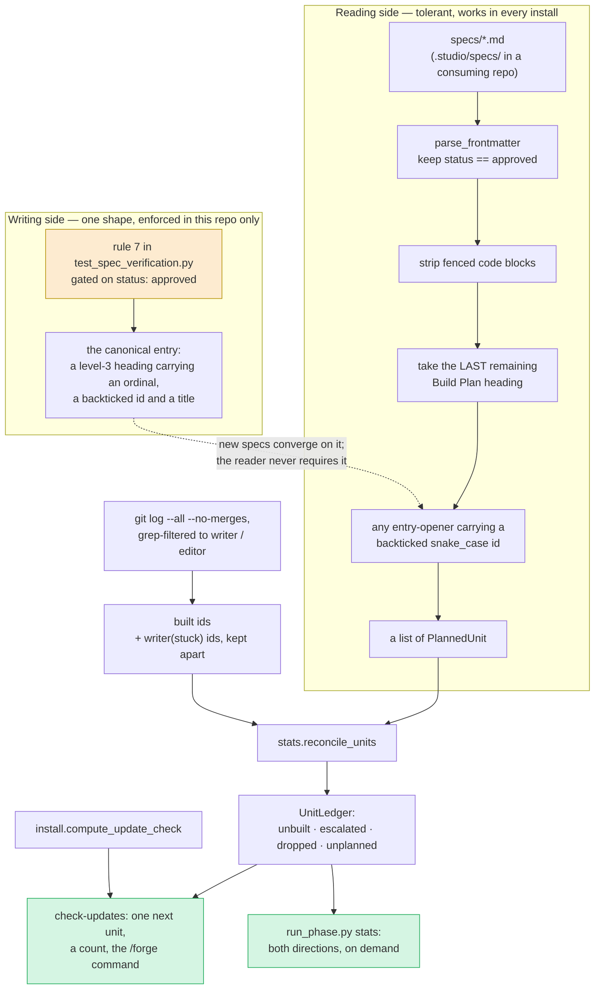

# The Completion Ledger — Architecture Spec

## In Plain Language

A Studio spec ends with a Build Plan: a short list of named units of work, in the order they should
be built. Someone approves the spec, builds the first two units, gets pulled onto something else,
and the rest sit there. Nothing anywhere notices. The next session opens with no idea that three
units of approved, agreed work were left on the floor — and the spec still reads as if the whole
plan is in motion.

The completion ledger closes that gap. It compares two things that are already in the repository —
what the approved specs planned, and what the commit log says was actually built — and at the start
of a session it names **one** unfinished unit, says how many others there are, and prints the exact
command that continues it. When there is nothing unfinished it says nothing at all. A nudge that
fires when there is no news is one people learn to skip.

The thing to understand about it is that **it stores nothing**. There is no ledger file, no progress
database, no "done" flag anyone has to remember to set. Every session re-derives the answer from the
specs on disk and the commit log. That is not an efficiency choice; it is the whole safety property.
A feature that wrote its own state would eventually hold a stale "done" nobody could see was wrong,
and the only two ways to stop the nudge stay honest: build the unit, or write into the spec — in a
commit somebody reviews — that you dropped it on purpose, with the date and the reason.

One term of art, used throughout: a **unit** is one buildable, usable slice of a feature, with a
short `snake_case` handle called a `unit_id`. `/forge --spec <slug> --unit <unit_id>` is how you
build one, and the loop records it in git as a commit whose subject is `writer: <unit_id>`. That
commit subject is the only durable trace that a unit was built, and it is what this feature reads.

## Architecture at a Glance



Read it left to right as two sides that deliberately do not meet. The **writing side** is a test
rule that pins one Build Plan shape for specs approved from here on. It runs in Studio's CI and
nowhere else, so it can never normalise anything in the ten repositories that installed Studio. The
**reading side** therefore never depends on it: the reconciler accepts any entry opener that carries
a backticked `snake_case` id, which is what makes the feature audible outside this repo. The dashed
line is the only relationship between them — new writing converges on the canonical shape, and the
reader is glad of it but does not require it.

Everything below the two subgraphs is a single pure reconciliation: planned units in, built ids in,
one `UnitLedger` out, rendered two ways. The session brief names one thing; `stats` prints the whole
picture when someone asks for it.

## How It Works (Technical)

### Components

| Where | What it owns |
|---|---|
| `studio/tests/test_spec_verification.py` | **Rule 7** — the Build Plan writing standard, and a directory-wide `unit_id` uniqueness test. |
| `studio/stats.py` | The pure reconciliation: `build_plan_section`, `parse_build_plan`, `built_unit_ids`, `reconcile_units`, `format_unit_ledger`, and the two frozen dataclasses. Text in, values out — no `Path`, no `subprocess`, no clock. |
| `studio/run_phase.py` | The I/O edge: `_approved_spec_units`, `_built_unit_ids`, `_specs_dir_for`, `_unfinished_context`, and the restructured `_do_check_updates`. |
| `.claude/commands/spec.md`, `.claude/commands/forge.md` | The canonical shape as it is taught, and the corrected `unit_id` uniqueness sentence. |

No new module. `stats.py` already owns `parse_frontmatter` and already reads the specs directory;
a second reader of the same files is exactly the drift this feature exists to end.

### The canonical Build Plan entry (the writing standard)

One shape, pinned by rule 7 for specs at `status: approved`:

```markdown
## Build Plan

<One short paragraph: how many units, the dependency order, and why that order.>

### 1. `unit_id` — one-line usable outcome

<What gets built: the files, the behavior, the tests.>

**Acceptance criteria:**
- [ ] <one checkable statement>
- [ ] <another>

**Out of scope:** what this unit deliberately does not do.

### 2. `next_unit_id` — the next usable outcome
```

A heading is a boundary; a numbered list item is an indentation convention. Under the heading form
an entry ends at the next `###` or `##`, with no indentation arithmetic and no hazard from nested
lists inside a unit body — which is why the rule can stay small enough to be worth having. Each unit
also gets a stable GitHub anchor to link from a ticket.

Rule 7 checks three things and nothing else, and only on an approved spec:

- A `## Build Plan` section that exists must open every unit with `### N. ` + a backticked
  `[a-z][a-z0-9_]{2,}` id + an em dash + a non-empty title. The id pattern is the reader's, bound
  for bound: an id rule 7 accepts but the reader cannot see (`` `ui` ``) would be silently dropped.
- Every unit entry holds at least one `- [ ]` (or `- [x]`) acceptance criterion, unless it carries a
  `Dropped:` line.
- No two specs in the directory plan the same `unit_id`. Ids are collected from every spec at every
  status with the tolerant reader below, because the built set is flat and a shipped spec's id
  silences an approved spec's just as well; the test fails only when at least one of the colliding
  specs is `approved`, so a draft can reuse an id mid-argument and is caught at its approval commit.

What it must **not** reject, each deliberately: a spec with no `## Build Plan` at all (not every
document has units); either acceptance-criteria indentation in use today, since the heading already
bounds the entry; a dropped unit with no criteria; a `status: draft` spec mid-argument; and the
`*-eval-results.md` files, which `_spec_files` already drops.

**Gated on `approved` alone, so zero specs migrate.** All three currently-approved specs are already
in this shape, so the rule rejects nothing on today's tree and fires at the approval commit, which is
the right moment to demand a shape. Gating it on `shipped` too would have forced eleven historical
specs to be rewritten and eighteen `unit_id`s to be invented after the fact — ids for features that
predate `/forge`'s spec wiring and whose commits carry no `writer:` subject, so they could never
match git. Writing eighteen ids guaranteed not to match, into the repo whose new feature matches ids
against git, is manufacturing false data.

### The tolerant reader (the reading standard)

The reconciler does **not** use rule 7's regex. It accepts any entry opener carrying a backticked
`snake_case` id:

```python
UNIT_OPENER = re.compile(r"^(?:###\s+\d+\.|\d+\.)\s*\**\s*`([a-z][a-z0-9_]{2,})`", re.M)
```

Strict writing, tolerant reading, and the split is the difference between a feature that works in one
repository and one that works in four. Measured across the 24 approved specs in the five consuming
installs on this machine: the strict shape-A regex finds **zero units in 23 of them**, and zero units
is indistinguishable from "nothing is unfinished" — the exact silence this feature exists to end. The
tolerant opener finds **61 units instead of 9**. Orkid Garden goes from 0 to 45, hand-checked and all
real handles. The cost is roughly 3 percent false positives (see Risks).

Under either opener an entry runs from its opener to the next unit opener of either form, or the next
`##`/`###` heading, whichever comes first. That one boundary is what attributes a `Dropped:` line or an
acceptance criterion to its unit, so a list-form plan in a consuming repo is bounded the same way a
heading-form plan is, with no indentation arithmetic.

The `snake_case` demand is load-bearing and is not a style preference: it is what stops the reader
emitting `/forge --spec doc-parity-tests --unit studio/tests/test_doc_parity.py`, a command that
cannot run. A loose reader that accepted anything backticked would name commands that stall, which is
worse than saying nothing.

### Locating the section: strip fences, take the last heading

```python
def build_plan_section(spec_text: str) -> str | None:
    """The `## Build Plan` section, or None when the spec has none.

    Fenced code blocks are removed first. A spec that documents the Build Plan format
    contains a *fenced* `## Build Plan` heading, and a line-anchored regex cannot see the
    fence — so the phantom heading would win on line order. Strip fences, then take the
    LAST remaining heading, then slice to the next `## `.
    """
```

This is not defensive coding for a case that never happens. `specs/unit-acceptance-criteria.md` has
`## Build Plan` at line 77 and line 415; the first is inside a ```` ```markdown ```` fence, 338 lines
ahead of the real one. A naive first-match slice grabs 283 wrong lines and reports "a `## Build Plan`
with no unit headings" against a spec whose plan is fine.

**It also bites this document.** The section above fences a `## Build Plan` heading and a
`` ### 1. `unit_id` — one-line usable outcome `` entry. Without fence-stripping, the day this spec is
approved the session brief would tell a fresh agent to run
`/forge --spec completion-ledger --unit unit_id`. The fence-stripping must live in the one shared
reader that both rule 7 and `parse_build_plan` call, so the two can never disagree about where the
Build Plan is. Both fence widths are in use here (three and four backticks), so track the opening
fence's backtick count rather than assuming three.

### The built set, from git

```python
subprocess.run(
    ["git", "-C", str(repo_root), "log", "--all", "--no-merges", "-E",
     "--grep", r"^(writer|editor)", "--format=%s%n%b%n%x1e"],
    capture_output=True, text=True, timeout=5,
)
```

- `--all` covers every local and remote-tracking ref. A unit built on an unmerged branch is done
  work, and nagging about it would train people to ignore the nudge.
- `--grep` lets git filter in C — 96 commits instead of 650 here — and it matches the body as well as
  the subject, which is what keeps squash merges readable when the squash body retains the loop's
  subjects.
- `%x1e` (record separator), never `%x00`. A NUL separator makes `git log` output binary, and any
  shell pipeline over it prints "Binary file matches" and nothing else — a silently empty built set
  that looks exactly like "no units were ever built." This is not hypothetical: it is the most likely
  cause of the debate's first solitaire measurement reading 19 built ids where the real count is 71.
  Parse in Python; never pipe this through `grep`.
- Nothing is cached. The 24-hour update-check cache is deliberately not reused: a cache is a second
  source of truth that can disagree with git, and this feature exists because two sources of truth
  already disagreed. Measured cost: 19 ms in this repo, 33 ms in a 2,493-commit repo with 165 refs.

**`writer(stuck):` is not built.** That is the escalation commit the loop tells a blocked writer to
make — `commit --allow-empty -m "writer(stuck): <unit_id>"` — and it means the writer stopped on
purpose rather than fake a finish. Counting it as built would delete from the report the one case
where a fresh agent most needs to be told there is unfinished work. It is collected into its own set
and the unit is reported in its own state: **started and escalated**, distinct from a unit nobody has
opened. Built wins: a unit with both a `writer(stuck):` commit and a `writer:` or `editor:` commit is
built, whatever their order, because the writer only commits a passing state. The two sets carry no
order, so "stuck, then finished" is decided by membership and never by commit time.

### Dropped on purpose

A line inside the unit's own Build Plan entry, carrying a date and a non-empty reason:

```markdown
- **Dropped:** 2026-09-16 — the divisor cannot satisfy both ranking rules; superseded by `rank_the_ladder`.
```

```python
DROPPED = re.compile(r"^\s*-\s+\*\*Dropped:\*\*\s+(\d{4}-\d{2}-\d{2})\s+(?:—|--|-)\s+(\S.+)$", re.M)
```

The separator accepts `—`, `--` or `-`. The em dash is what the template writes, but a hand-typed
hyphen that silently failed to match would leave the unit nagging with no hint why.

Both halves are required, for the same reason `verification_due` demands a date: a bare "dropped" is
a way to make the nudge stop without deciding anything. A unit carrying a valid line is neither
unbuilt nor built — it is closed, counted in `stats`, and never nagged about. State next to the plan
is in git, human-editable, reviewed like any other commit, and cannot drift from the plan it
describes. A separate state file is the machinery that turns this into a second Studio.

This is already a live need. `move-advancement.md` in the solitaire install records a withdrawn unit
as prose, because there was nowhere to put it — and that unit would nag forever.

### Contracts

```python
@dataclass(frozen=True)
class PlannedUnit:
    slug: str              # the spec's slug, from frontmatter or filename
    unit_id: str
    title: str
    dropped_on: str        # "" when live; "YYYY-MM-DD" when closed
    dropped_reason: str


@dataclass(frozen=True)
class UnitLedger:
    unbuilt: tuple[PlannedUnit, ...]    # approved, planned, not built, not dropped
    escalated: tuple[PlannedUnit, ...]  # a writer(stuck): commit and no writer:/editor: commit
    dropped: tuple[PlannedUnit, ...]    # closed on purpose
    unplanned: tuple[str, ...]          # built ids no spec ever mentions, sorted
```

Document order is dependency order — the Build Plan template has said so since it was written — so
order is list position and there is no `ordinal` field to disagree with it. Every field on both
classes is printed by something; a field carried on the promise that something will read it later is
the machinery this feature is supposed to avoid.

```python
def parse_build_plan(spec_text: str, slug: str) -> list[PlannedUnit]: ...
def built_unit_ids(git_log_text: str) -> tuple[set[str], set[str]]:   # (built, escalated)
def reconcile_units(planned, built, escalated, mentioned_ids) -> UnitLedger: ...
def format_unit_ledger(ledger: UnitLedger) -> list[str]: ...
```

`reconcile_units` takes `planned` already filtered to approved specs by the caller, so the status
policy lives in one place rather than being re-decided here.

### The two directions read different things

They are different questions and they need different readers, which is why `mentioned_ids` is a
separate argument:

- **Planned and never built** — *which approved spec still owes this unit?* Reads Build Plans of
  `status: approved` specs only. This is the session-brief direction.
- **Built and never planned** — *was this id ever planned anywhere?* Reads every spec at any status,
  looking for the id as a backticked mention in the prose, and reports only the ids nothing mentions.
  Without that check, `stats` prints 41 orphans in this repo against a true count near 20, because
  every unit planned under a spec that has since shipped gets counted as undisciplined work. A ledger
  that confidently prints a number twice the truth is one people learn to ignore. This direction is
  `stats`-on-demand only; the heaviest `/forge` user on this machine has 34 units and zero Build Plan
  ids, so putting it at session start would print 34 lines every morning forever.

### What `check-updates` prints

`_do_check_updates` stops being an update check and becomes a session brief. It keeps its contract
with the SessionStart hook exactly — one JSON object on stdout, always exit 0, never raise — and
changes only what it computes and when it speaks.

The ledger **cannot** ride the existing payload. That payload sits behind `result.should_notify`,
which is `update_available and source_commit != cache["notified_commit"]` — so it prints at most once
per new upstream Studio commit, never in a current repo, and never on a clone with no Studio source.
All ten installs are current today, so an appended line would be silent from day one. Instead the
subcommand computes the ledger unconditionally and emits when **either** source has news:

```python
def _do_check_updates(args: argparse.Namespace) -> None:
    target = Path(args.target).resolve()
    blocks = []
    try:                                     # guard one: the update check
        import install
        if install.compute_update_check(target).should_notify:
            blocks.append(install.UPDATE_ADDITIONAL_CONTEXT)
    except Exception:
        pass
    try:                                     # guard two: the ledger
        unfinished = _unfinished_context(target)
        if unfinished:
            blocks.append(unfinished)
    except Exception:
        pass
    if blocks:
        print(json.dumps({"hookSpecificOutput": {
            "hookEventName": "SessionStart",
            "additionalContext": "\n\n".join(blocks),
        }}))
```

**Two guards, not one.** A single `try` around both would let a malformed spec or an odd git state in
one repository silence the update nudge that ten installs have depended on for a month. There is a
sharper version of the same hazard: `compute_update_check` writes `notified_commit` into its cache as
a side effect of being asked, so if the ledger path raised between that write and the `print`, the
update notice would be consumed without ever being shown.

Nothing about the hook's installed command string changes, so this reaches all ten installs through
`/studio-update` alone — no installer change, no cross-repo sweep.

The specs directory is resolved from `--target`, never from `get_specs_dir()`, which reads a
cwd-derived artifact root while the hook runs from wherever the session opened:

```python
def _specs_dir_for(target: Path) -> Path:
    installed = target / ".studio" / "specs"
    return installed if installed.is_dir() else target / "specs"
```

**The update-only string is byte-identical to today's**, so nothing regresses for the installs that
see only that. The unfinished block is three sentences — the count, the named item, the command —
plus the escape and one honest caveat:

```
Unfinished planned work: 2 units across 2 approved specs. The next one is
`stale_configs_get_the_new_command` in specs/detected-static-check-command.md — "repos configured by
an older Studio stop refusing". Tell the user they can continue it with: /forge --spec
detected-static-check-command --unit stale_configs_get_the_new_command. If it was dropped on purpose,
open a PR adding `- **Dropped:** YYYY-MM-DD — <reason>` under that unit's heading in the spec and it
stops being counted. Built work is read from all branches including unmerged ones, so a teammate who
has not fetched may see a different count. Run `python studio/run_phase.py stats` for the full list,
both directions.
```

Singular collapses cleanly: `Unfinished planned work: 1 unit in 1 approved spec.` When both sources
have news, the update block comes first, separated by a blank line. When neither does, nothing is
printed at all — no JSON, no empty object.

The unmerged-branches sentence is not padding. It is the difference between a count a reader can
reproduce and one they quietly stop trusting: `gate_keys_resolve_to_none` is built on a **local-only**
branch in this repository right now, so it reads built here and unbuilt on any other clone.

**Which unit is "next":** specs sorted by slug, units within a spec in document order. Across specs
there is no real ordering, so the tiebreak is alphabetical and said plainly rather than dressed up as
"oldest". The property that matters is stability — the same unit is named every session until it is
built or dropped. A nudge that names a different item each morning is a status report, and a status
report is the thing people skim past.

### Failure modes

| Mode | Behaviour | Why |
|---|---|---|
| Not a git work tree, or `git` not on PATH | `_built_unit_ids` returns `None`; no unit block printed | With no built set every planned unit reads unbuilt, so a repo with approved specs would nag about all of them. Silence beats a lie. |
| Shallow clone (`git rev-parse --is-shallow-repository`) | Same: `None`, print nothing | Truncated history drops old `writer:` commits, so built units read unbuilt. Same over-reporting, detectable in one cheap call. |
| Detached HEAD | Unaffected | `--all` walks refs, not HEAD. Worth one test so nobody "fixes" it into `HEAD` later. |
| No specs directory | `[]`, the same as `_shipped_spec_records` | The normal state for a repo that has never run `/spec`. It must stay silent, not start nagging. |
| Every approved spec complete | No block at all | Nothing unfinished means nothing printed. |
| Squash merge whose body was replaced by a PR description | Built units read unbuilt and nag | The escape is the `Dropped:` line, the same escape as any other stale nag. Documented, not engineered around. |
| Two specs planning the same `unit_id` | One flat set; building either marks both done | Git subjects carry no slug. Rule 7 prevents new collisions in approved specs; see Risks for the repos that already have them. |
| `git log` slow or hung | `timeout=5`, then `None`, then silence | A SessionStart hook must never make a session wait. |
| Malformed spec, unreadable file, bad encoding | `except OSError: continue`, per spec | Copied from `_shipped_spec_records`, which already does this. |
| Any exception in the ledger path | Swallowed by guard two; the update block still prints | The existing hook contract, kept — but not extended over the update check. |

### Dependencies

Standard library only. `stats.parse_frontmatter` and `_spec_files`' `*-eval-results.md` exclusion are
reused as-is. Nothing new is installed in a consuming repo, no hook entry changes, no config key is
added.

## Key Decisions

- **Git commit subjects are the only source of "built".** 283 units appear in git against 201 editor
  records from the implementation loop, and those records live under a gitignored output directory —
  they die with a worktree and never reach another machine. Git is the only source that survives a
  clone.
- **Nothing is persisted.** No ledger file, no state key, no cache. Every run re-derives from the
  specs and the log, which is what makes the feature structurally stale-proof rather than
  disciplined into staying correct.
- **Strict writing, tolerant reading — and the two are separable.** Rule 7 pins one shape for new
  approved specs in this repository; the reconciler accepts any backticked `snake_case` id in an
  entry opener. Fusing them would have shipped a feature that works in Studio and is silent in the
  four consuming repos that have specs.
- **Rule 7 gates on `approved` only, so zero specs migrate.** The alternative — gating on
  `approved` and `shipped` — was rejected: it forced eleven rewrites and eighteen invented ids that
  could never match git, bought `/forge` nothing (it refuses non-approved specs anyway), and changed
  neither direction of the ledger.
- **Fenced code blocks are stripped before the `## Build Plan` heading is located, and the last
  remaining heading wins.** A real spec in this repository has two such headings, and this spec has
  one of its own.
- **`writer(stuck):` is its own state, not "built".** The escalation commit means a human is needed.
  Counting it as built would delete precisely the case the feature exists to surface.
- **Session start shows one direction only.** Planned-and-unbuilt is actionable. Built-but-never-
  planned is an audit question and lives in `stats` on demand.
- **One named next unit plus a count, not a list.** A list is a status report people skim; a single
  named action with its exact command is what biases a fresh agent toward doing the work.
- **An id counts as "never planned" only if no spec mentions it in backticks anywhere.** Without that
  check `stats` prints 41 in this repo against a truth near 20.
- **The functions go in `stats.py`, not a new module.** It already owns `parse_frontmatter` and
  already reads the specs directory; a second reader of the same files is the drift this feature
  exists to end. (The alternative, a `studio/ledger.py`, was proposed and cut.)
- **`check-updates` becomes a session brief that emits on either source.** Riding the existing
  `should_notify` payload was the first design and was rejected outright: it would have been silent
  in every up-to-date install, which is all ten of them.
- **`unit_id` is unique repo-wide**, and `spec.md`'s "unique within this spec" sentence is corrected
  as part of unit 1. A commit subject carries no slug, so same-id units in two specs cannot be told
  apart. Studio's own 34 ids, read with the tolerant reader across every status, have no collisions,
  so enforcing it costs nothing here.
- **Two `try` blocks in the hook path, not one**, so a ledger failure can never silence the update
  nudge.

## Non-Goals / Cut Scope

- **Decision points.** Unfinished P0 decisions are not in v1 and get their own spec, if the units
  nudge proves it gets read at all. Surfacing 101 unanswered blocking decisions at session start is
  paralysing rather than motivating, and scoping them usefully is its own design problem.
- **Built-but-never-planned at session start.** `stats` only.
- **Migrating the eleven non-canonical specs**, and inventing ids for the eighteen units inside them.
- **`doc-parity-tests.md`'s file-path `unit_id`.** It stays. That spec records, on the record, that
  its unit was built directly rather than through `/forge`; inventing `doc_parity_tests` would erase
  that fact rather than record one, and it is `shipped`, so nothing reads it.
- **Any new state file, progress percentage, or plan-drift tracking.**
- **Fuzzy matching of renamed units.** A renamed unit reads as unbuilt; the fix is to edit the spec.
- **Any change to `install.py`, the hook command string, or a consuming repo's
  `settings.local.json`.** This must reach all ten installs through `/studio-update` alone.
- **A second closing state (`Built directly:`) beside `Dropped:`.** One line, with the reason
  carrying the nuance. The case does not arise in v1, since shipped specs are not reconciled.
- **Any cache of the git read.**

## Risks & Open Questions

- **The tolerant reader has roughly a 3 percent false-positive rate, by measurement.** Over the 24
  approved specs in the consuming installs it accepts 61 ids, of which 2 are not units at all —
  `propose` and `prior_review_for` in Multica, function names that happen to be backticked inside a
  numbered list. The failure is visible and cheap: the brief names a unit that does not exist, and
  the `/forge` command fails to resolve. It is the price of not being silent in 23 of 24 specs, and
  it is the right trade, but it is a real error rate and should be stated wherever the count prints.

- **Every count in this debate moved, repeatedly, and that is the honest headline.** The
  built-but-never-planned figure for one install was reported as **52**, then **33**, then roughly
  **19** — three numbers for one question, because each parser saw a different dialect. The
  built-set for that same repo moved from **19** to **71** once the NUL-separator trap was found.
  This repository's own day-one unbuilt count moved from **3** to **2** when `--all` was actually
  applied. About two-thirds of the original 52 was a parser artefact rather than a discipline
  failure. What follows: **no single number this feature prints should be read as exact.** The
  direction it is most entitled to assert is planned-and-unbuilt, where every id was parsed out of a
  plan somebody wrote; the audit direction is a rough figure and its line must say so. Both the
  ledger's output and anyone quoting it should treat a count as "about this many", and the design
  reflects that by putting one exact, checkable action in the brief and leaving the totals to a
  command someone chose to run.

- **Duplicate `unit_id`s are enforced where the problem does not exist and absent where it does.**
  Rule 7's directory-wide check runs in Studio's CI, which has zero collisions. The solitaire install
  has six, will never run Studio's suite, and has no clean exit: renaming an id in an approved spec
  makes a built unit read unbuilt and nag forever, while leaving it means one build silences two
  units. *Open question:* add a reconciler-side guard — when two specs plan the same id, decline to
  name it as "next", count it, and say once that N ids are ambiguous. Three lines, works in every
  repository, and it does not impose a global namespace on documents never written to share one. It
  is not in the v1 build plan; it is the first thing to add if any consuming repo adopts this.

- **The built set is machine-dependent.** `--all` includes local-only branches, so two clones of the
  same repository can disagree about what is built until they fetch. The design's answer is one
  sentence in the brief rather than a structural fix. That is a deliberate trade — the alternative,
  HEAD-only, nags about work that is plainly done — but it means the count is not reproducible
  across machines, and a number a reader cannot reproduce is one they stop trusting.

- **Squash merges that replace the body with a PR description make built units read unbuilt,
  permanently.** The only escape is the `Dropped:` line, which is the wrong word for work that was
  actually finished. Unresolved; not worth engineering around until a repo hits it.

- **Rule 7 will land red in consuming repos that do run Studio's suite.** None do today, which is why
  the writing standard cannot normalise anything outside this repo — the same fact that forced the
  tolerant reader. If that ever changes, the rule's `approved`-only gate is what keeps a repo's
  shipped history from making its suite unfixable.

- **Editing an approved spec to drop a unit is an edit to an approved contract**, which the coding
  principles route back through the spec. It is a reviewed commit either way, so this is probably
  fine, but the docs should say the escape is a pull request rather than a local edit — and the brief
  string above says so.

- **Unit 1 is a precondition, not a user-facing gain**, and the spec says so rather than dressing it
  up. What a spec author can do after unit 1 that they could not before is narrow: write an approved
  spec in the wrong shape and be refused, by name, with the correction. The precedent for shipping a
  test rule as its own unit is rule 6, which shipped the same way.

- **No `## Verification` section, deliberately.** The template's test is *could a failing pytest tell
  us this feature broke?* — and here the answer is yes for every part of it. The parser, the
  fence-stripping, the built-set derivation, the reconciliation, the exact bytes of the printed brief
  and the silence when there is nothing to say are all Python with deterministic inputs, and the
  build plan below pins each of them to a test. Nothing in this feature lives in an agent's prompt.
  So there is no `verification_due` either: no section, no deadline.

## Build Plan

Three units in dependency order. Unit 1 fixes the writing standard and the documentation that teaches
it; unit 2 makes the reconciliation visible on demand; unit 3 puts one line of it in front of a fresh
session. Unit 1 comes first because every later parser reads the shape it pins, and because it is
the only unit that changes what an author is allowed to write. Units 2 and 3 are each usable on their
own: after unit 2 you can run one command and learn something you could not learn before, and after
unit 3 a session tells you without being asked.

### 1. `build_plan_one_shape` — an approved spec's Build Plan has one shape, and the suite refuses another

Adds rule 7 and the directory-wide uniqueness test to `studio/tests/test_spec_verification.py`, with
the shared fence-stripping section reader they and unit 2 both use. Rewrites `spec.md`'s Build Plan
template to the heading form, corrects its "unique within this spec" sentence to repo-wide, and cuts
`forge.md`'s prose restatement of the unit locator down to a pointer at that shape.

**Acceptance criteria:**
- [ ] Rule 7 fires with a sentence naming the spec when an `approved` spec's `## Build Plan` contains no unit heading, when a unit has neither a `- [ ]` criterion nor a valid `Dropped:` line, and when a unit id is not `snake_case` — and stays quiet for a spec with no Build Plan section, for a `status: draft` or `status: shipped` spec, and for both acceptance-criteria indentations in use today.
- [ ] A synthetic approved spec carrying a **fenced** `## Build Plan` with a fenced `` ### 1. `unit_id` — x `` heading *before* its real Build Plan parses to the real units only and raises no violation; the same check passes against `specs/unit-acceptance-criteria.md` unchanged, whose two `## Build Plan` lines are at 77 (fenced) and 415.
- [ ] Taking any one currently-approved spec, rewriting a single unit entry into the numbered-bold form, and re-running the suite turns it red with a sentence naming that spec; restoring the heading form turns it green.
- [ ] A test walking the whole specs directory fails when two specs plan the same `unit_id`, and passes against the current tree.
- [ ] `cd studio && python -m pytest tests/test_spec_verification.py -q` is green against the real `specs/` directory with no spec file modified, and `ruff check .` from the repo root is clean.
- [ ] `spec.md`'s template shows the heading form and says `unit_id` is unique repo-wide; `forge.md` points at that shape instead of restating a format in its own words; no doc still says "unique within this spec".

**Out of scope:** any reconciliation, any git reading, any change to `check-updates`, and any edit to a `shipped` spec's Build Plan.

### 2. `stats_reconciles_units` — `stats` says what was planned and never built, and what was built and never planned

Adds `PlannedUnit`, `UnitLedger`, `parse_build_plan`, `built_unit_ids`, `reconcile_units` and
`format_unit_ledger` to `stats.py`, and `_approved_spec_units` / `_built_unit_ids` to `run_phase.py`,
with the ledger block wired into the `stats` dashboard.

**Acceptance criteria:**
- [ ] `python studio/run_phase.py stats` prints a ledger block listing planned-and-unbuilt units by spec, any started-and-escalated units under their own label, a dropped count, and a built-but-never-planned count carrying the caveat that ids from before `/forge` read this way too — and prints a single "nothing unfinished" line rather than an empty block when there is nothing to report.
- [ ] `parse_build_plan` accepts both the `` ### N. `id` — `` and `` N. **`id`** — `` entry openers, rejects an entry opener whose backticked token is not `snake_case`, returns units in document order, and returns `[]` for a spec with no `## Build Plan`.
- [ ] `built_unit_ids` returns `writer:` and `editor:` ids from both subjects and bodies in its built set and `writer(stuck):` ids in a separate escalated set, with the escalated ids absent from the built set; a log containing only `writer(stuck): foo` yields an empty built set, and a log with both `writer(stuck): foo` and `writer: foo` puts `foo` in the built set and not the escalated one.
- [ ] `parse_build_plan` records a unit as dropped only when the line carries both a `YYYY-MM-DD` date and a non-empty reason; a `Dropped:` line missing either is not a drop, and `reconcile_units` classifies every planned unit as exactly one of unbuilt, escalated, built or dropped.
- [ ] A built id that appears as a backticked mention in any spec at any status is absent from `unplanned`; against a `git log` output captured from this repo into a test fixture, the reported built-but-never-planned count is at most 20. The test reads the fixture, never the live tree: CI checks out at `fetch-depth: 1`, where `_built_unit_ids` returns `None`, and a live count would move with every commit.
- [ ] `_built_unit_ids` returns `None` — not an empty set — when the target is not a git work tree, when git is unavailable, and when `git rev-parse --is-shallow-repository` says true, and the ledger then reports no unbuilt units rather than reporting every unit as unbuilt.

**Out of scope:** the session-start surface, decision points of any kind, and any duplicate-`unit_id` ambiguity guard.

### 3. `session_brief_names_the_next_unit` — a fresh session is told what is unfinished and the command that continues it

Restructures `_do_check_updates` into a two-source brief with two independent guards, adds
`_unfinished_context` and `_specs_dir_for`, and updates `CLAUDE_CODE_USAGE.md`, `API.md` and the
README where they describe what the SessionStart hook does.

**Acceptance criteria:**
- [ ] With Studio current and an approved spec holding an unbuilt unit, `check-updates --target <repo>` prints one JSON object whose `additionalContext` names the unit, its spec file, its title, the exact `/forge --spec <slug> --unit <id>` command, the count of remaining units, the `Dropped:` escape as a pull request, and the sentence saying the built set includes unmerged branches.
- [ ] With an update available and nothing unfinished, the output is byte-identical to today's; with both, one JSON object carries the update text first and the unfinished text second, separated by a blank line; with neither, nothing is printed and the exit code is 0.
- [ ] Forcing the ledger path to raise still prints the update block, proven by a test that makes `_unfinished_context` throw — and forcing the update check to raise still prints the unfinished block.
- [ ] Adding a valid `- **Dropped:** YYYY-MM-DD — reason` line to the named unit removes it from the brief, and the brief then names the next unit or falls silent.
- [ ] The specs directory is resolved from `--target` and not from the working directory, proven by running the command from a subdirectory of an unrelated repo; every failure path — missing target, unreadable specs, no git, an exception anywhere — exits 0.
- [ ] `CLAUDE_CODE_USAGE.md`, `API.md` and the README describe `check-updates` as a session brief with two sources, and no doc still calls it an update check only.

**Out of scope:** any change to `install.py`, to the hook command string, or to an installed `settings.local.json` — this must reach all ten installs through `/studio-update` alone.
