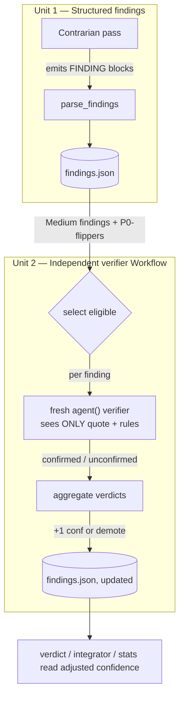

# Independent Verifier for Contrarian Findings — Architecture Spec

## In Plain Language

Studio's contrarian already has to back up its criticisms: when it flags a flaw it must quote the
exact thing it's objecting to, and mark how sure it is (High / Medium / Low). That's the gate we
just shipped. But the contrarian still grades its own homework — nothing checks whether a
"Medium-confidence" flaw is actually real.

This feature adds a second opinion. After the contrarian writes its findings, a **fresh, separate
agent** re-checks the shaky ones. The trick that makes it worth anything: the checker is shown
**only the quoted claim and the rules for judging it — never the contrarian's own reasoning**. It
can't just nod along, because it never saw the argument. If the checker independently agrees, the
finding gets more trustworthy (its confidence goes up). If it can't confirm the flaw, the finding
gets demoted out of the main list. Two independent voices agreeing is a much stronger signal than
one voice being confident.

The debate that produced this spec turned up two things that reshaped it, so it's worth being clear
about them up front:

1. A verifier is only meaningful if it's genuinely **independent**. If the same assistant just
   role-plays "contrarian" and then "verifier" in one breath, it already knows the reasoning it's
   supposed to ignore — that's theater, not verification. Real independence needs a real separate
   agent with its own fresh context.
2. Today the contrarian's findings are **free-form prose**. To hand a checker "just the quoted
   claim" cleanly, findings first need a **machine-readable form** — otherwise the hand-off leaks
   the reasoning and the whole point is lost.

So this is built as **two units in sequence**: first give findings a structured form (useful on its
own), then build the independent checker on top of it.

## Architecture at a Glance



The firewall is the load-bearing part: the verifier reads the finding's quoted `file:line` (so it
can look at the real code) and the demotion rules — but the contrarian's argument for why the code
is wrong never enters the verifier's context. Independence comes from the process boundary (a
separate `agent()` call with fresh context), not from asking one agent to "be objective."

## How It Works (Technical)

### Unit 1 — Structured findings (`findings.json`)

The goal: make a contrarian finding a parseable record, the same way `decision_points.py` already
makes a decision one.

- **New canonical finding block** the contrarian emits alongside its prose (single source of truth,
  emitted-and-parsed, mirroring `DECISION_BLOCK_TEMPLATE`):

  ```
  > **FINDING [confidence: medium]:** <the flaw, one line>
  > **Quote:** `path/to/file.py:42` — "<the exact text/claim being critiqued>"
  > **Impact:** <what breaks if it's real>
  ```

- **New module `studio/findings.py`** patterned on `decision_points.py`: a `Finding` dataclass
  (`confidence`, `flaw`, `quote`, `impact`, `source_file`, plus a later-filled `verdict` /
  `verified_confidence`), `parse_findings(text)`, `save_findings_json` / `load_findings_json`, and
  `extract_findings_from_run(run_dir)`.
- **`CONTRARIAN_MANDATE` addition** (`scopes.py`): the evidence-gate bullets already tell the
  contrarian to quote and rate; this adds "emit each finding as a FINDING block so it's captured."
  It extends — does not rewrite — the shipped gate.
- **Contract:** `findings.json` is a list of `Finding` records keyed by a stable `finding_id`
  (`source_file` + index). It is the artifact both the verifier (Unit 2) and any future stats/dedup
  consumer read.

Unit 1 is usable on its own the moment it lands: the confidence gate becomes machine-readable, so
`stats` can count/trend findings and dedup them across iterations — value even if Unit 2 never
ships.

### Unit 2 — Independent verifier Workflow

A Claude Code Workflow, `.claude/workflows/finding-verifier.js`, built the same way as
`implementation-loop.js` (orchestration-only shell; behavior in prompts + a typed handoff).

- **Input:** a run directory (or `findings.json` path).
- **Selection:** eligible = findings at `confidence: medium`, plus any finding whose demotion would
  flip a P0 decision. High is skipped (the self-gate already defines High as "quoted + shown");
  Low/unverified already live in the demoted list.
- **Per-finding verification:** one `agent()` call per eligible finding — a genuinely fresh context.
  Its prompt contains **only** the finding's `quote` (with the `file:line`, so it can read the real
  code) and the demotion rules. It returns a `VERIFIER_HANDOFF`:

  ```jsonc
  { "verdict": "confirmed | unconfirmed | uncertain",
    "one_line_reason": "..." }
  ```
  The write-back keys each verdict to its finding by list position (the Select step's `index`), and
  derives confidence from the verdict alone — the agent returns no confidence override (see Key
  Decisions).

- **Aggregation → write-back:** `confirmed` → confidence +1 band (Medium→High) and tag
  "verified — two voices agree"; `unconfirmed` → demote (Medium→Low, moved to lower-confidence
  notes); `uncertain` → leave as-is, note it. The Workflow updates `findings.json` in place (no
  separate `verifier.md` parser-with-no-reader — the finding record *is* the overlay) and returns a
  summary `{ verified, confirmed, demoted, cost_findings }`.
- **Cost control:** a config knob (small `verifier` table or reuse of the loop-config pattern) caps
  which tiers are verified (default: `medium`) and the max findings per run.
- **Trigger:** a `/verify-findings <run-dir>` command for the MVI; folding it automatically into the
  run flow after the contrarian pass is a later step, once the one path is proven.

## Key Decisions

- **Sequenced into two units, not one build** (user decision, this run). Structuring findings is a
  real prerequisite *and* independently useful, so it ships first; the verifier builds on it.
- **Real independence via a Workflow, not an honor-system instructions.md pass** (contrarian P0).
  One assistant role-playing both roles in one context cannot be independent — it already holds the
  reasoning it's told to ignore. A separate `agent()` call is the only mechanism that delivers the
  fresh context the feature depends on. This mirrors `/forge`'s writer/editor separation.
- **Verify Medium (+ P0-flippers) only, not High** (contrarian cut). High is already the
  most-self-gated tier; re-checking it duplicates the shipped gate. Medium is the tier literally
  tagged "verify this."
- **Write back into `findings.json`; no standalone verifier artifact** (contrarian cut). The finding
  record carries its own verified confidence; a separate parsed file with no distinct reader was cut
  as speculative machinery.
- **The verifier reads the code, not the argument.** It gets the `file:line` so it can look at the
  real source; it never gets the contrarian's reasoning. Independence is the process boundary.
- **Confidence tracks veracity, not severity — so confirmed always promotes** (decided from the live
  smoke). The verify agent returns only a verdict; the write-back derives confidence (confirmed →
  high, unconfirmed → low, uncertain → unchanged). It cannot override confidence to "hold a real but
  minor flaw at medium" — that blends *is it real* with *is it bad*, which neither gstack (separate
  severity + confidence numbers) nor Studio (priority separate from confidence) does anywhere else.
  Whether a real flaw is minor is a severity axis; `Finding` has no severity field today, and adding
  one is out of scope for R1.

## Non-Goals / Cut Scope

- **No honor-system / same-context verifier** — rejected as theater.
- **No High-confidence verification** — redundant with the shipped self-gate.
- **No `verifier.md` parser** — findings.json is the single record.
- **Not wired into every phase/scope at once** — prove it on one path (studio depth) before
  generalizing to single-phase and other scopes.
- **No automatic post-contrarian trigger in the MVI** — start with an explicit `/verify-findings`
  invocation; auto-wiring comes after the path is proven.

## Risks & Open Questions

- **Unit 2 is Claude-Code-only.** The finding format + `findings.json` (Unit 1) are portable; only
  the verifier *executor* is Claude-specific — the same trade `/forge` already accepts. A port
  rewrites only the thin Workflow shell.
- **A "cold" quote may be too starved.** A quote with no context might be unfairly unconfirmable.
  Mitigation: always include the `file:line` so the verifier can read the actual code; withhold only
  the contrarian's reasoning, not the code itself. Watch for verifiers that return `uncertain` a lot
  — that's the signal the quote isn't carrying enough.
- **Double-counting confidence.** The +1/demote semantics must not silently re-grade what the
  contrarian's self-rating already set; the write-back records "verified" as a distinct, additive
  signal.
- **Cost.** Even Medium-only verification adds one `agent()` per eligible finding; the per-run cap is
  the guard, and the success metric (does verification change enough verdicts to earn its tokens?)
  should be watched the way `/forge`'s editor pass is.

## Build Plan

Two MVI units, in dependency order (each a complete, usable thing — build a skateboard, not a
wheel), both buildable via `/forge`:

1. **Unit 1 — `findings.json`.** The FINDING block format + `studio/findings.py` parser +
   `CONTRARIAN_MANDATE` emitting it + loader tests (mirror the `decision_points` tests). *Usable
   alone:* the confidence gate is now machine-readable — `stats` can count and dedup findings.
2. **Unit 2 — verifier Workflow.** `.claude/workflows/finding-verifier.js` + the `/verify-findings`
   trigger + the confidence write-back. *Usable:* Medium-confidence findings get an independent
   second opinion; agreement promotes, non-confirmation demotes.
