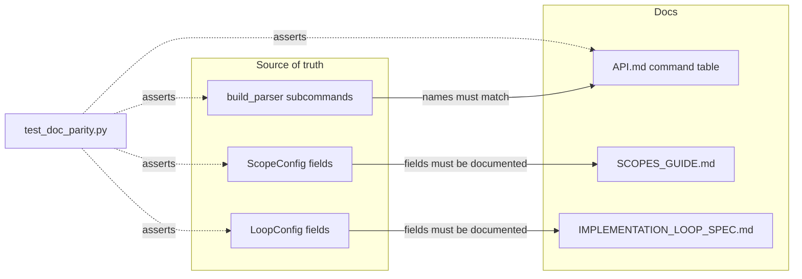

# Doc-Parity Tests — Architecture Spec

## In Plain Language

Studio's reference docs list things the code defines: the CLI subcommands, the config knobs. When
someone adds a command or a config field and forgets to document it (or renames one and leaves a
stale doc entry), the docs quietly go wrong. That's the doc-rot `/unstale` chases by hand.

R2 started as "generate those docs from the code" — copied from gstack. The `/spec` debate
**rejected that** for Studio, and the reason is worth recording: gstack generates its docs from
source because *there* the source is the richer thing. In Studio it's the opposite — the reference
docs are **intentionally richer than the code**. `check-updates`'s argparse `help=` is one line;
its API.md entry is a ~180-word explainer of TTL caching and exit-0 safety that lives *nowhere* in
the code. Generating that table from argparse would **delete** the authored prose. That's not
drift-prevention, it's drift-infliction.

So the shape that actually fits Studio is not generation — it's **assertion**. A handful of tests
check that every name the code defines is documented, and that no documented name is stale. The
hand-written prose stays exactly where it is and stays human-owned; the tests only guard the
*names*. When you add a command or a config field, a test fails until you document it — the
`/unstale` chore, made automatic and free, with zero risk to the prose.

## Architecture at a Glance

The tests read the code (the authoritative names) and the docs (the committed text), and assert the
names line up. No generator, no new CLI, no CI wiring beyond the existing `pytest` run.

## How It Works (Technical)

One new file, `studio/tests/test_doc_parity.py`, pure stdlib, three checks:

- **CLI command parity (both directions).** Import `build_parser()`, pull the sub-command names from
  its `_SubParsersAction.choices`. Parse the `Command | Description` table in `docs/API.md` (the
  rows under that header, first column, backtick-stripped). Assert the two sets are equal — a new
  command with no row *and* a stale row with no command both fail. This is the clean two-way check
  because API.md has a real, parseable command table.
- **ScopeConfig field coverage (forward).** `dataclasses.fields(ScopeConfig)` minus `name` (which is
  the TOML *section* name `[scopes.<name>]`, not a row key). Assert each remaining field appears as a
  backticked token in `docs/SCOPES_GUIDE.md`. Forward-only (does the doc mention the field?) because
  the reverse would need fragile prose parsing; the high-value drift is "new field, undocumented."
- **LoopConfig field coverage (forward).** `dataclasses.fields(LoopConfig)`; assert each appears as a
  backticked token in `docs/IMPLEMENTATION_LOOP_SPEC.md` (its §4 TOML block is the canonical list).

**Interfaces:** the only "contract" is the API.md command-table header (`| Command | Description |`)
and the backtick convention for names in the config docs — both already the house style. If a doc's
structure changes, the parser helper in the test is the single place to adjust.

**Dependencies:** `build_parser` (run_phase.py), `ScopeConfig` (scopes.py), `LoopConfig`
(impl_loop.py), and the three doc files. Stdlib `dataclasses` + `re` only.

## Key Decisions

- **Assert, don't generate** (the debate's core reversal). Studio's docs are richer than the code, so
  generation destroys value; parity assertion catches the real drift (add/rename/remove of *names*)
  while leaving every hand-authored sentence untouched.
- **`build_parser()`, not `_actions` introspection.** It's a real importable function; only
  `_SubParsersAction.choices` (the command names) is needed — the brittle `_actions` walk the
  original plan flagged is unnecessary.
- **Two-way for commands, forward-only for config.** API.md has a clean command table, so both
  directions are cheap and robust. Config keys are sprinkled through prose, so forward-only ("field
  is documented") avoids fragile reverse parsing while still catching the common failure.
- **No new module, CLI, or CI step.** The checks live in the existing `pytest` suite that CI already
  runs. This is the contrarian's cut, kept.

## Non-Goals / Cut Scope

- **No codegen / `docgen` module / `--check`/`--write` CLI / CI wiring** — rejected; it would delete
  authored prose and over-builds for the problem.
- **No generating descriptions**, ever — descriptions stay human.
- **No cross-repo generation** — the docs ship as static artifacts via `install.py` already; nothing
  runs downstream, so the install-path trap never applies.
- **No reverse check on config keys** — fragile against prose; not worth it for the MVI.

## Risks & Open Questions

- **A doc restructure breaks the parser helper.** Mitigation: one small, well-named helper per
  surface; a failure points straight at it. This is strictly better than the status quo (silent
  drift).
- **Forward-only config checks miss a *stale* documented key** (renamed field, old name lingers).
  Accepted for the MVI; it's the rarer, lower-cost drift. Revisit if it bites.
- **First run may fail on real, existing drift** — that's the test earning its keep. If so, fix the
  doc (add the missing row/key) as part of landing this; do not weaken the test to pass.

## Build Plan

One MVI unit (small enough to build directly, not via `/forge`):

1. **`studio/tests/test_doc_parity.py`** — the three checks above, with a small table/token parser
   per surface. If any check fails on the current tree, fix the drifted doc in the same change.
   *Usable immediately:* the next undocumented command or config field fails CI.
