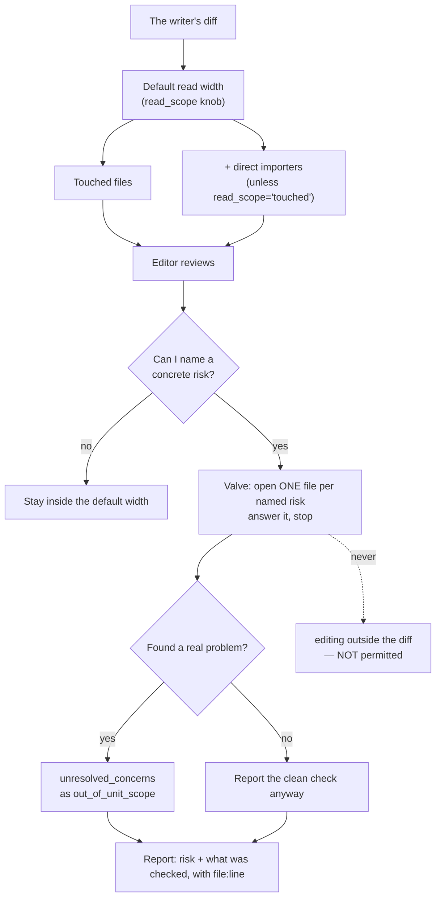

# Editor Breadth Valve — Architecture Spec

## In Plain Language

When `/forge` finishes writing code, a second agent reviews it. That reviewer is told which files it
may read — the ones the change touched, plus the files that import them — and then told flatly:
"Do not wander beyond that read scope."

The ban has no exception, which leaves one class of problem unfindable. Some code depends on other
code without importing it. Something reads a config key by name. Something parses a file format.
Something shells out to a command. Rename that key or change that format and every test still passes,
because nothing in the test's import graph noticed. The reviewer is the one agent positioned to catch
it, and it is forbidden from looking.

This replaces the flat ban with a valve: the reviewer may open one more file, but only to check a risk
it can *name*, one file per risk, and it has to report what it checked — including the checks that came
back clean. Reading wider does not let it edit wider; anything it finds out there gets written down as
a concern rather than fixed on the spot.

Second, smaller piece: the reviewer must cite a `file:line` for its claims, including the ones it would
otherwise answer with a bare "yes." "Callers still work" is not evidence. A line number is.

## Architecture at a Glance



The valve widens *reads only*. Edits stay inside the diff, which keeps the loop's one-way pipeline
intact: the editor cuts within the writer's change, and anything it notices further out becomes a
written concern for a human rather than an edit nobody reviewed.

The dotted line is the abuse this design explicitly closes. A reviewer that can read a file will be
tempted to fix it, and an edit outside the reviewed diff is an edit nobody checks.

## How It Works (Technical)

### The gap this closes

Worth being precise, because the first draft of this spec got it wrong and the correction matters.

The flat ban does **not** make the existing `out_of_unit_scope` concern category unreachable. Unit
scope and read scope are different sets, and read scope is the larger one. At the default
`touched+importers`, the reviewer's read scope already extends past the diff to every direct importer,
so a problem spotted in an importer is out-of-unit *and* inside the read scope — no ban violated. Even
at `touched`, a touched file contains code the diff never modified, and "this whole module needs
restructuring" is an out-of-unit observation requiring zero extra reads.

The real gap is narrower and more specific: **`+importers` covers static-import consumers only.** The
consumers a green diff most often breaks are the ones that never import it —

- something that reads a **config key** the diff renamed,
- something that reads or writes a **file format or schema** the diff changed,
- a **CLI flag** or **subprocess entry point** the diff altered,
- **shared mutable state** (module-level, singleton, cache, registry) the diff writes to.

None of those appear in the touched files or in their direct importers, at either width. They are also
precisely what a unit-scoped test run structurally cannot catch, which is why the reviewer is the only
agent positioned to find them.

### The prompt change

`.claude/workflows/implementation-loop.js`. Lines 156–158 (the review scope and read width) are
untouched. Line 159 — `Do not wander beyond that read scope.` — is deleted and replaced by 114 words:

```js
    `That read scope is your default width, not a fence: you may open one more file to check a risk you can`,
    `name. The risks that earn a look:`,
    `- a signature, contract, or config key the diff changed that something outside the diff still uses;`,
    `- shared mutable state the diff writes to (module-level, singleton, cache, registry);`,
    `- a file format or schema the diff changed that something else reads.`,
    `One file per named risk: answer it and stop. No survey, no "let me understand the architecture first".`,
    `Reading wider does not widen editing: your edits stay inside the diff, and a real problem you find`,
    `outside it goes to unresolved_concerns as out_of_unit_scope.`,
```

Four load-bearing choices:

- **The risks are named concretely.** Generic phrasing ("consider cross-cutting concerns") is what
  agents route around — either ignoring it or reading it as licence for a survey.
- **"One file per named risk: answer it and stop"** is the cost governor. Without a per-risk unit of
  work, "you may look outside" has no upper bound.
- **"Reading wider does not widen editing"** closes the abuse, routing out-of-diff findings to the
  concern category that already exists.
- **Clean checks get reported too** (required by the evidence rule below). Without that, a report with
  no breadth findings is indistinguishable from a reviewer that read half the repo and found nothing.

### The evidence rule

Inserted immediately before the existing `Keep your edits rationale under ${u.output_budget || 400}
words.` line — top of the reporting block, so it governs `edits`, `unresolved_concerns`, and
`mvi_verdict` together, and sits next to the word cap that constrains it. 54 words:

```js
    ``,
    `Evidence rule — cite, don't narrate. Every claim about the code carries a \`file:line\`: each cut, each`,
    `risk you checked above (clean results included, one line each), each unresolved concern. That includes`,
    `any check you would answer with a bare "yes". If you cannot point at a line, say you did not verify it.`,
```

This is not a new concept. `CONTRARIAN_MANDATE` already carries "**Quote before you claim.** … If you
cannot point at the exact thing, you have not verified it" (`studio/scopes.py:48`), and the editor
inherits that mandate by reference at `implementation-loop.js:153`. This paragraph only says what
"point at the exact thing" means when the thing is code. That is exactly why it stays out of
`scopes.py`: a market-phase contrarian critiquing a market-size estimate has no line number to cite.

An earlier draft illustrated the rule with a worked example — `"callers still work (studio/stats.py:212,
studio/verdict.py:88)"`. That example was itself fabricated: `studio/verdict.py` is 7 lines long, and
`stats.py:212` is a comment. A rule against asserting what you cannot point at, teaching by example
that a plausible-shaped line number clears the bar, is worse than the rule with no example. It is
deleted, deliberately, and this paragraph is the record of why nobody should add it back.

**Total prompt cost: 168 words** added to every editor prompt, unconditionally, before any file is
opened — against an `output_budget` of 400 words for the editor's entire rationale. That squeeze is
real and is not mitigated by raising `output_budget`, which is a cadence-lab measurement knob.

### Documents that change

| File | Change |
|---|---|
| `.claude/workflows/implementation-loop.js` | line 159 replaced; evidence paragraph inserted; line 102's comment `read-scope bounds` → `unit-scope bounds` |
| `studio/docs/IMPLEMENTATION_LOOP_SPEC.md` §3 | editor-mandate bullet gains the valve and the cite rule |
| `studio/docs/IMPLEMENTATION_LOOP_SPEC.md` §4 | the `read_scope` note says it sets a default, not a ceiling |
| `studio/docs/IMPLEMENTATION_LOOP_SPEC.md:196` | TOML comment (byte-identical copy — must change with the config file) |
| `studio/docs/IMPLEMENTATION_LOOP_SPEC.md:271` | cadence-lab question rewritten to name the valve as a measured variable |
| `studio/config/implementation_loop.toml:17` | `# bound the editor's reads` → `# default read width` |
| `studio/docs/CLAUDE_CODE_USAGE.md:472` | the Config paragraph explains the valve to users |

The §4 and config comments are byte-identical copies of each other, and `test_doc_parity.py` compares
assigned *keys* rather than comments, so nothing would catch them drifting. Hand-kept invariant: change
both in the same commit.

**Deliberately unchanged, and recorded here so a future `/unstale` pass does not "fix" them:**

- `IMPLEMENTATION_LOOP_SPEC.md:317` — "added `read_scope` to bound the editor's input context" sits in
  the changelog of what the original debate decided. It is a record of a past decision. Rewriting it
  would falsify the history.
- `IMPLEMENTATION_LOOP_SPEC.md:39` — "a *bounded* slice of surrounding code (see read-scope)" stays
  accurate: one file per named risk is still bounded.
- `CLAUDE.md`, `studio/docs/ARCHITECTURE.md`, `.claude/commands/forge.md`, `README.md` — all mention
  `read_scope` only as a config knob, which stays true. No edits.
- `CLAUDE_CODE_USAGE.md` step 5 — says the editor "diffs against `writer_sha`", which is *review*
  scope, unchanged. Only reads widen.

### Interfaces and dependencies

- **No schema change.** A `breadth_checks` field was rejected upstream: nothing in the JS or Python
  would read it, and `edits` is already a free-text rationale field.
- **No config change.** `VALID_READ_SCOPES` stays `{"touched", "touched+importers"}`.
- **No `scopes.py` change**, by decision.
- **No Python change at all.** `test_impl_loop.py`'s eleven `read_scope` assertions still hold.
- **Cross-repo:** `implementation-loop.js` is already in `install.py`'s `WORKFLOW_FILES`, and the
  install manifest hashes files at install time, so no hand-updated digest.

## Key Decisions

| Decision | Ruling | Why |
|---|---|---|
| What `read_scope = "touched"` means once a valve exists | The valve applies at both widths; `read_scope` sets the default read width only | One rule for the editor to learn, and `touched` users aren't stranded without a way to check a contract change. The knob keeps its real job: bounding routine input cost. |
| Where the evidence rule lives | `editorPrompt` only | `CONTRARIAN_MANDATE` ships into market and design debates where `file:line` is meaningless and would generate noise. The abstract "quote before you claim" gate already serves those phases. |
| Report the named risk where? | In the existing free-text `edits` field | A schema field nothing reads is worse than no field. |
| Worked example in the evidence rule | **Deleted.** No example | The drafted example was a fabricated citation. A rule against unverifiable assertions must not model one. |
| Justification for the valve | The non-importing-consumer gap, **not** "the ban orphans `out_of_unit_scope`" | The orphaning claim is false — out-of-unit problems are reachable inside the read scope at both widths. The false version nearly shipped into this document. |
| Ship before a cost baseline exists? | Ship, with a written provenance note — not with two hand-measured numbers | See below. |

### On shipping without a baseline

The study that motivated this said "land this with the cadence lab, not before it," because bounding
the editor's input cost is what `read_scope` is for. That concern is legitimate: if the valve lands
with no before/after number and a future cadence lab finds the editor pass over its cost ceiling, the
cause is unattributable — valve, gate granularity, and unit size all confounded.

The rejected middle path was to hand-record editor tokens from two live runs and write them into the
cadence-lab section as the valve's first data points. That fails on its own terms. The spec already
says the lab is pending because there are "Only ~2 data points so far" — so adding two more, as
authoritative, makes the document assert precision it disclaims two paragraphs earlier. And two runs on
two different units cannot separate valve cost from unit size, which is the exact confound the
measurement existed to remove. **Two confounded data points are worse than none, because none is
honest.**

What preserves attribution at near-zero cost is a provenance note: record in the cadence-lab section
that the valve landed **un-baselined** at a named commit, so a future lab knows to treat pre-valve and
post-valve runs as different populations. That is the whole mitigation, and it is one line.

## Non-Goals / Cut Scope

- **A `breadth_checks` schema field.** Rejected upstream; nothing would read it.
- **Any change to `VALID_READ_SCOPES`**, or a third read-scope value.
- **Any change to `scopes.py` / `CONTRARIAN_MANDATE`.**
- **Raising `output_budget`** to make room for the citations. It is a measurement knob; moving it would
  confound its own numbers.
- **Letting the editor edit outside the diff.** Reads widen; edits do not.
- **Hand-measured token numbers written into the cadence lab as data points.** See above.
- **A test asserting `file:line` is absent from `scopes.py`.** It would forbid a decision that was
  never actually forbidden — a *tech-phase* contrarian citing a line number is perfectly reasonable —
  and its only repair when it failed would be deletion, which teaches nothing. The reason lives in this
  document instead, where it carries its rationale.
- **Machine-checking whether the reviewer obeys any of this.** It cannot be done; see Risks.

## Risks & Open Questions

- **Token inflation, and today nobody would notice.** This is the headline risk and the honest answer
  is bleak: the handoff JSONs carry no token or cost field, and `record-metrics`/`show-metrics` covers
  debate agents, not the implementation loop. The only signal is the session cost readout, read by a
  human who happens to look. The mitigation in this design is behavioral, not instrumental: because
  clean checks must be reported, a human reading one report can see the breadth that was spent. That is
  weak. It is what exists.
- **"Check the risk" becomes "read the codebase."** Mitigated by the per-risk unit of work and the
  explicit anti-survey clause. Detection is the reported check list — three named checks is the intent,
  "reviewed the surrounding modules" is the failure, and the fix is sharpening the named risks rather
  than restoring the ban.
- **Fabricated citations.** Nothing verifies the line numbers. The rule's closing clause makes "I did
  not verify this" a legitimate answer, which is the only lever prompts have. Real mitigation is human
  spot-checks. The drafting history here is the cautionary evidence: an experienced agent produced a
  fabricated citation *inside the paragraph forbidding them*.
- **The valve becomes an editing licence.** Closed by the routing sentence plus the existing hard bounds
  (green tests, `load_bearing`, forced revert). An editor that edits an out-of-diff file is the one
  outcome that would justify reverting this change outright.
- **`output_budget` squeeze.** 168 prompt words plus per-claim citations compete with the cut rationale
  inside the same 400-word cap.
- **Nothing here is machine-verifiable beyond text placement.** Whether the reviewer names concrete
  risks, whether one risk stays one file, whether citations resolve — all of it needs a live run.

## Build Plan

**One unit.** Prompt and documents together: splitting them would ship a commit whose config comment
contradicts its own prompt, and the documentation contract requires usage docs to move with a workflow
change.

**Unit 1 — "the reviewer may check a named risk, and has to show its work."**
The two `implementation-loop.js` prompt edits plus the line-102 comment fix; the spec's §3 bullet, §4
note, line 196 TOML comment, and line 271 cadence-lab question (with the provenance note); the config
comment; the `CLAUDE_CODE_USAGE.md` paragraph; the two tests below.

*Usable at the boundary:* the next `/forge` run's reviewer can legitimately check whether a renamed
config key broke a non-importing consumer, must report what it checked, and every document describing
the read scope agrees with the prompt.

*Verify:* `cd studio && python -m pytest tests/test_workflow_shells.py tests/test_doc_parity.py
tests/test_impl_loop.py tests/test_install.py -v`, then the full suite, then
`grep -rn "wander\|bound the editor's reads"` returns nothing outside output directories.

### Tests

Two assertions, in a `TestEditorBreadthValve` class in `studio/tests/test_workflow_shells.py`,
following the existing slice-the-source pattern:

1. **The flat ban is gone and stays gone.** `"Do not wander beyond that read scope."` does not appear
   in the shell source. This is the one real regression pin — it stops a future edit quietly restoring
   the ban. (Verified: the string is present today, so this test fails before the change and passes
   after, which is the property a guard needs.)
2. **The valve and the cite rule reached the editor prompt.** In the `editorPrompt` slice, the anchors
   `"signature"`, `"shared mutable state"`, `"config key"`, and `"file:line"` are present. Short
   anchors, never whole sentences, so the prose can be tuned without breaking the test.

Three further tests were drafted and cut. One asserted `"out_of_unit_scope"` appears in the editor
prompt — it already does, so it could not fail either before or after the change. One asserted the
valve text is absent from `writerPrompt`, which no plausible edit would violate. One asserted
`file:line` is absent from `scopes.py`, which is the non-goal explained above.

**Live verification (the real gate, qualitative by design).** Run `/forge` on two real units and read
`.studio/output/impl_loop/<unit>/impl--<unit>--editor.json`:

- Did `edits` name concrete risks with what was checked, clean results included — or gesture vaguely?
- Did one named risk stay one file, or become a survey?
- Do two spot-checked `file:line` citations resolve to real, relevant lines?
- Did anything route to `unresolved_concerns` as `out_of_unit_scope`?
- Did the editor edit anything outside the diff? (If yes, revert this change.)

No token numbers are recorded as data points. The provenance note in the cadence-lab section — valve
landed un-baselined at commit `<sha>` — is what a future lab needs from us.
