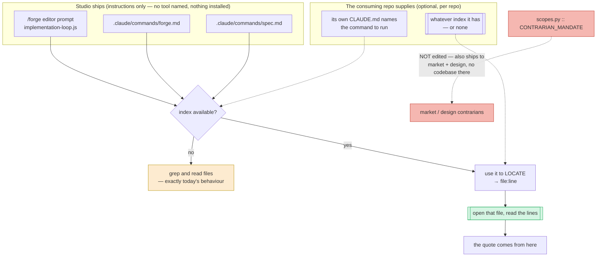

# Find Before You Grep — Architecture Spec

## In Plain Language

When an agent works on a codebase it starts blind. To answer "where does this live" or "what calls
this" it greps, opens a file, greps again. It pays for that rediscovery on every task.

Tools exist that fix this. They read a repository once and build an index — what exists, where it is,
what calls what — so a question like "where is the gate config merged" is answered in a fraction of a
second with an exact file and line number. Several such tools exist and more will; which one a given
repository uses is that repository's business.

This feature teaches Studio's agents two things, in that order. **Use an index if the repo has one**,
instead of grepping blind. And — the part that matters more — **the index tells you where to look, not
what the code says.** An index entry is a summary some tool wrote. It can lag the file it describes. An
agent that quotes the summary instead of opening the file has done something that looks like checking
and isn't, and that is worse than not checking at all, because nobody downstream re-checks a claim that
arrived with evidence attached.

**Studio names no tool and installs nothing.** It describes the behaviour it wants; the repository
supplies the tool. That keeps this public repository free of a dependency on somebody else's project,
and it means the rule still works the day a given index tool is abandoned or replaced.

## Architecture at a Glance

Two things to read off the diagram. The **green box is the point**: every path that consults an index
ends by opening the real file. And the **amber box is the safety property**: with no index, the
instruction is inert and agents behave exactly as they do today.

The red path is the one deliberately not taken, and it is this spec's main architectural decision.

## How It Works (Technical)

### Why this cannot live in `CONTRARIAN_MANDATE`

The obvious home is `CONTRARIAN_MANDATE` in `studio/scopes.py` — one edit reaches both the phase
contrarians and the `/forge` editor, since `.claude/workflows/implementation-loop.js:236` reads the
editor's mandate straight from that constant.

It is the wrong home. `studio/run_phase.py:851-853` extends the contrarian's instructions with
`CONTRARIAN_MANDATE` gated **only** on `is_qmode` — not on phase. So a *market* contrarian debating a
cozy farming sim, and a *design* contrarian judging a store page, would both be told to query a code
index. Three lines below, `DESIGN_CRITIQUE_GUIDE` is gated `if phase == "design":` with a comment
stating the principle: guidance that judges one phase's artifacts stays out of the other phases'
instructions.

`studio/docs/SUPERPOWERS_COMPARISON.md` already rejected this exact idea twice, at `:245` and `:293` —
"market and design debates where `cite file:line` is meaningless."

So the instruction goes only where a codebase is guaranteed: the `/forge` editor prompt, `forge.md`,
and `spec.md`.

### The find-versus-quote rule

The wording guards a failure that *looks like success*, so it needs three properties:

1. **Split the verbs.** The index *locates*; the file *evidences*. "Use the index" alone is too loose
   to survive paraphrase.
2. **Name the tempting artifact.** Index tools return summaries, and some inline an excerpt of the
   source and describe it as sufficient — one popular tool documents its excerpt mode as *"the pack IS
   the answer, no need to re-open files."* An agent will meet a contract that contradicts ours and must
   know which one wins. Say so without naming the tool.
3. **Attach a consequence that already exists.** A quote taken from an index summary rather than the
   file is `(unverified)`, which `studio/scopes.py:49` already demotes to the lower-confidence list and
   drops unless fatal. Failing to open the file costs the finding. No new enforcement machinery.

### Naming the tool is the repo's job

Studio's shipped text says *"if this repo has a code index or symbol search."* The specific command
lives in the consuming repo — its own `CLAUDE.md`, or an optional `[code_index]` entry in
`.studio/integrations.toml` following the pattern `studio/integrations/slack_digest.py` already sets:
*"The integration is disabled unless a target is explicitly enabled."*

No Python reads it. Studio's relationship with any index tool is that its prompts mention the category.

This is also what makes the feature survivable. An index tool that is abandoned takes nothing with it:
the instruction goes inert, and the repo's own `CLAUDE.md` is the only thing that needs an edit.

### What Studio does *not* do

No new module, no import, no subprocess, no wizard step, no version bump, no config file Studio writes
or parses, and nothing added to `SOURCE_FILES` / `SLASH_COMMANDS` / `WORKFLOW_FILES`. The whole feature
is prompt text in three files.

## Key Decisions

- **Studio names no tool.** Chosen after the first design named one directly. Studio is a public
  repository; making its prompts depend on a third-party project means shipping instructions that can
  rot when that project does. Naming a *capability* costs nothing and outlives any particular tool.
- **No setup-wizard step.** The earlier design had `/studio-setup` install an index tool's wiring into
  each repo. That is what created the dependency, and it also edited a tracked `.gitignore` in every
  installed repo and installed third-party hooks that run on every prompt. Dropped entirely. Wiring a
  tool is a per-repo, per-developer choice, made once by hand.
- **Not in `CONTRARIAN_MANDATE`.** It would reach market and design debates that have no codebase — a
  conclusion this repo had already reached twice and written down.
- **The discipline is the deliverable, not the speed.** Faster lookups are a nice side effect. The rule
  that an index locates and the file evidences is the part worth writing into Studio, and it is worth
  writing even in a repo that never adopts an index tool at all.

## Non-Goals / Cut Scope

- Naming, installing, configuring, or shipping any index tool.
- Any Python that reads an index, parses its output, or shells out to it.
- A setup-wizard step, a `CURRENT_SETUP_VERSION` bump, or any coordinated sweep of installed repos.
- `CONTRARIAN_MANDATE`, and therefore the market, design and studio phases.
- Solving the case where an index is poor. A repository whose index is swamped by vendored code will
  get poor results; the guard is that the agent must open the real file before quoting, so a poor index
  wastes a lookup rather than producing a false claim.
- A test asserting the prompt text contains a given phrase. This repo has already rejected that shape:
  it "would assert that a phrase appears in the module defining that phrase"
  (`studio/docs/SUPERPOWERS_COMPARISON.md:249-250`).

## Risks & Open Questions

- **A tool-neutral instruction is weaker than a named one.** An agent told "use an index if you have
  one" may not know what to run. The mitigation is that repos which adopt a tool name it in their own
  `CLAUDE.md`, and most such tools install their own prompt-time nudge carrying the exact command. Left
  as a real cost of the neutrality, not pretended away.
- **The rule is unenforceable by test.** Nothing fails if an agent quotes a summary. `(unverified)` is
  a social consequence inside a prompt, not a gate. This is why the feature carries a Verification
  section rather than a test.
- **It may simply be ignored.** Prompt instructions compete with everything else in a long prompt.
  The honest read is that this is worth doing because it is nearly free, not because it is guaranteed.

## Verification

This is prompt-shaped: no failing test can tell you an agent stopped honouring the rule.

- **Pass criterion.** This feature works if and only if, in a `/forge` or `/spec` run inside a repo that
  has a code index, the agent (a) uses that index to locate code before grepping or opening files blind,
  **and** (b) every quoted piece of evidence in its output is traceable to the file at the returned
  `file:line` rather than to the index's own summary or excerpt.
- **Baseline.** The same run with the prompt clauses reverted: the agent greps and opens files to locate
  code, and no index lookup appears in its transcript.
- **Where the evidence goes.** `specs/find-before-you-grep-eval-results.md`, created from the skeleton
  when this spec is approved.
- **Stop condition.** While that file still says `FILL_ME`, nobody may call this feature working and this
  spec stays `status: approved`.

## Build Plan

One unit. The feature is three prompt edits; splitting it would produce a unit that changes one file and
does nothing observable.

### 1. `find_before_you_grep` — agents locate code with an index and still quote the file

**Acceptance criteria:**
- [ ] The `/forge` editor prompt in `.claude/workflows/implementation-loop.js` gains an instruction that (a) says to use a code index or symbol search to *locate* code before grepping, when the repo has one, and (b) requires every quote to come from the file opened at the returned `file:line`, explicitly rejecting an index summary or inlined excerpt as the quote.
- [ ] `.claude/commands/forge.md` and `.claude/commands/spec.md` each gain an equivalent clause, and all three are conditional on the repo actually having an index, so a repo without one behaves exactly as before.
- [ ] No shipped text names a specific index tool, and no Python file under `studio/` imports, invokes, or parses one — the change is confined to prompt text.
- [ ] `studio/scopes.py` is unchanged, and a test asserts the rendered market-phase and design-phase contrarian instructions contain no code-index instruction.
- [ ] `.claude/workflows/tests/workflow-shells.test.mjs` covers the editor prompt carrying the instruction.
- [ ] `cd studio && python -m pytest tests/ -q` passes, `ruff check .` from the repo root is clean, and `README.md` plus `studio/docs/CLAUDE_CODE_USAGE.md` describe the rule without naming a tool.

**Out of scope:** any setup-wizard step, `CONTRARIAN_MANDATE`, `.studio/integrations.toml` schema changes, and naming or installing any index tool.
