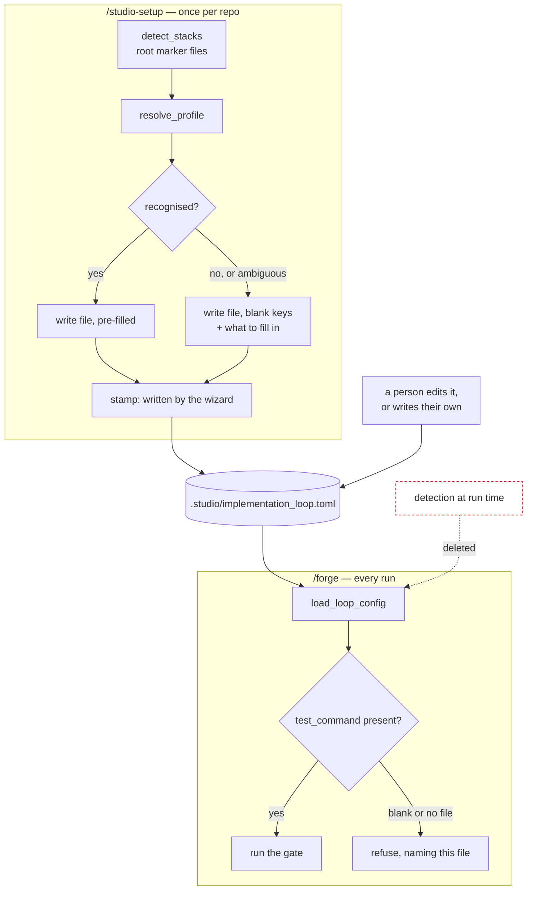

# First-class /forge gate configuration — Architecture Spec

## In Plain Language

`/forge` builds one piece of work and then checks it against the repository's own tests before
calling it done. To do that it needs to know how to run those tests. Today it tries to work that
out by itself, by looking for a familiar file at the top of the repository — a `pyproject.toml`, a
`package.json`, a `Cargo.toml`.

That guess has never once succeeded in a repository where anyone actually uses `/forge`. In three
of them it found nothing, and somebody wrote the commands out by hand; the comments they left are
complaints. In the fourth it found two languages at once and gave up, which is also a refusal — and
that repository has more `/forge` history than any other and no hand-written file, so `/forge`
refuses there right now.

This changes where the answer comes from. The repository says how to run its own tests, in a file,
once. Studio stops guessing every time. The setup wizard still offers a starting point when it
recognises the project — that part was always the useful half of guessing — but it now *always*
leaves a file behind, filled in where it could and blank with instructions where it could not. And
it signs what it wrote, so it can tell its own untouched template from something a person edited.

Refusing to run remains correct and is unchanged. A build gate that invents its own success
criterion is worse than no gate, so when there is no command `/forge` still stops and says so. What
changes is that it now points at a file that already exists and names the line to fill in, instead
of describing a file somebody has to create from nothing.

## Architecture at a Glance



The top half runs once, when somebody sets the repository up. The bottom half runs on every
`/forge`. The important change is the dotted line: detection no longer reaches the runtime path at
all. It survives only as the wizard's opening guess, where a wrong answer costs a person one edit
rather than a silently mis-gated build.

## How It Works (Technical)

**Components and responsibilities**

- `studio/setup.py` — `apply_implementation_loop_config` becomes the only caller of detection. It
  writes on every path, stamps what it writes, and never modifies a file that already exists.
  `_format_loop_toml(profile, root)` gains the stamp line and carries the stack-specific warning
  text that `_detected_line` used to print at runtime.
- `studio/impl_loop.py` — `load_loop_config` stops calling `resolve_profile`. `LoopConfig`'s gate
  fields lose their Python-literal defaults. `_no_test_command_message` loses its `Detected:` line
  and instead names the file it read and whether the key was blank or the file absent.
- `.claude/workflows/implementation-loop.js` — the existing prompt branch at `:246` dictates the
  `mutation_check` record the writer persists at `:250`.
- Detection itself — `STACK_MARKERS`, `detect_stacks`, `resolve_profile`, `_detected_line` — stays
  in `impl_loop.py`, now with `setup.py` as its only caller.

**Data flow.** Setup detects once and writes a file. Every later `/forge` reads that file and
nothing else. There is no longer a merge between a file and a runtime guess.

**The contract that must not break.** `LoopConfig`'s gate fields are currently
`test_command = "pytest -q"`, `static_checks = ["ruff check {paths}"]`,
`require_mutation_check = True`, `mutation_command = "mutmut run"`. Its own docstring says these are
safe only because *"No production path reads them — the loader always passes the gate keys in"* —
which is true today precisely because the loader builds its merge base from `resolve_profile`. Take
detection out of the loader without removing those literals and every key a config omits falls
through to them. One install's live file sets only `test_command`, so it would start being told to run
`ruff` and `mutmut` in a repository that has neither. That is the original complaint reappearing
through its own fix, so the two changes are inseparable: the defaults become `""`, `[]`, `False`,
`""`, and a bare `LoopConfig()` is refused rather than silently gating on nothing.

**The file's shape.**

```toml
# Written by /studio-setup on 2026-09-15. Edit freely — setup never overwrites this file.
# Detected: nothing. No marker file Studio recognises is present here.
[gate]
test_command = ""              # ← the command that runs this repo's tests
static_checks = []
require_mutation_check = false
mutation_command = ""
```

The first line is the stamp. It exists so the wizard can tell its own untouched template from a
person's file, and for nothing else — which is why it is one plain comment line rather than a
version number or a content hash. A blank `test_command` beside the stamp already identifies the
only state that matters: a template nobody has filled in.

**Recording why a gate was skipped.** Across every repository, 31 writer records carry no
`mutation_check` object at all, 81 carry it with `performed: false` and no reason, and 102 record a
real run. So the object becomes required in the handoff schema, not merely annotated, and `reason`
is an enum of `not_configured`, `nothing_to_mutate`, `not_reached`. Nothing in Python reads writer
records, so requiring the object breaks no existing reader.

**Dependencies.** None added. The schema is pinned the way the existing tests pin it, by asserting
on the shell's own `required` list rather than by running a JSON-schema validator, because the
harness has none and adding one for a single assertion is not worth a dependency.

## Key Decisions

- **Detection is demoted, not improved.** Its success rate across the four heaviest `/forge` users
  is zero. Growing it is open-ended, because every repository is shaped differently, and a confident
  wrong guess is worse than none — that is one install's literal complaint, where Python defaults
  would run `pytest` and `mutmut` against a Unity project and "every unit fails the gate for the
  wrong reason." The repository owner knows the answer for certain; ask once instead of guessing
  every run.
- **The wizard always writes a file.** Writing nothing when detection failed is what sent three
  people off to author a file from scratch. A blank template with the keys and a sentence saying
  what to put in them turns that into one edit.
- **The wizard stamps what it writes, and still never overwrites.** Provenance is what makes
  always-writing safe: without it, writing a template looks indistinguishable from clobbering
  somebody's work. This is also the live half of issue #133.
- **The config file is authoritative; a missing key is empty, not a default.** Verified there are no
  live casualties — one install holds the only partial config and detection finds nothing there, so
  its resolved values do not change.
- **The stack-specific warning moves into the template.** `_detected_line` loses its runtime home
  when the loader stops calling `resolve_profile`, and the warning is more use sitting in the file
  someone is about to edit than in a refusal they see once.
- **A human fills a blank template, not an agent.** The wizard's Python step cannot ask, and a
  proposed value confirmed by a tired reader reintroduces exactly the guessing this removes.
  Revisit if filling it in turns out to be laborious in practice.
- **Studio's own repository needs two `.gitignore` lines, not one.** Git cannot re-include a file
  whose parent directory is excluded, so `studio/.studio/` must become `studio/.studio/*` before
  `!studio/.studio/implementation_loop.toml` can take effect. Tested both ways in a scratch
  repository: with the directory form the negation is dead and `git ls-files` returns nothing. The
  first version of this decision got it wrong and the depth contrarian caught it.

## Non-Goals / Cut Scope

- **The refusal itself.** It is correct and stays. Only its wording changes, to name the file it
  read rather than what it detected.
- **What the gates do once configured.** Out of scope entirely.
- **A content fingerprint on the stamp.** Cut: the stamp plus a blank `test_command` already
  identifies the only untouched template that matters, and a hash is a moving part with no reader.
- **A template version number and a re-offer path.** Cut for the same reason — nothing consumes
  them, and "never overwrite" makes re-offering moot.
- **Listing the marker files Studio looks for in the template.** Cut: `_detected_line`'s docstring
  records a deliberate rule against enumerating them, since the table recognises more stacks than it
  serves and "naming a few while recognising more reads as a lie." A test pins that rule.
- **Moving detection into `setup.py`** beside its only caller. Logged as a P2; it touches a
  standalone-shipped module for no behaviour change.
- **The cross-repo sweep.** Deployment, not a build unit — it follows the existing cross-repo push
  procedure once the wizard unit lands.

## Risks & Open Questions

- **Test churn is real and worth naming.** Deleting the gate literals re-points about 3 tests;
  taking detection out of the loader re-points roughly 15 more. None are deleted, but that is a
  meaningful diff to review.
- **The heaviest `/forge` user arrives cold.** It has 53 units, no config, and detection that
  returns two stacks at once. Nothing here fixes it automatically — it needs the wizard run, which
  is why the sweep is called out as deployment rather than assumed.
- **The build order is load-bearing, not cosmetic.** See the Build Plan: the loader unit cannot go
  first without leaving the tree red.
- **The refusal's discriminator is easy to get wrong**, and the debate's first draft did. Branching on
  "is this the project override" rather than "does this file exist" mis-reports an explicitly passed
  file with a blank key as a missing file. An independent verifier promoted that finding to high
  confidence after the spec was drafted; unit 2's criteria now pin the correct discriminator.
- **Open (P2):** whether detection eventually moves to `setup.py`. Not decided, not urgent.

## Build Plan

Three units, in this order. **The order is a correctness constraint, not a preference:** the loader
unit changes `_no_test_command_message`'s signature while `setup.py` still calls the old one, and
removes refusal text that `test_setup.py` currently asserts on. Building the wizard first keeps the
Unity and two-stack sentences pinned by a test before the loader tests that pin them are cut.

### 1. `wizard_writes_stamped_template` — every repo ends setup with a gate file, filled in or ready to fill

The wizard writes on every path and signs what it writes. It still never modifies an existing file.
`_format_loop_toml` gains the stamp and the stack-specific warning text; `is_wizard_template`
answers whether a file is the wizard's own untouched template. Also updates `studio-setup.md`,
`CLAUDE_CODE_USAGE.md`, the README and `API.md` where they describe this step.

- **Acceptance criteria:**
  - [ ] In a repo with no marker files, the wizard writes a file whose first line is the stamp and whose `[gate]` carries all four keys with `test_command = ""`.
  - [ ] Loading that written file refuses, and the refusal names that file's path.
  - [ ] In a Unity repo the written file carries the sentence about Unity reporting success when it discovered no tests; in a repo holding both `Cargo.toml` and `package.json` it names both markers; in a Python repo it is pre-filled and loads back to `pytest -q`.
  - [ ] An existing file is byte-for-byte unchanged after the wizard runs, whether it is stamped or not — including the wizard's own blank template.
  - [ ] `is_wizard_template` is true for a file the wizard wrote and untouched, and false for a hand-written one.
- **Out of scope:** the loader, which still merges over detection at this point.

### 2. `gate_keys_resolve_to_none` — the config file is the only thing that decides how a repo is gated

`load_loop_config` stops calling `resolve_profile`; `LoopConfig`'s gate literals are deleted; a
missing `[gate]` key resolves to empty or false; the refusal names the file it read and whether the
key was blank or the file absent. Includes the two-line `.gitignore` change and Studio's own
committed config, plus `IMPLEMENTATION_LOOP_SPEC.md` §4, `forge.md` Step 5 and the `CLAUDE.md`
config paragraph.

- **Acceptance criteria:**
  - [ ] A file whose `[gate]` holds only `test_command` — the one partial config found in the wild — resolves with `require_mutation_check` false and `static_checks` and `mutation_command` empty.
  - [ ] The two installs that carry a hand-written override load to the values those files write, raising nothing.
  - [ ] With `resolve_profile` patched to raise, a repo with no marker files and a filled config still loads — proving the loader never calls it.
  - [ ] A `LoopConfig()` built with no arguments is refused rather than gating on the old literals.
  - [ ] The refusal chooses its wording from **whether the file exists**, not from which resolution branch supplied the path: a blank `test_command` in a file passed explicitly to `load_loop_config(path=...)` says that file's key is blank, not that the path does not exist.
  - [ ] With no file at all, the refusal says the path does not exist; neither wording mentions what was detected.
  - [ ] `git ls-files studio/.studio/implementation_loop.toml` returns the file — checked with `git ls-files`, not `git check-ignore`, whose output on a negated pattern reads as a match either way.
- **Out of scope:** the wizard, which already writes complete files by now.

### 3. `mutation_skip_reason_recorded` — every handoff says whether the mutation check ran, and why not

The writer handoff schema requires a `mutation_check` object with `performed`, and a `reason` enum of
`not_configured`, `nothing_to_mutate`, `not_reached`. The existing prompt branch dictates the record
in both arms. The escalation paragraph gains a sentence naming `not_reached`, so a writer that
escalates before reaching the check has a value to use rather than omitting the field.

- **Acceptance criteria:**
  - [ ] The handoff schema requires `mutation_check`, that object requires `performed`, and `reason` is exactly those three values.
  - [ ] With the mutation check disabled, the writer prompt contains the literal `{"performed": false, "reason": "not_configured"}` and does not mention `mutmut`.
  - [ ] With it enabled, the prompt names `nothing_to_mutate` and `not_reached`, and is otherwise unchanged from today.
  - [ ] `IMPLEMENTATION_LOOP_SPEC.md`'s example handoff shows `reason` and says which values exist.
- **Out of scope:** validating a handoff against the schema at runtime — the harness has no JSON-schema validator and adding one for a single assertion is not worth the dependency.

**Not a unit:** the cross-repo sweep. It is deployment, run after unit 1 via the existing cross-repo
push procedure.
