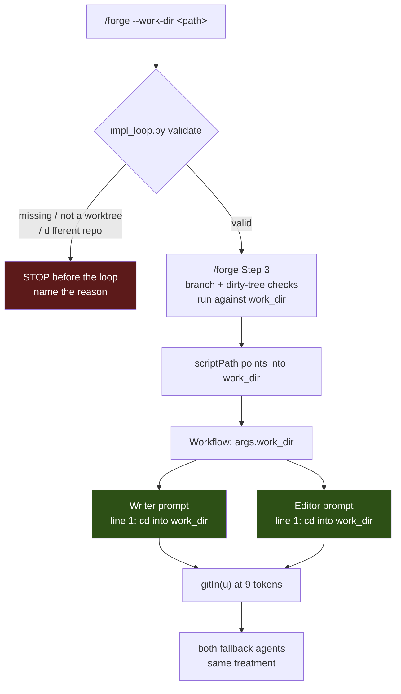

# /forge Can Build in a Git Worktree — Architecture Spec

## In Plain Language

`/forge` builds a unit by handing instructions to two agents: one writes the code and commits it,
another reviews and either keeps or reverts. Every git command those agents run is a line of text in
their instructions — `git commit`, `git reset --hard` — so each one executes wherever that agent's
shell happens to be sitting. Which is the main checkout, on whatever branch you had open.

That's fine when you're building on a branch in the main checkout. It falls apart the moment you
want to build in a *worktree* — a second working copy of the same repo on its own branch. The agent
reads "commit your work," runs it where it stands, and the commit lands on the wrong branch. Worse,
`git reset --hard` from the wrong place can move your main checkout, because worktrees share one
object store. That has happened here, and the current workaround is a script that rewrites a private
copy of the loop before every run.

This teaches the loop to be told where the code lives. You pass `--work-dir`, `/forge` checks it's
really a worktree of this repo before anything starts, and both agents are told up front to change
into it. One honest caveat, stated here so nobody over-trusts it: these are instructions to an agent,
not a sandbox. This makes the accident far less likely; it cannot make it impossible.

## Architecture at a Glance

Green is the mechanism: **`cd` first**. That single instruction covers the test command, the static
check, the mutation run, and anything added later — none of which are git, and none of which `git -C`
could ever have reached. `gitIn` is the backstop for the git calls specifically, so a agent that
ignores the `cd` still doesn't commit to the wrong branch.

Red is the design's other half: if the path isn't a genuine worktree of this repo, nothing starts.

## How It Works (Technical)

### The mechanism, and why it isn't `git -C` alone

The obvious design — wrap every git call in `git -C <path>` — is what the reference implementation in
a consuming repo does, and it is **not sufficient**. `test_command`, `static_check`, and
`mutation_command` are interpolated into the prompts at `implementation-loop.js:175, 190, 215, 371`
and are not git commands. Pinning git while leaving those running in the main repo is *worse than
today*: the agent commits to the correct branch, then reports green tests that describe a completely
different tree.

Note the test command never passes through Python at all — `/forge` infers it in command markdown
(`.claude/commands/forge.md:100-105`) and `impl_loop.py:38` only holds a fallback. So there is no
Python-side seam to pin it at. `cd` is the only instruction that covers everything at once.

### Components

| Component | Responsibility |
|---|---|
| `impl_loop.py` — new validator | Resolve and check `work_dir`; refuse the run with a named reason |
| `.claude/commands/forge.md` | New `--work-dir` flag; Step 3 checks target the work dir; `scriptPath` points into it |
| `implementation-loop.js` — `gitIn` | One-line helper rendering `git -C "<path>"` or `git` |
| Both agent prompts | Open with the `cd` instruction |
| Both fallback agents | Same treatment — separate spawns, easiest to miss |

### The validator

Lives in `impl_loop.py` (stdlib only, runs as a script). It must distinguish three failures and name
which one it hit:

1. the path doesn't exist
2. it exists but isn't a git worktree
3. it's a worktree of a **different** repository

The same-repo check compares `git rev-parse --path-format=absolute --git-common-dir` in both the work
dir and the main repo. **`--path-format=absolute` is load-bearing** — verified on this machine: the
bare form returns a relative `.git` from the main checkout, so the comparison fails every time.
Compare `--git-common-dir` (equal for a worktree and its main repo), never `--git-dir` (which
differs).

### Quoting

`gitIn` emits `git -C "<path>"`. Quoting means the validator only has to refuse the handful of
characters that break inside double quotes, rather than rejecting ordinary paths containing spaces.

### The test-loader constraint

`workflow-shells.test.mjs:26-30` extracts a const from source with a **single-line regex**. So `gitIn`
must be a one-liner, exactly as `runDir` already is, and it must be added to the `deps` list at
`:66-67` or every prompt test throws. This is a constraint on the implementation, not a preference.

### `/forge` Step 3 is in scope

`forge.md:108-122` does branch selection and a dirty-tree check **in the current directory**. Against
a worktree already sitting on `impl/<unit_id>`, that either hard-fails or moves the main checkout off
`main` — precisely the accident this feature exists to make less likely. This was verified as essential, not
scope creep.

Likewise `forge.md:183` hardcodes `scriptPath` to the main repo. With a work dir set it must point
into that directory, or a unit that edits the loop silently builds against main's copy.

### The absent-`work_dir` path is byte-identical

`gitIn(u)` returns the bare string `'git'` when `work_dir` is unset, and the `cd` line is omitted
entirely. Every existing run has no `work_dir`, so this is the compatibility bar: the rendered prompts
must be unchanged, character for character.

## Key Decisions

**1. `cd` is the mechanism; `git -C` is the backstop.** *(contrarian, iteration 1)* Pinning git alone
must not ship — see above. Both survive: `cd` covers everything, `gitIn` protects the git calls if
the `cd` is ignored. The prompts also carry: **if `git -C` fails, STOP — never fall back to bare
`git`.**

**2. One concept, not three.** `--work-dir` populates a `work_dir` field on the unit. No separate
run-directory knob. As a flag rather than config it also keeps `TestLoopConfigParity`
(`test_doc_parity.py:103-114`) green without a doc edit.

**3. `run_dir` is cut entirely.** *(contrarian, iteration 2)* An earlier draft threaded an absolute
run directory through Python and JS. It was computed from a helper whose fallback is off by one
directory — `STUDIO_ROOT` is `<repo>/studio`, so handoffs would land in
`<repo>/studio/.studio/output/…`, not where `/forge` points. Verified. That is the same artifact-root
confusion `specs/source-repo-detection.md` addresses, so the right move is deletion, not repair: it
was a second concept carrying a Python field, a JS branch, two tests, three criteria, and a bug.
Handoffs land in the worktree.

**4. No source-text firewall test.** *(contrarian, iteration 1)* A test failing on any bare `git`
token is red on arrival against the explanatory comments at `implementation-loop.js:379` and `:381`.
A narrower guard survives — see decision 5.

**5. One narrow guard, and it scans for `reset --hard`, not `git reset --hard`.** This is the
feature's own wrong-reason trap and it was nearly shipped. `git reset --hard` appears as a literal at
`implementation-loop.js:217` and `:371` today; a correct implementation renders
`${gitIn(u)} reset --hard`, so a guard scanning the full literal would match **nothing** and pass
vacuously forever. Scan for `reset --hard` and assert both occurrences are pinned.

**6. Honest framing, everywhere it's documented.** Every git command is prompt text an agent may
ignore. The docs say *reduces the blast radius*; they never say *prevents* or *worktree-safe*.
Validation is also one-shot at t0 while agents run for an hour.

**7. `pin_loop_to_worktree.py` can be retired** once decision 2 and the `scriptPath` line land.

## Non-Goals / Cut Scope

- **No sandboxing.** The loop cannot force an agent to obey. See decision 6.
- **No run-directory knob.** Decision 3.
- **No source-text firewall test.** Decision 4.
- **No named git builders.** Nine tokens across seven sites in three commit shapes; one builder
  covering them needs flags — a small config language nobody asked for. One `gitIn` at each site
  reads like the command it produces.
- **No worktree creation.** `/forge` validates a worktree you already made; it never runs
  `git worktree add`.
- **No config-file support** for `work_dir`. Flag only.

## Risks & Open Questions

- **The load-bearing risk is obedience.** Every mitigation is prose. A test can assert the prompt
  *says* `cd`; only a live run shows the agent *did* it. This is why this spec carries a Verification
  section.
- **Validation is one-shot.** Someone could `git worktree remove` mid-run.
- **The compatibility bar is exact.** Any stray whitespace change to the no-`work_dir` prompts is a
  silent regression to every existing run.
- **Three commit shapes** (`add -A && commit -m`, `add -A && commit --allow-empty -m`, `commit -am`)
  must each be pinned; the `--allow-empty` stuck-writer commit is the easiest to overlook.

## Verification

This feature is prompt-shaped where it matters most. Tests can assert the prompts contain the right
strings, but no failing pytest can tell you whether an agent actually honored `cd` and left the main
checkout alone. That gap is the whole risk, so it gets a criterion agreed before the build.

- **Pass criterion.** This feature works if and only if a `/forge` run with `--work-dir` pointed at a
  real worktree produces every commit it makes on the worktree's branch, leaves the main checkout's
  `HEAD` and working tree unchanged, and runs its tests against the worktree's code — all four
  observed in a single live run, not inferred from the rendered prompts.
- **Baseline.** The same unit run without `--work-dir` from the main checkout while a worktree exists:
  commits land on the main checkout's current branch and tests describe the main tree. This is
  reproducible on demand and is the behavior today.
- **Where the evidence goes.** `specs/forge-work-dir-eval-results.md`, created empty on approval.
- **Stop condition.** While that file still says `FILL_ME`, nobody may call this feature working and
  this spec stays `status: approved`.

## Build Plan

1. **`work_dir_pinning` — the loop targets a named directory instead of wherever the shell is.**
   Add the one-line `gitIn` helper, register it in the JS test loader's `deps`, open both agent
   prompts with the `cd` instruction plus the never-fall-back-to-bare-`git` rule, and give both
   fallback agents the same treatment.
   - **Acceptance criteria:**
     - [ ] With `work_dir` set, every one of the nine git tokens renders as `git -C "<path>"`, including the writer's `--allow-empty` stuck commit.
     - [ ] Both fallback agents' prompts render pinned git commands when `work_dir` is set.
     - [ ] Both the writer and editor prompts open with an instruction to change into the work directory before doing anything.
     - [ ] Both prompts instruct the agent to stop rather than fall back to bare `git` if a pinned command fails.
     - [ ] With `work_dir` unset, both rendered prompts are byte-identical to the current output.
     - [ ] A Python guard scans for `reset --hard` (not `git reset --hard`) and asserts both occurrences are pinned; it is shown failing against an unpinned occurrence.
   - **Out of scope:** the `/forge` flag, validation, docs.

2. **`work_dir_validation` — a bad `--work-dir` stops the run before any agent spawns.**
   Add `--work-dir` to `/forge`, a validator in `impl_loop.py`, point `scriptPath` into the work dir,
   and make Step 3's branch and dirty-tree checks target it.
   - **Acceptance criteria:**
     - [ ] A path that does not exist stops the run before the loop, naming that reason.
     - [ ] A path that exists but is not a git worktree stops the run, naming that reason.
     - [ ] A worktree belonging to a different repository stops the run, naming that reason.
     - [ ] The same-repo check compares `--git-common-dir` using `--path-format=absolute`, proven by a test that fails when the flag is removed.
     - [ ] With a work dir set, `/forge` resolves `scriptPath` into that directory rather than the main repo.
     - [ ] With a work dir set, Step 3's branch selection and dirty-tree check report on the work dir, not the current directory.
   - **Out of scope:** creating worktrees; re-validating mid-run.

3. **`retire_pin_script` — the worktree workaround is gone and the docs are honest about limits.**
   Delete `.scratch/forge-queue/pin_loop_to_worktree.py`, update the handoff note that calls it
   mandatory, and document `--work-dir` without overclaiming.
   - **Acceptance criteria:**
     - [ ] `pin_loop_to_worktree.py` is deleted and no doc still instructs anyone to run it.
     - [ ] `IMPLEMENTATION_LOOP_SPEC.md` and `CLAUDE_CODE_USAGE.md` document `--work-dir`, including that validation happens before the loop starts.
     - [ ] Every place describing the feature says it reduces the blast radius and none claims it prevents the accident or makes the loop worktree-safe.
     - [ ] `CHANGELOG.md` carries one entry covering the flag, the `cd`-first mechanism, and the honest limit.
   - **Out of scope:** changing the loop's behavior; the memory note about the old gotcha.
