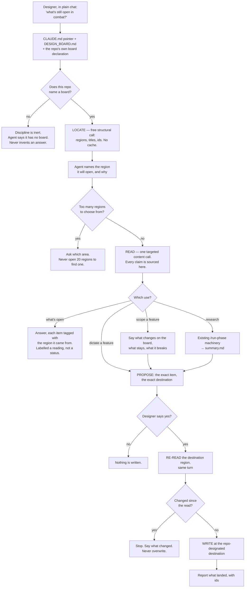

# The Game Design Board as Studio's Live Working Surface — Architecture Spec

## In Plain Language

A Game Design Board is a Miro board a designer keeps as the living version of a game design
document — mechanics, feel, art direction, what's decided and what's still up in the air, laid out
visually instead of written down in a file nobody opens.

Today Claude can't see it. You describe your game in chat, it helps, and the board sits in another
window going stale. This feature closes that gap: with a board connected, you work against it in
plain conversation. Ask what the board says about combat. Ask what's still open. Tell it a feature
is going to work a certain way and have it written onto the board. Send agents to research a
mechanic or an art direction and file the results where art lives. No command to type first — you
just talk, and the board is there.

Two rules keep it honest, and they're the whole design. **The board is the only place that says what
the game is** — Studio never keeps its own copy, because a copy starts lying the moment you move a
sticky. And **the agent never claims something about your game that it didn't just read.** Board
structure tells it *where* to look; only opening a region tells it *what's there*. Anything it can't
source, it says so rather than filling in.

## Architecture at a Glance



The flow has one shape and four uses hang off it. Everything starts with a free structural call that
returns addresses — region names, ids, types, never content. The agent picks a region, says which and
why, and only then spends a content read. That read is the sole source of any claim about the game.
Writing runs the same path in reverse: propose first, re-read the destination in the same turn, and
abort if it moved. The re-read is not caution for its own sake — Miro retired change notifications,
so re-reading is the *only* way to know you're not about to overwrite something the designer typed a
minute ago.

## How It Works (Technical)

### Components

| # | Component | Responsibility |
|---|---|---|
| 1 | **`studio/docs/DESIGN_BOARD.md`** (new) | The whole discipline: locate-then-read, structure-vs-content, same-turn re-read, propose-then-write, and the honesty rules. |
| 2 | **A conditional pointer in `studio/docs/CODING_PRINCIPLES.md`** (~3 lines) | Rides the existing CLAUDE.md injection into every consuming repo. Says: if this repo keeps a design board, the discipline is in `DESIGN_BOARD.md`. Inert otherwise. |
| 3 | **One entry in `SOURCE_FILES`** (`studio/install.py`) | Ships `DESIGN_BOARD.md` to consuming repos. `_collect_source_files` and the manifest follow for free. |
| 4 | **The repo's board declaration** (its own `CLAUDE.md`) | Names the board tool, the destination for agent writes, and optionally destinations by purpose. Written by the repo, read by the agent, parsed by nothing. |
| 5 | **The locate step** — the board tool's free structural call, per request | Decides which region to pull. No cache. Returns addresses, never content. |
| 6 | **The read step** — one targeted content call at the located ids | The only source of any claim about the game. Costs credits; justified aloud against the locate result first. |
| 7 | **The write step** — at the designated destination, after a same-turn re-read | The single write path shared by every write-shaped use. Proposes before it writes. |
| 8 | **A board-citation clause in `.claude/commands/spec.md`** | A spec cites the board region it was scoped against. It never copies the board, and `/spec` never writes to it. |

Components 5–7 are one capability used three ways, not three features. They are listed apart because
their failure modes differ, not because they ship separately.

### Interfaces and contracts

Studio's shipped text never names a vendor. It says *"a design board"*, *"the place the repo
designates"*, and *"the board's structural listing"*. The repo supplies every proper noun, in its own
`CLAUDE.md`:

```markdown
## Design board
This project keeps a Game Design Board in Miro (board id `xxx`), reachable through the Miro MCP tools.
Agent writes go to the frame titled "Claude — working". Research output goes to "Art & references".
An open question is marked with a magenta sticky.
```

Nothing parses that. It is prose the agent reads, exactly as `find-before-you-grep` has the repo name
its code index.

### Data model

There isn't one, and that is the point. Studio stores nothing about the board — no cache, no index,
no mirror, no state file. The board holds the game; the repo's `CLAUDE.md` holds three or four
sentences of wiring; every question is answered by a live read. The only durable Studio-side artifact
is a spec that *cites* a board region by name.

### Dependencies

- A board tool the agent can call, exposing a structural listing and a content read. Miro's MCP
  server is the reference implementation and the only one tested.
- Nothing else. No new Python module, no import, no subprocess, no wizard step, no config file Studio
  writes or parses.

### Failure modes

| Failure | What happens |
|---|---|
| Repo names no board | The discipline is inert. The agent says it has no board rather than answering from memory. |
| Board too large to choose a region | The agent asks which area rather than opening many regions to find one. |
| Destination region changed between read and write | The write aborts, and the agent says what changed. Never overwrites. |
| Designer never approved the proposal | Nothing is written. Writing is always proposed first. |
| Board tool unreachable or abandoned | The instruction goes inert. The repo's `CLAUDE.md` is the only thing needing an edit. |
| A claim can't be sourced to a region read this turn | The agent says so rather than filling in. |

## Key Decisions

**The board owns what the game is; `specs/` owns how the code is shaped.** The designer's first
instinct was one source of truth, the board, full stop. The argument that changed it: Studio's PR
review and its test-enforced verification gates only exist for files in git, and they matter most
when an agent is building unattended. So a spec *cites* a board region and never copies it. Nothing
is duplicated, and neither document answers the other's question.

**Reading and writing are one capability, not two features.** An early split into read / comment /
write / watch decomposed by mechanism. With a board connected, all four are the same thing used
differently, and splitting them would have produced units that each ship half a turn.

**No cached structural map.** The first design had the agent keep a cheap map of regions and ids and
pay only for targeted reads. It was cut on a verified fact: Miro's structural call consumes no AI
credits and only the content call does. The cache saved free calls while its own failure mode — a
lookup at a stale id — was the paid one. It cached the wrong side of the cost boundary, and with
change notifications retired it could never be invalidated anyway. Deleting it also removed two
open questions that existed only to support it.

**The repo designates where writes land — Studio does not.** A proposed "one agent-owned landing
frame" was cut because *frame* is a Miro noun, and shipping vendor nouns in Studio's text is what
this design exists to avoid. `find-before-you-grep` settled the pattern: naming the tool is the
repo's job.

**A dedicated doc, not a section of the coding principles.** The delivery vector was the hardest
call. A `/board` slash command was rejected — it needs a Python registry edit and carries permanent
rename debt, and it is the wrong ergonomic besides, since every use the designer described is typed
in plain chat. The tempting alternative was a new section inside `CODING_PRINCIPLES.md`, which ships
to every repo automatically with no Python at all. That was rejected too: at ~36 lines it would be
the largest section in a 119-line file about how to write code, injected always-on into ten repos
that mostly have no board. The chosen shape pays one line in `SOURCE_FILES` to put the discipline in
its own document, with a three-line conditional pointer riding the existing injection.

**"Prompt text only, zero Python" was never a rule.** It was asserted as a hard bar during this
debate, citing `find-before-you-grep`. That citation was wrong: the lines quoted sit under the
heading *"What Studio does not do"* and describe that one feature's footprint. Treating a report as a
constraint nearly bought a category error to satisfy a rule nobody set.

## Non-Goals / Cut Scope

- **The autonomous board watcher.** Out of scope by decision, and blocked by reality: Miro retired
  webhooks on 2025-12-05 with no replacement, so nothing can be notified a board changed. Any watcher
  must poll and diff. Build it last, if at all.
- **`board_open_questions` as its own build unit.** Cut. Its criteria all graded prose — an editor
  would pass them by reading the document it had just written while the designer's question stayed
  exactly as unanswerable. The capability survives inside unit 1 as a labelled reading.
- **`board_research_publish` as its own unit.** Cut. It exists to save a copy-paste.
- **A `[design_board]` table in `.studio/integrations.toml`.** Cut. It would ship five keys and a
  defaulting rule with no parser — Studio documenting a shape it does not own.
- **A "structured items only" write-type restriction as a separate rule.** Collapsed into the
  destination rule, which already guards the harm.
- **Any Studio-side copy, cache, mirror or index of board content.**

## Risks & Open Questions

**"What's still open" is the weakest capability here, and it ships labelled as such.** Nothing on a
free-form canvas distinguishes an open question from a decided one. If the repo states its marker,
the agent uses it. If not, the agent gives a reading and says plainly that it is a reading of what it
found, not a status it looked up. It never keeps its own open-questions list — that is the
duplication the source-of-truth decision forbids. **Open: how the designer actually marks something
undecided today.** The answer improves this capability; its absence does not block the build.

**Credit spend is bounded by discipline, not by machinery.** The structural call is free but the
content read is not, and nothing stops a chatty session from spending. The guard is that the agent
must justify each read against the structural listing first. That is a prompt-level discipline, and
prompt-level disciplines are exactly what no test can enforce — hence the Verification section.

**A second hop.** Putting the discipline in its own document means the agent reads a pointer and then
fetches the real text. That is a genuine cost of not inlining it, accepted deliberately.

**The contrarian rejected the depth proposal** on the delivery vector and the build plan, and this
spec is written to its cuts rather than around them. What survived untouched: locate-before-read,
structure-says-where, the same-turn re-read, propose-then-write, repo-names-the-tool, and the
Verification section below.

## Verification

This feature is prompt-shaped: no failing pytest can tell us it stopped working.

- **Pass criterion.** This works if and only if, in a repo that declares a design board, the agent
  (a) makes the free structural call and names the region it will open *before* any content read,
  (b) sources every claim about the game to a region it read in that turn, and (c) re-reads the
  destination region in the same turn before every write, with no write occurring that the designer
  did not see proposed first.
- **Baseline.** The same conversation with the discipline reverted: the agent either refuses, or
  reads broadly and answers from region titles, and writes without a proposal.
- **Where the evidence goes.** `specs/game-design-board-eval-results.md`, created at approval.
- **Stop condition.** While that file still says `FILL_ME`, nobody may call this feature working and
  this spec stays `status: approved`.

A warning worth carrying from the `find-before-you-grep` eval, which came back inconclusive for a
reason that applies here: a baseline arm is only a baseline if the behavior under test cannot reach
the agent by another route. Check what else in the session is telling the agent to read the board
before trusting the comparison.

## Build Plan

Two units. The five-unit plan from the debate was cut: four of them edited the same block of prose,
which would have meant four writer/editor passes over one document to split a capability the design
itself calls one thing.

### 1. `board_conversation` — a designer with a board can ask about their game and write to it in plain chat

Creates `studio/docs/DESIGN_BOARD.md` with the full discipline, adds the conditional pointer to
`studio/docs/CODING_PRINCIPLES.md`, and adds the one `SOURCE_FILES` entry that ships it. This is the
whole capability: reading, answering, and writing, including the labelled reading for "what's still
open".

**Acceptance criteria:**
- [ ] `studio/docs/DESIGN_BOARD.md` exists and states, in order: locate with the structural call before any content read; structure gives addresses and never content; every claim about the game is sourced to a region read this turn; re-read the destination region in the same turn before any write; propose the exact item and destination before writing; and say so plainly when something cannot be sourced.
- [ ] The discipline is conditional throughout — a repo that names no board behaves exactly as it does today, and a test asserts the shipped text contains no board-vendor product name (assert absence of the *category*, following `studio/tests/test_run_phase.py:161`, which names no tool).
- [ ] `studio/docs/CODING_PRINCIPLES.md` gains a pointer of three lines or fewer that names no vendor, and the file's existing sections are unchanged.
- [ ] `DESIGN_BOARD.md` appears in `SOURCE_FILES`, and a test asserts a fresh `install_studio` into a temp target puts the file on disk and records it in `MANIFEST.json`.
- [ ] `studio/docs/DESIGN_BOARD.md` states that agent writes go to the destination the repo designates, and that a repo may name further destinations by purpose, with everything falling to the default when it names only one.
- [ ] `cd studio && python -m pytest tests/ -q` passes and `ruff check .` from the repo root is clean.

**Out of scope:** the `/spec` citation clause, any research-publishing path, any `.studio/integrations.toml` schema, and any change to `SLASH_COMMANDS` or `WORKFLOW_FILES`.

### 2. `board_cited_spec` — a spec scoped from a board says which region it came from

Adds the citation clause to `.claude/commands/spec.md`. Depends on unit 1: there is nothing to cite
until the discipline exists.

**Acceptance criteria:**
- [ ] `.claude/commands/spec.md` instructs that when a spec is scoped against a design board, the spec names the board region it was scoped from, and that the spec never copies board content it could cite instead.
- [ ] The same clause states that `/spec` never writes to the board, so scoping stays read-only.
- [ ] The clause is conditional on the repo declaring a board and names no vendor; a run in a repo with no board is unchanged.
- [ ] `node --test .claude/workflows/tests/workflow-shells.test.mjs` passes and the doc-parity suite is green.

**Out of scope:** writing the spec to the board, publishing run summaries, and any change to `/forge`.
