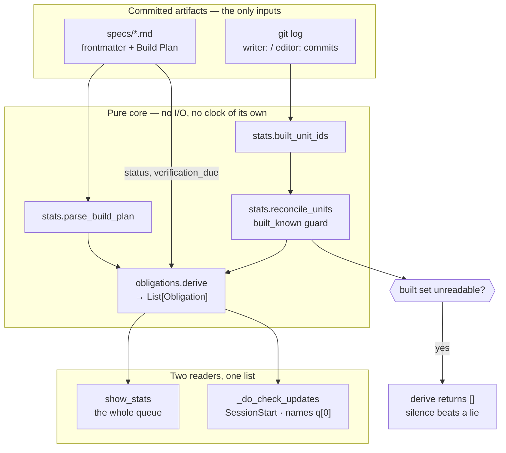

# Obligation Queue — Architecture Spec

## In Plain Language

Studio can already tell you one thing you owe: if an approved spec planned a unit of work and no
commit says it was built, the session brief names that unit and the command that builds it. That one
sentence is the most-used thing Studio has ever shipped, and the reason is not that it is clever. It
is that nobody has to remember to ask for it.

There are two other ways work goes unfinished here, and neither has a voice. A spec can have every
unit built, and any evidence it promised recorded, and still say `status: approved` in its
frontmatter, because flipping it to `shipped` is a separate edit somebody has to remember — and until
they do, `stats` leaves it out of the shipped-features block, so the record of what landed and what it
changed is missing a feature that did land. That happened three times in a single week. Separately, a spec
that promised evidence by a date can sail past it with the evidence file still blank; the test suite
goes red over it, but nothing tells you before you start work, when doing something about it is cheap.

This feature gives all three the same shape. An **obligation** is one thing this repository owes,
worked out fresh each time from the specs and the git history — never stored anywhere. Every
obligation knows the exact command or edit that discharges it, and the exact line you write in the
spec to close it on purpose instead. `stats` shows the whole list; the session brief names the single
most important one. Nothing new has to be remembered, because nothing new has to be asked for.

## Architecture at a Glance



Everything flows one way, from committed artifacts through a pure function to two readers. The
specs directory supplies what was planned and what each spec claims about itself; git supplies what
was actually built. `derive` turns those into a sorted list of obligations, and the two surfaces
differ only in how much of that list they show.

The guard at the bottom is the one that matters. When the built set cannot be read — no git, a
shallow clone, a directory that is not a work tree — every planned unit would read as unbuilt and
every spec as unfinished. `reconcile_units` already distinguishes "I cannot see" from "nothing was
built", and `derive` inherits that: it returns an empty list rather than a confident lie.

## How It Works (Technical)

**Components**

| Component | File | Responsibility |
|---|---|---|
| `Obligation`, `derive()` | **new** `studio/obligations.py` | Pure. Turns approved specs plus a reconciled ledger into a sorted list of obligations. No I/O, no paths, no git, no `date.today()` — the caller passes `today`. |
| `SpecView` | `studio/obligations.py` | One approved spec as the derivation needs to see it: slug, path, the frontmatter values it reads, and its planned units. Built by the caller that touches the filesystem. |
| `_collect_obligations()` | `studio/run_phase.py` | The one place I/O meets the pure core: reads the specs directory and git, builds `SpecView`s, calls `derive`. |
| `_unfinished_context()` | `studio/run_phase.py` | Narrows from "the next unbuilt unit" to "the top obligation". Same contract, same silence rules. |
| `show_stats()` | `studio/run_phase.py` | Prints the whole queue where the "Planned work" block is today. |

**Data flow — how one obligation is produced**

1. `_specs_dir_for(target)` resolves `specs/` in the Studio source repo, `.studio/specs/` in a repo that installed it.
2. Each `*.md` is read for frontmatter; specs whose `status` is not `approved` are dropped. This is the existing policy, unchanged — a shipped spec is finished work, and a draft is not yet a promise.
3. `parse_build_plan` yields the `PlannedUnit`s for each surviving spec, `Dropped:` lines included.
4. One `git log` call yields the built and escalated unit ids. This is today's call, unchanged.
5. `reconcile_units` produces the `UnitLedger`, unchanged.
6. `derive(specs, ledger, today=...)` returns the obligations, sorted by kind rank, then spec path, then subject.
7. `stats` prints all of them; the brief prints the first and says how many there are.

**Interfaces and contracts**

```python
# studio/obligations.py — pure, stdlib only, shipped in install.SOURCE_FILES

UNBUILT_UNIT     = "unbuilt_unit"
STALE_STATUS     = "stale_status"
EVIDENCE_OVERDUE = "evidence_overdue"

# Rank order, and the order the brief picks from. stale_status leads because a finished spec
# left at `approved` is missing from the shipped-features block — the only record of what
# landed and what it changed — and it is the cheapest of the three to discharge.
RANK = (STALE_STATUS, EVIDENCE_OVERDUE, UNBUILT_UNIT)


@dataclass(frozen=True)
class Obligation:
    """One thing this repository owes, derived — never stored.

    `command` is the exact line a reader can run, or "" when discharging this is an edit
    rather than a command. `silence` is the exact line to write in the spec to close it on
    purpose without doing it, so the way out is always in front of the reader — the part of
    today's brief that people actually use.
    """
    kind: str          # one of the three constants above
    subject: str       # a unit_id, or a spec slug for the spec-level kinds
    spec_file: str     # repo-relative path to the spec that defines it
    detail: str        # one plain sentence: what is owed, and why it is owed now
    command: str
    silence: str


@dataclass(frozen=True)
class SpecView:
    """One approved spec, as the derivation needs to see it."""
    slug: str
    spec_file: str
    status: str
    promises_evidence: bool          # True when the spec has a `## Verification` section
    verification_due: str            # the raw frontmatter value; "" when there is none
    evidence_is_blank: bool          # True when the results file is missing, unreadable, or still FILL_ME
    units: Tuple[PlannedUnit, ...]


def derive(
    specs: Sequence[SpecView],
    ledger: UnitLedger,
    *,
    today: date,
) -> List[Obligation]:
    """Every obligation these inputs imply, sorted by RANK, then spec_file, then subject.

    Returns [] — never a guess — when `ledger.built_known` is False. With no built set every
    planned unit reads unbuilt and every spec reads unfinished, so silence beats a lie. This is
    the same call `reconcile_units` already makes, inherited rather than re-decided.
    """
```

**Data model — what an obligation is**

An obligation is a value derived from committed artifacts at the moment it is asked for. It has no
identity, no lifecycle, and no storage. It exists exactly while the facts that imply it are true and
stops existing the moment they are not.

`stale_status` is gated on pending evidence because the frontmatter template defines `shipped` as
built *and* verified, and the spec-verification suite enforces the second half: rule 3 turns red on a
`shipped` spec whose evidence file still holds `FILL_ME`. A spec that is built but still waiting on
evidence before its deadline owes nothing yet — telling its reader to flip it would be telling them to
make an edit the suite rejects. Once the deadline passes, `evidence_overdue` names it instead.

Two edge cases are silent on purpose. An approved spec whose Build Plan yields no units produces no
`stale_status`: "every unit is built" is vacuously true of it, and a spec that planned nothing has not
been shown to be finished. An approved spec whose units are all `Dropped:` produces none either — it
was abandoned rather than shipped, and `shipped` would be a false claim about it. Neither produces an
`unbuilt_unit`, so both are simply absent from the queue.

| Kind | Derived from | Discharged by | Silenced by |
|---|---|---|---|
| `stale_status` | an approved spec plans at least one unit, every unit is built or dropped, at least one is built, and no evidence is pending — the spec has no `## Verification` section, or its evidence file is no longer blank | editing the frontmatter to `status: shipped`, with `shipped_impact` and `shipped_changed` | nothing — it is discharged or it is not |
| `evidence_overdue` | `verification_due` parses as a date on or before `today`, the spec is `approved`, and its evidence file is still blank | filling in the evidence file | moving `verification_due`, which is a visible edit |
| `unbuilt_unit` | an approved spec's Build Plan minus git's built set (`reconcile_units`, unchanged) | `/forge --spec <slug> --unit <unit_id>` | `- **Dropped:** YYYY-MM-DD — reason` |

**Failure modes**

| It cannot see… | What happens |
|---|---|
| git missing, not a work tree, shallow clone, or slow | `built_unit_ids` returns `None`, `reconcile_units` reports `built_known=False`, `derive` returns `[]`. The brief is silent, `stats` prints its existing "cannot read" line. Exactly today's behaviour. |
| a `verification_due` that will not parse as `YYYY-MM-DD` | Read as no deadline, the same way rule 6 of the spec-verification suite reads it (`_parse_due` returns `None`, and rule 6a reports the spec). No `evidence_overdue` fires, and because the evidence is still pending no `stale_status` fires either, so the queue says nothing about that spec while the suite is already red over it — the queue does not restate a failure the suite already reports. |
| a spec that will not parse | That spec contributes no `SpecView`. One bad file silences its own obligations and nothing else's — the per-source isolation `_do_check_updates` already uses so one bad spec cannot eat the update nudge. |
| no specs directory at all | No specs, no obligations, silence. This is every consuming repo that has not written a spec yet. |
| an evidence file that is missing or unreadable | Treated as blank, which is the safe direction: it can produce an obligation to look at, never a claim that evidence exists. |

**Dependencies**

Standard library only — `re`, `json`, `pathlib`, `dataclasses`, `datetime`. No `tomli` at any
version, because nothing here loads configuration. `obligations.py` joins `install.SOURCE_FILES` so
it ships to every consuming repo.

## Key Decisions

**Nothing is stored. Every obligation is derived on demand.** This is inherited from the completion
ledger, where it is not an efficiency choice but the safety property: a derived obligation degrades
to silence when the inputs cannot be read, while a stored one degrades to a row that still says
*owed* after the work has landed. The debate tested a stored queue and found no obligation that
needed one.

**`stale_status` leads the ranking.** A finished spec left at `approved` is not merely one item in a
list — `stats` leaves it out of the shipped-features block, so the count of shipped features, the
impact tally and the recent change lines all read as if it never landed, for as long as nobody flips
it. It is also the cheapest of the three to discharge. Both arguments point the same way.

**The judged obligations are out, and the reason is measured, not aesthetic.** Two of the five ideas
this started with needed a model to decide something rather than compute it: "this plan names a
feature nobody designed" and "this work moved documented behaviour". The second looked computable —
a unit's commits either touched a documentation path or they did not — and the debate spent most of
its length on it before the numbers settled it. See Non-Goals.

**`/forge` is not changed.** An earlier design had the writer/editor loop record whether a unit's pass
touched documentation, so the obligation would be a fact rather than a judgment. Deriving the same
thing from git needs no new artifact and cannot disagree with the commits — and once the doc-path
rule itself turned out to be the judgment, neither version survived. The loop stays as it is.

**The rules are not duplicated into shipped code.** A rejected design had `obligations.py` own a
`shipped_flip_is_legal()` predicate that the spec-verification suite would import, so the rules for a
legal `shipped` flip lived in one place. Rule 4 of that suite compares an evidence file against lines
parsed from `.claude/commands/spec.md` at import time, so the predicate could not be pure and could
not be the single source of truth. The obligation's `detail` line names what a spec still owes in
plain words instead, and the suite keeps its own rules.

## Non-Goals / Cut Scope

**No Stop hook.** The original shape had a blocking Stop hook alongside the brief, on the argument
that the brief fires at session start and therefore cannot name an obligation the session itself
created. That argument is structurally true and it still did not survive:

- Its only blocking condition was unreachable. The hook was to block only when flipping a spec to
  `shipped` would actually pass the suite — but rule 5 fires on `status == "shipped"` and demands
  `shipped_impact` and `shipped_changed`, which the spec template tells authors to leave empty until
  the flip. A predicate asking "would the flip pass before the flip's own edit" is False for every
  spec that will ever exist.
- Its notion of "this session" could not survive a compaction. The plan was to record the head commit
  at session start and treat later commits as this session's work. The installed SessionStart entry
  carries no matcher, so `compact`, `clear` and `resume` all re-fire it and rewrite that baseline
  mid-session — and two sessions in one repo would attribute each other's commits.
- It would have blocked on nothing in this repository today.

**No `docs_untouched` obligation.** This was to fire when a unit's commits touched no documentation
path. The idea survived two rounds and died on measurement. Under the doc-path rule the design
actually specified, **25 of 51 units** touch no doc path, **2 of them are planned by specs that say
`approved` today** (`board_cited_spec`, `static_checks_are_commands`), and the ongoing rate since
2026-08-01 is **4 of 22, not 0**. Two of those four are the classifier being wrong rather than work
being undone: one touched `CHANGELOG.md`, which the rule omits, and one touched a spec file, which
the rule deliberately excludes. Widening the rule until it reaches zero makes it satisfiable by
editing the spec you are building from; narrowing it fires on real finished work. The list of
documentation paths is a judgment wearing a tuple's clothes, so it belongs with the other judgments.

**No plan-mode detection of undesigned features.** Deferred deliberately at the pre-flight: deciding
what counts as a feature is the one irreducible judgment here, and a judged obligation needs an eval
and an evidence file before it is built, not after.

**No autonomy policy for unattended agents.** An unattended session still fires SessionStart, so the
brief already reaches it. What is actually missing there is a statement of what an agent may do
without a human, which is a different feature.

## Risks & Open Questions

**The value here is modest and should not be oversold.** What ships is the ledger learning two more
kinds of unfinished work and the brief naming the most important one. That is worth building —
`stale_status` alone cost real time three times in one week — but it is much smaller than the queue
this started as, and most of what was cut was cut on evidence rather than taste.

**Nothing here proves a surfaced obligation gets discharged.** Tests can prove the queue computes the
right obligations; they cannot prove anybody acts on one. The honest measurement is this repository's
own state later: `specs/game-design-board.md` is `approved` with both its units built, its evidence
file blank and its `verification_due` at 2026-11-15. It owes nothing the day this ships — it is waiting
on evidence, not on a flip — and becomes a live `evidence_overdue` obligation the day after its
deadline if the file is still blank. If it is still sitting there a month after that, naming it was
not enough and the Stop hook argument deserves another look. That is worth
watching, and it is not worth a pre-registered evidence file for a feature whose mechanics are all
testable.

**The contrarian rejected both rounds.** The second rejection is the reason this spec is one unit
rather than three, and its findings were independently re-measured before being accepted. Nothing in
the design above is still contested; what was contested was cut.

## Build Plan

### 1. `obligation_queue_core` — one list of what this repository owes, in `stats` and in the session brief

What gets built: a new `studio/obligations.py` holding `Obligation`, `SpecView` and a pure `derive`;
`_collect_obligations` in `run_phase.py` to feed it from the specs directory and git; `show_stats`
printing the whole queue where the "Planned work" block is today; and `_unfinished_context` naming
the top obligation instead of the next unbuilt unit. `obligations.py` is added to
`install.SOURCE_FILES`. Tests cover `derive` entirely through fixtures — no repo, no git, no clock.

**Acceptance criteria:**

- [ ] `python studio/run_phase.py stats` prints obligations of all three kinds, each with the spec that defines it and either the command that discharges it or the edit that does, and the `unbuilt_unit` entries carry the same information the "Planned work" block carries today.
- [ ] A spec whose every planned unit is built while its frontmatter still says `status: approved`, and which has no `## Verification` section or an evidence file that is no longer blank, produces exactly one `stale_status` obligation naming that spec, and producing it does not also report that spec's units as unbuilt.
- [ ] A spec with a `## Verification` section whose units are all built but whose evidence file is missing or still holds `FILL_ME` produces no `stale_status` obligation, and no obligation at all while its `verification_due` is after `today`.
- [ ] An approved spec whose Build Plan yields no units, or whose units are all `Dropped:`, produces no `stale_status` obligation; a spec whose `verification_due` does not parse as a date produces no `evidence_overdue` obligation.
- [ ] A spec whose `verification_due` is on or before the supplied `today`, with its evidence file missing or still holding the skeleton's placeholders, produces exactly one `evidence_overdue` obligation; moving the date past `today` removes it.
- [ ] The queue degrades to silence rather than to a guess: `derive` returns an empty list whenever `ledger.built_known` is `False` and the brief then prints nothing at all, while a spec that cannot be parsed removes only its own obligations and leaves both the other specs' obligations and the update nudge intact.
- [ ] The session brief names exactly one obligation — the first by `RANK`, then spec path, then subject — states how many there are in total, and never prints a list; with no obligations and no available update it prints nothing.
- [ ] `obligations.py` imports nothing outside the standard library and is listed in `install.SOURCE_FILES`, verified by the existing stdlib-only test and an install test.

**Out of scope:** the Stop hook, the `docs_untouched` obligation and its `Docs-exempt:` suppression,
any change to `/forge`, any change to the `git log` call, and any import of Studio code into
`tests/test_spec_verification.py`.
