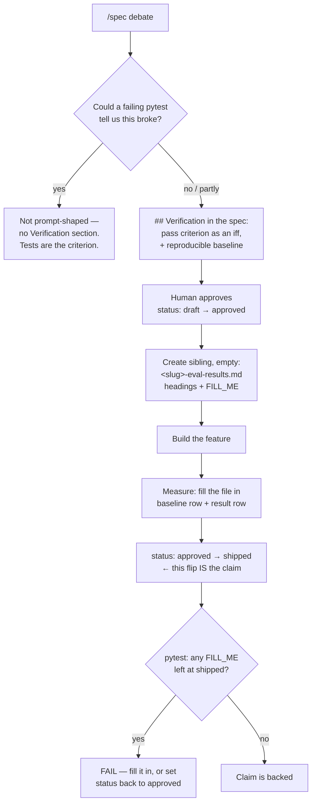

# Pre-committed Verification for Prompt-Shaped Features — Architecture Spec

## In Plain Language

Some of what Studio builds is prose. A mandate telling a critic to cut harder. A blacklist of clichés
a design agent must avoid. A passage giving a stuck writer permission to stop. For features like
these, tests can prove the words are present in the file. Nothing can prove the words *worked*.

Today that gap gets filled after the fact. Someone builds the prompt change, reads a couple of runs,
decides it seems better, and writes that up. The write-up picks the framing that flatters the result,
because it was written by the person who wanted the result — and nobody notices, because there was
never a stated criterion to fall short of.

This fixes it by pre-committing the shape of the answer before the answer is known. A spec for a
prompt-shaped feature states, up front, what would count as working — as an *if and only if* — and
names the behavior that must be reproducible *without* the feature. At approval time, an empty
evidence file is created beside the spec, with its headings already written, including one mandatory
section titled "What this doesn't prove." Filling that file in is what earns the right to say the
feature works.

A test backs it up. Flip a spec to `shipped` while its evidence file still says `FILL_ME` and the
suite goes red.

Being straight about the limit, because this spec would be a hypocrite otherwise: **the test does not
enforce that verification happened. It enforces that a claim of verification is backed.** Someone can
decline to flip the status and ship anyway. That hole is real, it is named in the Risks section, and
no amount of markdown closes it.

## Architecture at a Glance



The pre-commitment is the whole mechanism. The headings exist before the data, so the writer cannot
choose a structure that flatters the outcome, and "What this doesn't prove" cannot be quietly omitted
because it was written before anyone knew what there was to hide.

## How It Works (Technical)

### The judgment test: what counts as prompt-shaped

One question: **could a failing pytest tell us this feature broke?**

- **Yes** → not prompt-shaped. No Verification section; the tests are the criterion and a prose
  criterion beside them is theatre.
- **No** → prompt-shaped. Required.
- **Partly** → required, covering only the part no test can reach.

Applied to this repo's own history, so the test is grounded rather than abstract:

| Feature | Prompt-shaped? | Why |
|---|---|---|
| Design AI-slop blacklist | **Yes** | Its test is literally `assert "AI-slop blacklist" in instructions` — it proves the words arrived, not that design output got less generic. |
| Goodwill Reservoir score | **Yes** | Its own kill trigger — "the score is theatre, uncorrelated with human judgment" — is unreachable by assertion. |
| Contrarian editor mandate | **Yes** | Whether the contrarian actually cuts is a human read of the diff. |
| Named-scar anchors | **Yes** | The criterion is "the scarred regression stops recurring." No test observes that. |
| Doc-parity tests | **No** | The feature *is* a test. |
| Update nudge, staleness detection | **No** | Fully covered by pytest. |
| Delta-trend alerts | **No** | A pure function with unit tests. |
| Finding verifier | **Partly** | Its quote-only firewall is guarded structurally. Whether its *verdicts* are any good is prompt-shaped. |

**Who decides:** the `/spec` advocate proposes an answer; the contrarian's editor mandate already
covers both failure directions (a section that shouldn't be there, and a prompt-shaped spec quietly
omitting one); the human settles it at approval. No new role, no new pause.

### The `## Verification` template section

Inserted in `.claude/commands/spec.md` between `## Risks & Open Questions` and `## Build Plan`
(before line 156). Risks names what might be wrong, Verification names how you'd find out, Build Plan
hands off to `/forge` and stays last.

```markdown
## Verification
Required only for a **prompt-shaped** feature — one whose behavior lives in an agent's prompt, where
no test can tell you it broke. The test to apply: *could a failing pytest tell us this feature broke?*
If yes, delete this section — the tests are the criterion and this would be theatre. If the only
instrument is a person reading the output, keep it and fill it in.

- **Pass criterion.** This feature works if and only if <observable outcome>. Write it as an *iff*,
  now, before the build — so someone can disagree with it while disagreeing is still cheap.
- **Baseline.** The same behavior with the feature off. Say how to reproduce it on demand. If you
  can't make the old behavior fail, there's nothing here to improve on — treat it as a blocker and
  surface it.
- **Where the evidence goes.** `specs/<slug>-eval-results.md` (`.studio/specs/` in a consuming repo),
  created from the skeleton when this spec is approved.
- **Stop condition.** While that file still says `FILL_ME`, nobody may call this feature working and
  this spec stays `status: approved`. You set it to `shipped` when you fill the file in — that flip is
  the claim, and the spec-verification test is what makes the claim cost evidence.
```

Also: the frontmatter comment at `spec.md:111` becomes
`status: draft            # draft → approved (human approved it) → shipped (built AND verified)`.

### The evidence-file skeleton

Lives in `spec.md` **Step 4**, appended to the "On approval" bullet (line 172) — not in the spec
template, so the results markdown is never pasted inside the spec. Step 4 gains: create the sibling
now, empty, before any data exists; copy the criterion word for word; then run
`git check-ignore -q <path>` and if it exits 0, tell the user the evidence would never be committed.

No frontmatter on the skeleton — a second `status:` beside the spec's would be a drift risk for no
gain.

```markdown
# <Feature> — Verification Results

**Spec:** [`<slug>.md`](./<slug>.md). The pass criterion below was copied from that spec before
anything was measured. Don't edit it to match what happened — if it turned out to be the wrong
criterion, say so under "What this doesn't prove."

Every `FILL_ME` marks data that does not exist yet. Replacing one is the act of reporting. Deleting
one without replacing it — dropping a row or a section — is the failure these pre-written headings
exist to catch.

## Pass criterion (written before the build)
> _Copy the iff from the spec's Verification section, word for word._

## What happened
| Condition | What was run | Times | Criterion met | Notes |
|---|---|---|---|---|
| Baseline (feature off) | FILL_ME | FILL_ME | FILL_ME | FILL_ME |
| With the feature | FILL_ME | FILL_ME | FILL_ME | FILL_ME |

The baseline row should read "no". If the criterion was already met with the feature off, stop and
say so: a feature that fixes a problem you could never trigger has not been shown to do anything.

## What this doesn't prove
Required — this section is the point of the file.
- Did the criterion pass *as written*, un-rewritten after the fact? Name every number that moved the
  wrong way, cost included.
- What could a reader wrongly conclude from that table? At minimum: the sample size, the conditions
  you did not test, and the alternative explanation you can't rule out. "Nothing" is not an answer;
  if you can't name a limit, you haven't looked yet.

FILL_ME

## Verdict
One of **criterion met** / **criterion not met** / **inconclusive, and why**.

FILL_ME
```

**Why `FILL_ME` and not `<fill>`.** The obvious token was `<fill>`, and it is broken. It matches
CommonMark's raw-HTML-inline open-tag production, so a renderer parses it as a `<fill>` element and
GitHub's sanitizer drops it — verified with Python's `HTMLParser`, where `| <fill> | ok |` yields a
start tag and visible text of only `'| '` and `' | ok |'`. The token contributes **zero visible
characters**, so the file whose entire job is to look conspicuously unfinished would render as
complete. Every one of the 23 angle-bracket placeholders in this repo's tracked markdown sits inside
a code fence or span; this would have been the first bare ones, in table cells.

The distinction worth keeping straight: `<slug>`, `<Feature>` and the criterion are substituted at
creation and never survive. `FILL_ME` is *designed to survive* in a live file, so it must not be
tag-shaped. Zero collisions in the repo, greppable, loud.

**Why one table and four sections.** A first draft had six sections and two tables. "Read this table
honestly" and "What this does not show" were the same anti-flattery job written twice — nobody writes
two distinct answers to that, they write one and leave the other at the placeholder, which no test can
catch. And `## Baseline` and `## Result` carried identical columns in two tables, putting the
comparison that is the entire point on two different screens. One table with a `Condition` column
makes a "yes" in the baseline row's *Criterion met* cell self-evidently absurd — the null-baseline
check achieved structurally, with no prose and no machinery.

### The enforcing test

New file `studio/tests/test_spec_verification.py` — not an addition to `test_doc_parity.py`, whose
contract is "names the code defines must appear in the docs." This is doc↔doc completeness, a
different thing.

Path idiom: `Path(__file__).resolve().parents[2] / "specs"`. CI runs `pytest tests/ -q` with
`working-directory: studio`, so relative paths are out; `parents[2]` is the idiom `test_claude_code.py`
already uses.

A pure checker plus two kinds of caller, because the logic must be exercisable against synthetic
specs. Against the real directory alone it would be a green-checkmark trap: it passes today because
all five specs are out of scope, and would keep passing if the logic were inverted.

```python
_STATUSES = {"draft", "approved", "shipped"}
_RESULTS_SUFFIX = "-eval-results.md"
_FILL = "FILL_ME"

def _spec_files(specs_dir): ...          # *.md, excluding the -eval-results siblings
def _frontmatter_status(spec_text): ...  # the status: value, or "" if absent
def _has_verification_section(spec_text): ...  # prefix match on "## Verification"
def _violations(spec_name, spec_text, results_name, results_text): ...
```

`_violations` implements exactly three rules:

1. **Known status.** Must be in `{draft, approved, shipped}`. Without this, a typo (`Shipped`, `ship`,
   `done`) silently disables rules 2 and 3 forever while the suite stays green.
2. **Evidence has a home.** Verification section + `approved` or `shipped` → the sibling must
   **exist**. Existence only; a skeleton full of `FILL_ME` satisfies it. This is the
   approved-but-not-built tolerance, and it is the pre-registration — the whole borrowing.
3. **A claim costs evidence.** Verification section + `shipped` → the sibling must contain no
   `FILL_ME`.

`_has_verification_section` matches by **prefix**, not line equality, so `## Verification & Evidence`
is still gated. For a gate the forgiving reading is the correct one.

Rules 2 and 3 never fire without a Verification section, which is what leaves the five existing specs
untouched — all five report `approved` with no section, so the suite is green on today's tree.

**Callers:** `test_specs_dir_is_not_empty` (same defensive shape as `test_doc_parity.py`'s
`assert docs` — if `specs/` were renamed, every other check would silently pass while enforcing
nothing); `test_every_spec_satisfies_the_convention` over the real directory; and six synthetic cases
proving each rule fires *and* does not over-fire — shipped-with-`FILL_ME` fails, approved-with-missing-
sibling fails, unknown-status fails, **approved-with-`FILL_ME` passes** (the tolerance, asserted not
assumed), no-Verification ignored at any status, shipped-and-filled passes.

Rule 3's failure message, worded to leave two honest exits so nobody is cornered into deleting the
test:

```
specs/foo.md is marked `status: shipped`, but foo-eval-results.md still has 7 FILL_ME
placeholders — the first under '## What happened'. A results file still at FILL_ME is not
evidence. Either fill it in with what you actually observed, or set this spec back to
`status: approved` and stop describing the feature as working.
```

### Documents that change

| File | Change |
|---|---|
| `.claude/commands/spec.md` | frontmatter comment (111), the new section (before 156), the Step 4 approval bullet (172), one Key Rules bullet |
| `studio/docs/CODING_PRINCIPLES.md` | the §9 bullet below, after line 116 — ships to every installed repo via the sentinel block `install.py` builds |
| `CLAUDE.md` | the same bullet, **byte-identical, by hand**, after line 120 |
| `studio/docs/STUDIO_BRIDGE_TEMPLATE.md` §8 | the gitignore recipe below (ships in `SOURCE_FILES`) |
| `studio/docs/INDEX.md:15` | extend the `specs/` entry to name the `-eval-results.md` sibling |
| `studio/docs/CLAUDE_CODE_USAGE.md:482` | the `/spec` row gains the sibling |
| `README.md:389` and `:400` | test counts, set from a fresh collection (both currently say 823 against an actual 824, so both are already one behind) |
| `CHANGELOG.md` | one `[Unreleased] / Added` entry |

The §9 bullet, written once so it cannot drift between the two unguarded copies:

> - If the feature is **prompt-shaped** — its behavior lives in an agent's prompt, where no test can
>   tell you it broke — the spec also writes down how you would know it works: a pass criterion agreed
>   before the build, and a results file beside the spec that has to be filled in before anyone calls
>   the feature done.

The bridge-doc recipe, for consuming repos:

```markdown
- Studio's specs and their evidence files under `.studio/specs/` are **tracked docs meant to be
  committed** — unlike `.studio/output/` and `.studio/knowledge/`, which must not be. If your
  `.gitignore` ignores `.studio/`, git will silently refuse to track them, and the obvious one-line
  fix does not work: git cannot re-include a file whose parent directory is excluded, so
  `!.studio/specs/` under a `.studio/` rule does nothing. Use this form instead:

  ```gitignore
  .studio/*
  !.studio/specs/
  ```

  Confirm with `git check-ignore -v .studio/specs/`.
```

Both halves of that were reproduced in a scratch repo: the `.studio/` form leaves the file ignored;
the `.studio/*` form makes it addable while `.studio/output/` stays ignored.

**Deliberately not changed**, each checked: `install.py` (`spec.md` is already in `SLASH_COMMANDS`,
both docs already in `SOURCE_FILES`, so this ships with no list edit; and no `.studio/specs/` mkdir,
since `output/` and `knowledge/` exist because Python writes into them unprompted while a specs dir is
created by `/spec` when there is a spec). `API.md` — no new CLI surface. `/unstale` — it does not audit
`specs/` today; adding it is a real but separate idea that also collides with its own "don't create new
doc files" rule. `forge.md` — contains no reference to `/spec` or `specs/` at all; teaching `/forge` to
read its criterion is a separate future item. `ARCHITECTURE.md` and `README.md`'s layout tables omit
`specs/` entirely — pre-existing gaps, flagged not fixed.

## Verification

This feature is prompt-shaped by its own test, so it carries this section rather than exempting
itself. A pytest can tell us the *checker* broke. Nothing can tell us whether specs actually get
honest criteria — that is a human reading what `/spec` produces.

- **Pass criterion.** This feature works if and only if the next prompt-shaped spec written after it
  carries a pass criterion committed *before* its build, and its evidence file is filled in — with a
  non-empty "What this doesn't prove" — before anyone describes that feature as working.
- **Baseline.** The five specs in `specs/` today. All five describe features that shipped and merged;
  all five sit at `status: approved`; none carries a pass criterion; none has an evidence file.
  Reproducible on demand with `grep -H '^status:' specs/*.md` and
  `grep -l '## Verification' specs/*.md` (the second returns nothing).
- **Where the evidence goes.** `specs/prompt-feature-verification-eval-results.md`, created from the
  skeleton at approval.
- **Stop condition.** While that file still says `FILL_ME`, this feature is not working and this spec
  stays `approved`. The flip to `shipped` is the claim.

## Key Decisions

| Decision | Ruling | Why |
|---|---|---|
| Enforcement | A pytest | Studio's advantage over the source of this borrowing is that its rules are Python, not prose. |
| Scope | Prompt-shaped features only | For a code feature the section would restate the test plan, and padding teaches readers to skim. |
| How to tell approved from built | A third status, `shipped` | The recorded rule was self-contradictory: the sibling is *created* at approval full of placeholders, so failing on "approved + placeholder" fails on correct compliance. `approved` → must exist; `shipped` → must be filled. `shipped` is already Studio's word (`rate --shipped`). |
| Unknown status values | Rule 1 rejects them | Otherwise a stray capital letter disables the whole convention silently. |
| Placeholder token | `FILL_ME`, not `<fill>` | `<fill>` parses as an HTML tag and renders as nothing, so an unfilled file would look finished. |
| Skeleton size | Four sections, one table | Two of six sections were the same job twice; two tables with identical columns hid the comparison that is the point. |
| Consuming-repo specs | Stay in `.studio/specs/`, fixed by a doc note | Matches a decision this repo already recorded ("a doc note — `install.py` does no gitignore"). Moving them plants a Studio-shaped directory in someone else's root. |
| Ship a test to consuming repos? | No | `install.py` ships no `tests/` at all; a pytest landing in a repo with an unknown runner is worse than prose. |
| Retro-fit the five existing specs? | No | Writing a criterion after the outcome is known is exactly the flattery this prevents. |

## Non-Goals / Cut Scope

- **A `summary.md` skeleton.** Rejected upstream: it is a per-run debate artifact with no baseline and
  no arms, and its generator sits in a file already flagged for decomposition.
- **"Null baseline escalates to P0" as machinery.** The merged table carries that check structurally.
- **Pasting the results markdown inside the spec.** The spec names the criteria; the sibling holds the
  headings.
- **A text-equality check between the spec's criterion and the copy in the results file.** Heading and
  whitespace differences make it brittle, and a determined editor edits the spec instead. The back-link
  plus "don't edit it to match what happened" is the guard.
- **A CODING_PRINCIPLES mirror-parity test.** Real and worth doing — nine principles live in two
  unguarded copies, which is precisely the shape `test_doc_parity.py` was invented for — but it is a
  separate feature. Named, not built.
- **Teaching `/unstale` to audit `specs/`.** Separate, and it collides with that command's own rule
  against creating doc files.

## Risks & Open Questions

- **This enforces that a claim of verification is backed, not that verification happened.** Stated
  plainly because a spec implying a stronger gate than it has would be the exact flattery this feature
  exists to stop. The only trigger is a human typing `shipped`. Decline to type it and the feature
  ships anyway with the suite green.
- **And the evidence says that is the default.** All five existing specs are shipped-in-reality and
  all five sit at `approved`. Nobody has ever advanced a spec past approval in this repo. That is why
  the template names the flip explicitly — but naming it is persuasion, not enforcement, and it may
  not be enough.
- **Dodge by omission.** A prompt-shaped feature simply doesn't add the section. Judgment calls cannot
  be linted; the contrarian and the human at approval are the only guards, which is why the written
  test has to be applicable in thirty seconds.
- **Filler with no placeholder in it.** "N/A", "see the PR", "worked fine" all pass rule 3.
  Undetectable in principle.
- **The `## Verification` heading becomes a load-bearing literal.** Reword it and rules 2–3 stop
  firing. This is not the anti-pattern of asserting prompt prose against the module that defines it —
  here two independent artifacts must agree and the heading is the interface, the same shape as the
  existing doc-parity test asserting a table header.
- **The measurement for whether this whole tier is worth keeping already exists** and should not be
  duplicated: the scorecard trigger — two shipped features with unfilled results files means the
  convention is decoration, so either enforce the stop condition or delete the tier. Check it at the
  next cadence review.

## Build Plan

**U1 — the convention exists and produces both files.** `spec.md` (four edits), the §9 bullet in
`CODING_PRINCIPLES.md` and its hand-mirror in `CLAUDE.md`, the bridge-doc recipe.
*Usable alone:* the next `/spec` on a prompt-shaped feature produces a written criterion and an empty
evidence file with "What this doesn't prove" already in it — the whole point of the borrowing, working
with no test at all.
*Verify:* this spec's own approval exercises it end to end — approving it creates
`specs/prompt-feature-verification-eval-results.md` from the skeleton. That replaces a throwaway
temp-dir rehearsal with a tracked artifact, and makes the convention's first customer the feature
itself. Existing 824 tests still green.

**U2 — the claim costs evidence.** `studio/tests/test_spec_verification.py`.
*Usable alone:* flipping a spec to `shipped` with unfilled evidence fails CI.
*Verify:* green against the real five. Then the six synthetic cases, each asserted to fail *and* the
tolerance case asserted to pass — a test whose negative branch was never observed is the
green-checkmark trap `/detest` hunts. Then hand-mutate: invert rule 3's condition and confirm a
synthetic case goes red.

**U3 — the record.** `CHANGELOG.md`, the two `README.md` counts set from a fresh collection,
`INDEX.md:15`, `CLAUDE_CODE_USAGE.md:482`.
*Verify:* `pytest -q` count matches what the README claims; doc-parity green.

One sequencing note: marking Phase 4 done in `studio/docs/SUPERPOWERS_COMPARISON.md` cannot happen
here — that document lives only on the unmerged `docs/superpowers-study` branch. Either that merges
first and U3 folds the update in, or it is a one-line follow-up afterwards.
