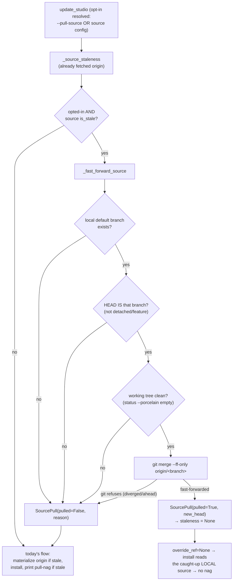

# Opt-in Source Fast-Forward for `/studio-update` — Architecture Spec

## In Plain Language

You develop Studio in one repo and use it from many others. When you merge a change on GitHub, the
"official" Studio moves forward — but the copy on your laptop (the one every other project actually
reads from) doesn't, until you remember to `git pull` it. You rarely do. So the next time any project
runs `/studio-update`, it correctly notices the source is behind, quietly installs the newer code
straight from the remote, and reminds you to go pull your source by hand. You don't, and it happens
again the next time. That reminder has never stuck — it's the recurring friction behind "I keep
having installation issues."

This feature lets you tell Studio, once, "when my source checkout is safely behind, just catch it up
for me." You set a single line in a config file on your machine, and from then on `/studio-update`
fast-forwards your source checkout to the latest before installing — so the source is genuinely
current and the nag stops. There's also a one-off `--pull-source` flag if you'd rather opt in per
run instead of setting the config.

It is deliberately timid about touching your git repo. It only ever does a **fast-forward** (the
safe kind of pull that just slides your branch forward to match the remote — never a merge, never a
force, never resolving conflicts). And it only does that when your source is clean, sitting on its
main branch, and simply behind the remote. If anything is off — uncommitted changes, you're on a
feature branch, your local work has diverged — it does nothing to your repo and falls back to
exactly today's behavior: install from the remote and print the manual pull hint. `check-install`
never pulls anything; a check stays a check.

## Architecture at a Glance



**Walk-through.** `update_studio` already calls `_source_staleness`, which fetches the source's
`origin` and reports whether the local default branch is behind. This feature adds one decision right
after: if the user opted in (via the `--pull-source` flag or the source's config) *and* the source is
stale, it calls `_fast_forward_source`. That helper runs a short gauntlet of safety checks and, only
if all pass, does a single `git merge --ff-only`. On success the local source is now current, so the
code sets `staleness = None` — which makes the rest of the existing flow read from the caught-up local
tree and skip the "go pull your source" nag entirely. On any skip (or when not opted in), nothing is
mutated and the code falls through to exactly today's behavior.

## How It Works (Technical)

All new logic lives in `studio/install.py` (mirroring the shipped `_source_staleness`), plus one CLI
flag and one output block in `studio/run_phase.py`. Stdlib only. Every new helper is best-effort and
never raises, matching the existing safety contract.

### Components / modules

- **`_source_auto_pull_enabled(source_dir: Path) -> bool`** (new, `install.py`). Reads
  `[update] auto_pull_source` from the source repo's own config and returns whether auto-ff is on.
  ```python
  def _source_auto_pull_enabled(source_dir: Path) -> bool:
      top = _git_out(source_dir, "rev-parse", "--show-toplevel")
      if top is None:
          return False
      config_path = Path(top) / ".studio" / "update.toml"
      if not config_path.is_file():
          return False
      try:
          with config_path.open("rb") as handle:
              data = tomllib.load(handle)
      except (OSError, tomllib.TOMLDecodeError):
          return False
      section = data.get("update")
      return bool(section.get("auto_pull_source", False)) if isinstance(section, dict) else False
  ```
  **Location is load-bearing:** the config lives in the SOURCE repo's top-level `.studio/`, found via
  `git rev-parse --show-toplevel` on the resolved `source_dir`. It is NOT read from
  `get_artifact_root()` (the consumer) or `get_studio_root()` (the installed snapshot) — a known
  cross-repo gotcha. Needs `from config_loading import tomllib` (the single shared loader).

- **`SourcePull`** (new frozen dataclass, `install.py`) — trimmed to exactly what the caller and
  output use:
  ```python
  @dataclass(frozen=True)
  class SourcePull:
      pulled: bool               # did the fast-forward happen
      reason: Optional[str]      # why it was skipped (None on success)
      new_head: Optional[str]    # short sha the source now points at (None if not pulled)
  ```

- **`_fast_forward_source(source_dir: Path, staleness: SourceStaleness) -> SourcePull`** (new,
  `install.py`). Performs the ff only when every precondition holds; mutates nothing otherwise. Never
  raises. Reuses `staleness` (origin already fetched, `behind` already counted) — no extra network.
  Precondition order:
  1. **local default branch exists** — `_default_branch_ref_local(source_dir)` (never `origin/*`).
  2. **HEAD is that branch** — `git rev-parse --abbrev-ref HEAD` equals it. *This is the load-bearing
     safety guard:* `staleness.is_stale` is computed on the local `main` vs `origin/main` regardless
     of where HEAD actually sits, so a detached HEAD (mid-rebase) or a feature branch could be
     "stale" while a blind `merge --ff-only origin/main` would move the wrong thing. This check
     refuses that. (It also subsumes a mid-rebase check — a rebase leaves a detached HEAD.)
  3. **clean working tree** — `git status --porcelain` empty. Kept deliberately simple ("any output →
     skip"): the source repo gitignores `.studio/`, `studio/output/`, `studio/knowledge/`, `.scratch/`,
     so ordinary clutter (including `update.toml` itself) never falsely blocks the ff. A conflicted
     merge leaves a dirty tree, so this also catches mid-merge state.
  4. **fast-forwardable** — `git merge --ff-only origin/<branch>`. `_git_out` runs with `check=True`
     and returns `None` on any non-zero exit; git refuses a non-fast-forward (diverged/ahead, or a
     lingering `MERGE_HEAD`) with a non-zero exit and leaves HEAD and the tree untouched. So a refused
     ff is a guaranteed no-op → skip. This covers the "also ahead / diverged" case that
     `staleness` (behind-only) doesn't measure.

  On success it captures `git rev-parse --short HEAD` as `new_head` and returns
  `SourcePull(pulled=True, reason=None, new_head=...)`.

### Data / control flow

In `update_studio`, insert between the existing `staleness = _source_staleness(...)` line and the
`override_ref = ...` line:

```python
staleness = _source_staleness(source_dir, fetch=fetch) if enabled else None

# Opt-in: fast-forward the user's OWN source checkout when it is cleanly behind
# origin, so consumers stop getting the recurring "go pull it yourself" nag.
do_pull = enabled and (pull_source or _source_auto_pull_enabled(source_dir))
source_pull = None
if do_pull and staleness and staleness.is_stale:
    source_pull = _fast_forward_source(source_dir, staleness)
    if source_pull.pulled:
        # Source is now current: read the caught-up LOCAL tree (override_ref
        # becomes None below) and clear staleness so the rest of the flow no
        # longer forces a reinstall-from-origin or prints the manual-pull nag.
        # The pull is reported separately via source_pull.
        staleness = None

override_ref = staleness.remote_ref if (staleness and staleness.is_stale) else None
```

- **On successful ff:** `staleness = None` ⇒ `override_ref = None` ⇒ `_source_at_default_branch` takes
  its clean-tree fast path and yields `source_dir` unchanged (`source_note = None`) ⇒ the install
  reads the caught-up **local** tree, and the up-to-date short-circuit (`status["up_to_date"] and not
  (staleness and staleness.is_stale)`) correctly no-ops when the consumer is already current — the old
  false-noop bug does not reappear, because the source really is current now.
- **On opted-in-but-skipped (`pulled=False`):** `staleness` stays intact ⇒ `override_ref = origin/main`
  ⇒ exactly today's install-from-origin path, plus `source_pull.reason` explains why we couldn't pull.
- **Not opted in:** `source_pull` stays `None`; behavior is byte-for-byte unchanged.

`asdict(source_pull) if source_pull else None` is added to the result dict at **all three** return
points inside the `with` block (up-to-date short-circuit, blocked-on-local-edits, success).

### Interfaces & contracts

- **`update_studio(target, studio_dir=None, force=False, fetch=True, install_hook=True, pull_source=False)`**
  — one new boolean param. `pull_source=True` forces the pull on; when False, the source config decides.
- **CLI:** a single `--pull-source` flag (`store_true`) on the `update` subparser. `_do_update` passes
  `pull_source=getattr(args, "pull_source", False)`. No `--no-pull-source` (see Cut Scope).
- **Output (`_do_update`):** the success case is a new block reading from `source_pull`; both
  not-pulled cases reuse the **existing** staleness nag, with one extra `reason` line prepended when an
  opted-in pull was skipped:
  ```python
  source_pull = result.get("source_pull")
  staleness = result.get("staleness")
  if source_pull and source_pull["pulled"]:
      print(f"Fast-forwarded your Studio source to {source_pull['new_head']}; "
            "your local checkout is now current.")
  else:
      if source_pull and source_pull["reason"]:
          print(f"Wanted to fast-forward your Studio source but couldn't: {source_pull['reason']}.")
      if staleness and staleness["is_stale"]:
          source_dir, _ = _resolve_source_dir(target, None)
          print(f"Studio source was {staleness['behind']} commit(s) behind {staleness['remote_ref']}; "
                f"installed from {staleness['remote_ref']} instead of the stale local copy.")
          print(f"Catch your source up:  git -C {source_dir} pull")
  ```
  The success path reads **only** from `source_pull` — never from `staleness`, which is `None` after a
  pull.
- **`check-install` is untouched** — read-only, keeps reporting staleness + the manual hint.

### Data model

One new config file, `<source-repo-top>/.studio/update.toml`, read-only from Studio's side:
```toml
[update]
auto_pull_source = true
```
It lives in the source repo's gitignored `.studio/`, so it is a per-machine developer preference that
persists locally and is never committed. `SourcePull` is an in-memory per-invocation value object. No
changes to `VERSION`, `MANIFEST.json`, or any on-disk install format.

### Dependencies

- Existing `install.py` helpers: `_source_staleness`, `_default_branch_ref_local`, `_git_out`,
  `_source_at_default_branch`, `_resolve_source_dir`, `install_studio`.
- `config_loading.tomllib` (the shared TOML loader).
- `git` on `PATH` (already assumed). No new network beyond the fetch `_source_staleness` already does.

## Key Decisions

1. **Source-side config, set once** (settled). `[update] auto_pull_source` in the SOURCE repo's
   `.studio/update.toml`. Every consumer resolves the same source via `VERSION.source_path →
   source_dir → git rev-parse --show-toplevel`, so one line on the source checkout covers all
   consumers on that machine — which is what actually stops the recurrence. Verified: the file is
   gitignored, so it's correctly a per-machine preference.
2. **`update` only; `check-install` stays read-only** (settled). A check must never mutate a git repo.
3. **Fast-forward only, inside a strict safety envelope** (settled + hardened by the debate). The four
   preconditions, in order, with `merge --ff-only` as the final load-bearing guard (git itself refuses
   anything non-fast-forward and leaves the repo untouched). `HEAD == default branch` is the guard that
   makes it safe when HEAD is detached or on a feature branch — called out because `is_stale` alone
   doesn't protect against it.
4. **Clear `staleness` on a successful pull** (contrarian-endorsed simplification). One assignment
   makes `override_ref`, the no-op short-circuit, and the existing nag all treat the source as fresh,
   instead of threading a new flag through three conditions. The cost — success output must read from
   `source_pull`, not the now-`None` `staleness` — is a stated contract.
5. **Reuse `_source_staleness`; no extra network** (settled). The staleness check already fetched
   origin and counted `behind`; the ff runs against that.
6. **Single `--pull-source` flag, no tri-state** (contrarian cut). The config is already opt-in
   (default off); a flag to *suppress* a setting the user deliberately turned on is speculative.
   `do_pull = enabled and (pull_source or _source_auto_pull_enabled(source_dir))`.
7. **`SourcePull` trimmed to three fields** (contrarian cut). `behind`/`remote_ref` were only there to
   feed output that the success message doesn't need; `new_head` is kept as a cheap confirmation of
   where the mutated repo now points.

## Non-Goals / Cut Scope

- **`--no-pull-source` and the tri-state `Optional[bool]`** — cut. The CI-skip scenario is invented;
  a single enable flag plus an opt-in config is enough for a single-user dev tool.
- **Scaffolding `update.toml`** via `init`/`setup` — out of scope. Those run against *consumer* repos;
  the config lives on the developer's *source* checkout, set once by hand. Documented, not auto-written.
- **Anything but a fast-forward** — no merge, no rebase, no force, no conflict resolution, no
  auto-commit, no stashing. If it isn't a clean ff, Studio does nothing to the repo.
- **Pulling a non-`origin` remote, a non-default branch, or a shallow/detached source** — all resolve
  to "skip + fall back," never a pull.
- **`SourcePull.behind` / `remote_ref` fields** — cut (duplicated `staleness`).

## Risks & Open Questions

- **It mutates the user's git repo.** This is the whole point, but it's why the envelope is strict and
  ff-only. The residual TOCTOU window (clean-tree checked, then ff) is negligible for a single-user dev
  tool, and `--ff-only` can't produce a merge commit even if it lost the race.
- **`enabled` gating (D5).** The pull only runs when the source was auto-resolved and resolved cleanly
  (`enabled = auto_resolved and warning is None`), same as staleness detection. So `--pull-source`
  against an explicit `--studio-dir` or an unresolvable source does nothing — by design, but worth
  naming so it isn't mistaken for a bug.
- **`--no-fetch` + opt-in (D3).** With `--no-fetch`, the ff runs against the last-fetched `origin/main`
  — still a safe, local, no-network fast-forward. Chosen: honor the offline intent and ff to what we
  have.
- **Origin advances after the staleness fetch (D4).** The ff targets the ref captured at fetch time; if
  origin moved again since, we ff to what we fetched and the next `update` catches the rest. Accepted.

## Build Plan

Build as MVI units, in dependency order. Hermetic tests (local bare remote + clone as source + temp
consumer), reusing the `_source_staleness` fixture pattern.

1. **Config reader.** `_source_auto_pull_enabled` + the `tomllib` import. Tests: true when
   file/table/key present; False for missing file, missing `[update]`, missing key, malformed TOML,
   non-git dir. *Usable outcome:* Studio can read the opt-in from a source checkout.
2. **Fast-forward helper.** `SourcePull` + `_fast_forward_source`. Tests: opted-in + behind + clean +
   on-main → `pulled=True`, source HEAD == origin, no merge commit (HEAD has one parent); dirty →
   skip; feature branch/detached → skip; diverged/ahead → skip. Each asserts HEAD unchanged on skip.
   *Usable outcome:* a safe ff primitive, testable in isolation.
3. **Wire into `update_studio`.** The `pull_source` param, the decision + placement, `staleness=None`
   on success, `source_pull` in all three return dicts. Tests: config-behind → ff happens, install
   reads local (`source_note is None`), no nag; opted-in + dirty → today's origin path; not opted-in →
   unchanged; `--pull-source` overrides absent config; `--no-fetch` + opt-in → cached ff. *Usable
   outcome:* `update_studio(pull_source=True)` catches a clean source up end to end.
4. **CLI + output.** `--pull-source` on the update subparser; the `_do_update` success block + the
   reused nag with the extra `reason` line. Output tests for pulled / couldn't / not-opted-in.
   *Usable outcome:* `studio update --pull-source` works from the command line.
5. **Docs.** `API.md` (the `--pull-source` flag + `update.toml` shape and its source-side location) and
   a one-line CLAUDE.md / CHANGELOG mention. *Usable outcome:* the opt-in is documented where users
   will look.
