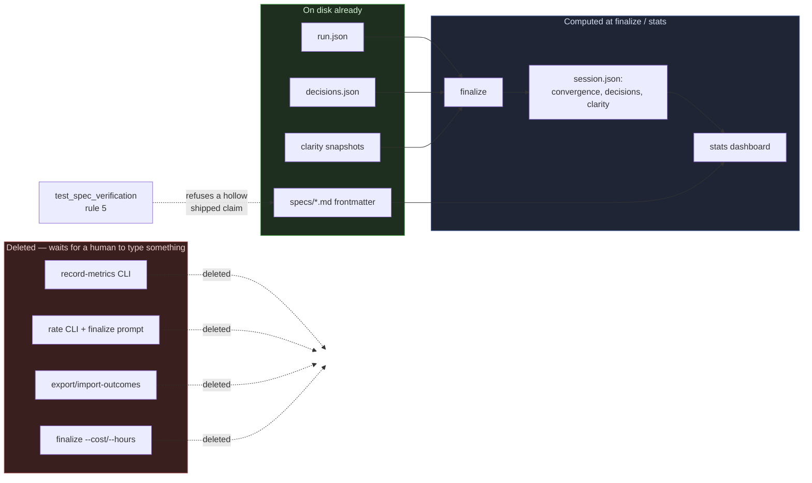

# Retire the Volunteer-Fed Metrics — Architecture Spec

## In Plain Language

Studio measures itself in two different ways, and only one of them works.

The first way is automatic: when a run finishes, Studio reads the files the run just produced and
counts what it finds — how many rounds the debate took, how many questions were surfaced and
answered, whether the contrarian rejected anything. That half has complete coverage on every run
ever done, and it has earned its keep. One rejected verdict killed a bad feature before a line of it
was written.

The second way asks a person, or an agent, to stop and type a number in. Rate this run one to five.
Record how many tokens that agent used. Tell us whether the work shipped. **In five months, across
ten repositories and roughly 150 runs, that second half has collected nothing at all** — not one
rating, not one token count. One of those steps is even marked "MANDATORY, DO NOT SKIP" in the
instructions every agent follows, and it was skipped in six runs out of six. Two of the numbers on
the dashboard are worse than empty: they are computed from missing data and print a confident,
wrong answer.

So this change deletes the asking. Every command, flag, and dashboard block that waits for someone
to volunteer a number goes away. In its place, the one question actually worth answering — *did this
feature ship, and what did it change?* — moves to a document you are already editing at exactly the
moment you know the answer: the feature's own spec, when you flip it to `shipped`. Two new lines in
that file's header, and a test that refuses the flip if they are blank. The dashboard then reads
those lines off disk like everything else it reports.

The rule this follows, and the one to hold future additions to: **a metric exists only if `finalize`
can compute it from files already on disk.**

## Architecture at a Glance



Everything on the left is a channel that asks someone to supply data, and every one of them is
removed. Everything the dashboard reports afterward is derived from a file that already exists:
`run.json`, `decisions.json`, and the clarity snapshots feed `session.json` at finalize; spec
frontmatter feeds the new shipped-features block directly. The dotted line is the only piece of
enforcement in the design — the existing spec-verification test gains one rule, so a spec cannot
claim `status: shipped` while its two outcome lines sit empty.

## How It Works (Technical)

Six modules change. Every line reference below was opened and read in the worktree.

### `studio/run_phase.py` — CLI entrypoint

Smaller in surface, unchanged in kind. It no longer accepts, stores, or forwards any
human-supplied measurement.

| What goes | Where |
| --- | --- |
| `_summarize_metrics`, `detect_trend_alerts`, `summarize_outcomes`, `VALID_SHIPPED`, `VALID_IMPACT` imports | `:88-95` |
| `"record-metrics"`, `"show-metrics"` in `SUBCOMMANDS` | `:222` |
| `"rate"`; the `export-outcomes`/`import-outcomes` line | `:223`, `:224` |
| `get_outcomes_ledger_path`, `get_configured_ledger_path` | `:380-392`, `:395-421` |
| `- Hours: … \| Cost: …` in the run log | `:748` |
| `_ordered_advocate_word_counts` (feeds editor liveness only) | `:1491-1499` |
| `_write_session_record`'s `metrics_entries` + `advocate_word_counts` params and forwarded args | `:1507`, `:1535-1536` |
| `finalize`: `--hours`/`--cost` writes; metrics aggregation; ledger append; the "Agent metrics:" print; the rating prompt call | `:1571-1574`, `:1577-1580`, `:1586`, `:1588-1591`, `:1660-1662` |
| `_maybe_append_to_ledger` | `:1685-1714` |
| argparse `--hours`, `--cost`, `--no-rate-prompt` | `:1886-1900` |
| `record-metrics`, `show-metrics`, `rate`, `export-outcomes`, `import-outcomes` parsers | `:2159-2220` |
| `stats` parser help string (says "efficiency") | `:2223` |
| `_load_metrics`, `_save_metrics`, `record_metrics`, `show_metrics` + banner | `:2518-2604` |
| `_load_rating`, `_write_rating`, `record_rating`, `_prompt_for_rating` | `:2611-2618`, `:2635-2733` |
| the seven ledger/outcome helpers | `:2736-2855` |
| `show_stats`: `_rating` enrichment, ledger read, outcome merge | `:2869`, `:2890-2897` |
| `_dispatch` branches for the six retired commands | `:3425-3436` |

**`VALID_IMPACT` leaves the import list too.** Its only use is the `rate` parser's `--impact`
choices at `:2193`, which this change deletes; the vocabulary check moves into the test, which
imports it from `stats` directly. Leaving it would be an unused import and `ruff` F401 would fail
the build gate this spec sets for itself.

Two functions are added — the only new I/O in the change:

```python
def get_specs_dir() -> Path:
    """Where /spec writes specs: repo-root specs/ here, .studio/specs/ in a consuming repo."""
    artifact_root = get_artifact_root().resolve()
    studio_root = get_studio_root().resolve()
    if artifact_root == studio_root:
        return studio_root.parent / "specs"
    return artifact_root / ".studio" / "specs"
```

The `.parent` is load-bearing and easy to get wrong: in the source repo `get_artifact_root()`
returns the **`studio/` directory**, not the repo root (`:315-327`), while `specs/` sits beside
`studio/`. That is why `test_spec_verification.py:29` reaches for `parents[2]`. The branch is taken
off the artifact root, never the studio root — the documented cross-repo trap in a new place.

`_shipped_spec_records()` globs that directory for `*.md`, skips `*-eval-results.md`, parses each
frontmatter block, and returns one record per spec whose `status` is `shipped`.

### `studio/stats.py` — pure aggregation

Still pure, still the only place numbers are crunched. It loses every series a human had to feed.

| What goes | Where |
| --- | --- |
| `VALID_SHIPPED` | `:16` |
| `summarize_outcomes` (replaced) | `:20-69` |
| tokens-per-settled-decision block + return key | `:134-148`, `:168` |
| editor-liveness block + return key | `:150-158`, `:169` |
| `MIN_CONSECUTIVE_REGRESSIONS`, `MIN_RELATIVE_CHANGE` | `:207-215` |
| `_rating_score`, `_run_tokens`, `_run_cost`, `_TREND_METRICS` | `:218-245` |
| `_trailing_regression_streak`, `detect_trend_alerts` | `:248-326` |
| `_summarize_metrics` | `:329-356` |
| `aggregate_stats` token/cost/hours accumulators + returns | `:397-402`, `:420-432`, `:467-473` |
| `aggregate_stats` rating accumulators + `ratings` return block | `:394-395`, `:434-444`, `:461-466` |
| `_format_outcomes` (replaced) | `:483-513` |
| the two session-health lines for tokens and liveness | `:557-570` |
| `_fmt_metric_value`, `_format_trend_alerts` | `:590-614` |
| `format_stats`: `trend_alerts` param, alerts block, ratings block, Efficiency block | `:623`, `:644-645`, `:654-667`, `:672-682` |
| the outcomes call in the **zero-runs early return** | `:633-634` |

That last row is easy to miss and would leave a hole: `format_stats` has a second, separate
`_format_outcomes` call inside its `if agg["total_runs"] == 0:` branch, with its own guard and a
comment about a cross-repo ledger that no longer exists. Rewire it to `shipped_specs` and drop the
comment, so a repo with shipped specs but no finalized runs — the state right after `/spec` lands
somewhere new — shows its features instead of only "No local runs found yet."

Added: `parse_frontmatter(text) -> Dict[str, str]` (pure), and `summarize_shipped_specs` /
`_format_shipped_specs`.

### `studio/session.py` — the `session.json` builder

Builds a health record with three sections — convergence, decisions, clarity — each derived from
files finalize already has open.

| What goes | Where |
| --- | --- |
| `from stats import _summarize_metrics` | `:24` |
| `_summarize_cost` (whole function) | `:72-101` |
| `_summarize_editor` (whole function) | `:104-131` |
| `metrics_entries` + `advocate_word_counts` params and defaults | `:149-150`, `:163-164` |
| `"cost"`, `"editor"`, and `"outcome": None` keys | `:190-192` |

`outcome` goes with them. Its own docstring (`:159-161`) calls it "the only field a human ever edits
later" — the same volunteer channel by another name, and outcome capture now lives in spec
frontmatter. Deleting it removes the second place a reader could go looking.

### `studio/setup.py` — the post-install wizard

No longer writes `.studio/scopes.toml` in any mode.

| What goes | Where |
| --- | --- |
| the `scopes` step in `SETUP_STEPS` | `:33` |
| `_load_default_scopes` | `:170-192` |
| `_format_scopes_toml`, `apply_scopes` | `:654-669`, `:672-704` |
| the `apply_scopes` call in `apply_defaults` | `:762` |
| the `scopes` branch in `apply_from_answers` + docstring line | `:781`, `:816-821` |
| the Scopes block in `show_status` | `:903-912` |

`CURRENT_SETUP_VERSION` stays at 4. `pending_steps` (`:92-100`) looks each `SETUP_STEPS` name up in
saved state, so a stale `completed_steps["scopes"]` in ten repos' `SETUP.json` is inert — no
migration, no version bump. **Reading `.studio/scopes.toml` is untouched** (`run_phase._resolve_scopes`,
`:1195`): a hand-written file still overrides the shipped defaults, which is the only way that file
should ever come to exist.

### `studio/tests/test_spec_verification.py` — the gate

Unchanged in spirit — it makes a *claim* cost something — with one more rule. See Interfaces.

### `.claude/commands/*.md` — the instructions agents follow

These ship to all 10 repos via `install.SLASH_COMMANDS` (`install.py:78-90`) and are overwritten
wholesale on update (`install.py:1039-1046`).

| File | What goes |
| --- | --- |
| `run-phase.md` | step (b)'s "Record metrics and extract decision points: **MANDATORY, DO NOT SKIP**" heading and command block (`:69-74`) — the step becomes "Extract decision points"; step (d)'s contrarian metrics sentence and block (`:126-129`); Step 7 "Rate this run" entirely (`:148-158`); `--no-rate-prompt` (`:145`) |
| `run-studio-phase.md` | item 1 "Record agent metrics" and its block (`:40-44`), renumbering 2→1 and 3→2; Step 7 (`:275-285`); `--no-rate-prompt` (`:272`) |
| `spec.md` | Step 5's rating paragraph and `rate` command (`:276-281`); `--no-rate-prompt` (`:273`); the step title stops saying "+ rate" (`:267`); **and `:269`'s "so its decisions and metrics are captured"**, which says "metrics" as a bare word and so slips past every grep in this plan |

The two MANDATORY record-metrics steps are the highest-value deletions here: they cost an agent a
tool call after *every* agent in *every* run in *every* repo, to feed a number nothing has read in
five months.

### Data flow after the cut

`finalize` still validates artifacts, updates `run.json`, rebuilds the index, appends the run log,
and fires the notify webhook. It stops folding `metrics.json` into `run.json["metrics"]` and stops
appending to a ledger. `run.json` loses `hours`, `cost`, and `metrics`.

`session.json` becomes:

```json
{
  "run_id": "run_tech_20260812_202226",
  "repo": "TheGameStudio",
  "phase": "tech",
  "mode": "deliverables",
  "finalized_iso": "2026-08-12T21:40:11",
  "verdict": "APPROVED",
  "convergence": { "iterations": 2, "max_iterations": 3, "rejections": 1 },
  "decisions": {
    "surfaced": { "P0": 4, "P1": 1, "P2": 0 },
    "answered_by_user": 3, "answered_by_assumption": 2,
    "unanswered": 0, "p0_assumed": 1
  },
  "clarity": { "mean_before": 0.41, "mean_after": 0.68, "topics_touched": 6 }
}
```

Every number there is counted from a file in the run directory. That is the governing rule satisfied
by construction, and it is why these three blocks survive while `cost` and `editor` do not.

`stats` reads two sources, both on disk: the run directories (`run.json`, `decisions.json`,
`session.json`, `usage.log`, clarity snapshot — `rating.json` no longer) and the specs directory
(frontmatter only). The dashboard, concretely:

```
============================================================
Studio Cross-Run Stats
============================================================
Total runs: 12
  By phase:  design=3, market=4, studio=4, tech=1
  By status: COMPLETED=11, PENDING=1

Verdicts (agent):
  APPROVED=8  REJECTED=3  UNKNOWN=1
  Approval rate: 73% (of decided runs)

Shipped features (from specs/):
  10 spec(s) at status: shipped
  Impact:  none=0 minor=6 major=4
  Recent changes:
    [doc-parity-tests] a new CLI command can no longer ship undocumented
    [forge-work-dir] deleted the private script that rewrote the loop before every run

Decision points:
  41 total — P0=6 P1=18 P2=17
  Answered: 33/41 (80%)

Session health (auto-measured at finalize):
  12 finalized session(s) on record
  Assumed-P0 rate: 17% (blocking questions guessed instead of asked; want ~0%)
  Convergence: median 2 iterations, 42% of sessions hit a rejection (both extremes are smells)
  Clarity gain: +0.28 mean per session (uncertainty reduced; higher is better)
  Trend (recent 6 vs earlier 6):
    Assumed-P0 rate: 25% -> 8%
    Median iterations: 3 -> 2

Usage (prepare log):
  12 prepares — design=3, market=4, studio=4, tech=1
  Modes: deliverables=10, questions=2
  Scoped: 4 / Flat: 8

Clarity: 14 topics tracked (run 'show-clarity' for the table)
============================================================
```

The shipped-features block has exactly one empty state, one line:
`No shipped features recorded yet — a spec gains a line here when its frontmatter says status: shipped.`

`--json` keeps `decisions`/`verdicts`/`by_phase`, gains `shipped_specs`, and drops `outcomes`,
`trend_alerts`, `ratings`, `tokens`, `cost`, and `hours`.

### Interfaces & contracts

Two frontmatter fields, added to `/spec`'s template (`.claude/commands/spec.md:107-113`) and filled
in by the person who flips a spec to `shipped`:

```yaml
status: draft            # draft → approved → shipped
studio_run: <run_dir>
shipped_impact:          # none | minor | major — how much it changed downstream
shipped_changed:         # one line: what this actually changed
```

| Field | Type | Allowed values | Required |
| --- | --- | --- | --- |
| `shipped_impact` | string | exactly one of `none`, `minor`, `major` (`stats.VALID_IMPACT`) | Only at `status: shipped` |
| `shipped_changed` | string, one line | any non-empty freetext after stripping | Only at `status: shipped` |

At `draft` and `approved` both may be absent or empty — you do not know the answer yet, and
demanding it early is how you get an invented one. `none` stays a legitimate impact: a feature that
shipped and changed nothing downstream is a real, useful record.

`stats.parse_frontmatter(text) -> Dict[str, str]` is the single shared reader — pure, string in,
dict out. It reads only the leading `---` block (the same `re.match(r"---\n(.*?)\n---", ...)` scoping
`_frontmatter_status` uses today at `test_spec_verification.py:65`, so prose discussing a status
still cannot declare one). `_frontmatter_status` is replaced by a call to it, and
`run_phase._shipped_spec_records` calls the same function, so the test and the dashboard can never
disagree about what a spec says. It lives in `stats.py` because `stats.py` does no I/O and this
keeps that true — file reading stays in `run_phase` and the test.

Rule 5 joins `_violations` (`test_spec_verification.py:175-247`). Unlike rules 2-4 it is **not**
gated on `promised_evidence`: those bite only on prompt-shaped features that promised evidence, and
this one bites on every spec claiming to have shipped, because "what did it change" is a question
every feature can answer. Say that in the docstring so the next reader does not "fix" the
inconsistency.

```python
    # Rule 5: a shipped claim costs an outcome. Not gated on `promised_evidence`: every
    # feature that shipped changed something, prompt-shaped or not, and this line is the
    # only record of what. It is also the whole reason `stats` has anything to show.
    if status == "shipped":
        impact = frontmatter.get("shipped_impact", "").strip()
        changed = frontmatter.get("shipped_changed", "").strip()
        if not impact or not changed:
            missing = " and ".join(
                name for name, value in
                (("shipped_impact", impact), ("shipped_changed", changed)) if not value
            )
            problems.append(
                f"specs/{spec_name} is marked `status: shipped`, but its frontmatter has no "
                f"{missing}. Shipping is the claim that this feature landed; those two lines "
                "are the only record of what landing bought, and they are what `stats` reads. "
                "Fill them in — impact is one of none, minor, major, and changed is one line "
                "on what actually changed — or set this spec back to `status: approved`."
            )
        elif impact not in VALID_IMPACT:
            problems.append(
                f"specs/{spec_name} has `shipped_impact: {impact}`, which is not one of "
                f"{', '.join(VALID_IMPACT)}. An unrecognized value is counted by nothing and "
                "read by no one, so pick the bucket that fits."
            )
```

Two honest exits, in the voice rules 3 and 4 already use: fill it in, or stop claiming it shipped.

`_synthetic_spec` (`:250-265`) must emit both fields by default — otherwise every existing `shipped`
synthetic case starts failing on rule 5 and those cases stop proving what their names say — and it
needs a keyword argument to *omit* them, so the two new negative cases can be built at all.

### Data model

One record per shipped spec:

```python
{"slug": "doc-parity-tests", "impact": "minor", "changed": "a new CLI command can no longer ship undocumented"}
```

**The existing outcome record shape does not fit.** Three of its five fields are dead on arrival:

- `shipped` (`yes`/`no`/`partial`) is degenerate — every record comes from a spec that says
  `shipped`, so the tally is always `yes=N` and `ship_rate` always 100%. A number that can take only
  one value is worse than no number: it reads as a finding. `VALID_SHIPPED` and `ship_rate` go too.
- `repo` is degenerate once the cross-repo ledger is gone. Every record comes from this repo's own
  specs directory.
- `run_id` becomes `slug`. `studio_run` is in the frontmatter and could have filled `run_id`, but
  **four of the ten specs** already say "run directory no longer on disk; removed by retention
  cleanup" — the retention policy outlives the pointer. The slug is stable and is what a reader
  greps for.

`impact` and `changed` transfer verbatim, keeping the 80-character truncation in recent changes.

```python
def summarize_shipped_specs(records: List[Dict]) -> Dict:
    """Roll up shipped specs into an impact tally and the recent change lines."""
    return {
        "records": len(records),
        "impact": {"none": int, "minor": int, "major": int},
        "recent_changed": [{"slug": str, "changed": str}, ...],  # last 8
    }
```

### Dependencies and ordering

- **Nothing depends on the scopes change**; it can land in any order.
- **`retire_supplied_numbers` comes first.** `session._summarize_cost` imports
  `stats._summarize_metrics` (`session.py:24`) and `finalize_run` feeds both. Delete the producer
  and its consumers in one pass or the tree is red between commits.
- **`spec_shipped_frontmatter` before `outcomes_from_specs`.** The fields must exist and every
  shipped spec must carry them before anything reads them, or the block ships empty on day one —
  the exact failure this design exists to avoid.
- **`test_doc_parity.TestCliCommandParity` forces API.md in the same commit as any parser change.**
  It asserts the command table against `build_parser()`'s subcommands both ways
  (`test_doc_parity.py:73-84`). Treat that as a feature. Note its limit: it checks *subcommand
  names*, so deleted **flags** like `--hours` are not covered and their doc rows must be hunted by
  hand.
- **`CHANGELOG.md` gets one entry under `[Unreleased]`; historical entries stay exactly as they
  are.** A changelog is the one document where a dated record of what was true then is correct. The
  correct-stale-docs-in-place rule applies to the reference docs — API.md, README, CLAUDE.md,
  ARCHITECTURE.md, SESSION_ANALYTICS_PLAN.md — each edited where the wrong sentence sits.
- **`GSTACK_COMPARISON.md:99` and `GSTACK_SCORECARD.md:62,107`** claim `detect_trend_alerts` as a
  live borrowing; each needs a few words saying it was retired and why. **Leave
  `PHASE_0_BASELINE.md` and `SUPERPOWERS_COMPARISON.md` alone** — they are analysis records, and
  this change is their conclusion.
- `cd studio && python -m pytest tests/ -v` green and `ruff check .` clean **at every unit
  boundary**, not only at the end.

## Key Decisions

**Outcome capture lives in spec frontmatter, not in a command.** Nothing in the codebase runs when a
spec flips to `shipped` — it is a human editing a file, policed by a test. A new `outcome` command
would be a volunteer step, which is the exact failure being deleted. Frontmatter fields are data on
disk that `stats` computes from, which is the governing rule.

**Item 5 ships only with the enforcement gate.** Frontmatter fields alone are the same volunteer
failure in a new location. The spec-verification test already fires at the moment of the claim, so
requiring the two fields there costs a few lines and makes the flip pay for itself. Without the
gate, item 5 should be cut entirely rather than shipped on optimism.

**Delete outright; no deprecation shims.** The `#95` orphan risk does not apply — these are CLI
subcommands inside `run_phase.py`, a manifest-tracked file replaced wholesale on update, not
`.claude/` files subject to the prune blind spot. Zero usage in five months means no scripts to
break.

**`detect_trend_alerts`, the Efficiency block, and `finalize --cost/--hours` go in the same pass.**
All three tracked trend metrics are volunteer-fed, so the feature is unreachable once its inputs are
gone. Worse, in a repo with rating history the series goes *frozen* rather than empty, and
`_trailing_regression_streak` would walk a tail that can never change — firing the same alert
forever.

**`session.json`'s `outcome` field and the run log's `Hours | Cost` line are in scope, not creep.**
The first is write-only and its docstring names it as the human-edited field; the second would print
`N/A | N/A` on every run forever once the flags are gone. Leaving either is strictly worse than
cutting it.

**The existing `.studio/scopes.toml` files stay.** Deleting them contradicts the installer's
preserve-user-customizations contract (`install.py:1246`) and could destroy real config. Stop
generating new ones; leave the seven alone.

**The whole `scopes` wizard step goes, not just the default path.** Keeping `apply_scopes` for an
explicit answers payload leaves a step in `SETUP_STEPS` that no default run completes, so
`/studio-setup` would report "1 step pending" forever in every repo. Someone wanting custom scopes
copies `config/scopes.toml` and edits it — which is what the repos with real customizations did.

**The enforcement gate binds only in the Studio source repo, and that is accepted.** `studio/tests/`
is absent from `install.SOURCE_FILES` (`install.py:37-71`). The alternative — a `stats --check-specs`
CLI gate — is a new command surface built on the guess that a consuming repo would wire it into CI,
which is precisely the optimism that produced `rate`. Rejected on the same evidence that condemns
the machinery being deleted: **19 specs across four consuming repos, every one at `approved`, not
one ever flipped to `shipped`.**

**No migration for historical data.** Every surviving read goes through `.get()` or a `_numeric`
guard (`stats.py:80-86`, `:104-145`), so leftover `cost`, `editor`, and `metrics` keys in old files
are inert. Do not write a migration; do not add a schema version.

## Non-Goals / Cut Scope

- **`with_data` and its dashboard line, cut.** The advocate proposed counting shipped specs missing
  their fields, to make the gap visible where no test enforces it. It is unreachable in both
  directions: in this repo the gate guarantees every shipped spec has fields, and in consuming repos
  no spec has ever reached `shipped`, so `records == 0` and the first empty state prints instead.
  Dead code in every repository.
- **Deleting the seven existing `.studio/scopes.toml` files** — contradicts the installer contract.
- **Deleting existing `rating.json`, `metrics.json`, and `outcomes.jsonl` files from disk.** They
  become unread and ordinary retention cleanup removes them. Note it in the changelog; write no code.
- **A `stats --check-specs` CLI gate** — rejected above.
- **Any change to how `.studio/scopes.toml` is read.** A hand-written file still overrides the
  shipped defaults.
- **Enforcing frontmatter fields outside this repo.**

## Risks & Open Questions

**The shipped-features block is a Studio-source-repo feature, honestly.** In the ten consuming repos
it will print its one-line empty state and keep printing it until someone flips a spec to `shipped`
there — which has not happened once in five months across 19 specs. Whether the block ever earns its
keep in the field is genuinely open; what it costs to find out is one line of output.

**The gate guarantees a line exists, not that the line is true.** Ten specs backfilled with
`shipped_changed: it shipped` would pass rule 5 and render ten useless dashboard lines. No test can
close this and none is proposed. The backfill's *content* is the human's job — stating that here
rather than leaving it in the head of whoever does it.

**Landing the gate turns the suite red until the backfill is done.** All ten specs in `specs/` are
already `status: shipped`, so rule 5 fails on all ten the moment it exists. That is why the backfill
is inside its unit rather than a follow-up — and it means the feature ships with ten real records
instead of an empty block.

**A repo with locally-edited slash commands keeps the old instructions.** `update` refuses to
overwrite local edits and reports `blocked` (`install.py:1254-1258`), so such a repo would run
`record-metrics` against new source and hit `argparse: invalid choice` mid-run. Mitigation is
operational: run `check-install --target <repo>` across the ten repos after this lands and clear
anything reported as locally modified. Verify by grepping the installed file, not by trusting the
installer's report.

**Historical token and rating data stops appearing on dashboards.** Thin to nonexistent given five
months of zero collection, but it is a real if small loss and it is irreversible on the display side.

## Build Plan

### 1. `retire_supplied_numbers` — `session.json` stops carrying anything a human supplied

Deletes the `record-metrics`/`show-metrics` commands, `metrics.json` reading and writing, the
`run.json["metrics"]` aggregation, the `session.json` `cost` block (with
`tokens_per_settled_decision`), `_summarize_editor` and the `editor` block, `session.json`'s
`outcome` field, `_ordered_advocate_word_counts`, the `editor_liveness` signal and its dashboard
line, and the two MANDATORY record-metrics steps agents follow in every run.

Merged from what were two units: they edit the same six lines in `build_session_record`'s return
dict, `_write_session_record`'s parameter list, `_session_health_signals`, two adjacent dashboard
lines, one docstring's signal count, API.md §4.1's schema table, and a single exact-key-set
assertion — nine shared touchpoints. Two units that must be sequenced because they edit the same
lines are one unit, and splitting them makes an intermediate commit whose only product is
"`session.json` lost one internal key," which is not a usable interaction.

**Turns red:** `test_session.py:65`, `:79`, `:87`, `:113`, `:120`, `:241` (exact key-set assertion
listing `cost`, `editor`, `outcome`), `:253-257`. **`test_shrink_ratio_math_and_divide_by_zero`
(`:177-198`) exists only to exercise `_summarize_editor` — delete it, do not repair it.**

**Docs:** API.md (command rows, §1.3/§1.4, the `run.json` and `session.json` schema rows), README,
CLAUDE.md, CLAUDE_CODE_USAGE.md's Agent Metrics section, ARCHITECTURE.md, SCOPES_GUIDE.md's metrics
bullet, SESSION_ANALYTICS_PLAN.md.

- **Acceptance criteria:**
  - [ ] `record-metrics --help` and `show-metrics --help` both exit non-zero with argparse's
        invalid-choice error.
  - [ ] A `prepare` → `finalize` cycle writes `run.json` with no `metrics` key and `session.json`
        whose keys are exactly `run_id`, `repo`, `phase`, `mode`, `finalized_iso`, `verdict`,
        `convergence`, `decisions`, `clarity` — and prints no "Agent metrics:" line.
  - [ ] `summarize_session_health` returns no `editor_liveness` and no `tokens_per_settled_decision`
        key, and its surviving signals still compute over a fixture of old records that *do* carry
        `cost` and `editor`.
  - [ ] The Session health block renders exactly three signals plus the record count and, with 6+
        records, the earlier-vs-recent trend.
  - [ ] `grep -rn "record-metrics\|show-metrics\|metrics.json\|tokens_per_settled_decision"` over
        `studio/*.py`, `studio/docs/`, `.claude/`, `README.md`, and `CLAUDE.md`, **excluding
        `PHASE_0_BASELINE.md` and `SUPERPOWERS_COMPARISON.md`**, returns nothing.
  - [ ] `test_doc_parity.TestCliCommandParity` passes and the full suite is green.
- **Out of scope:** the `rate` path, trend alerts, and the `--cost`/`--hours` finalize flags.

### 2. `retire_efficiency_metrics` — nothing in `stats` reports a number a human typed

Deletes `finalize --cost`/`--hours`, `run.json`'s `cost`/`hours`, the run log's Hours|Cost line,
`aggregate_stats`'s token/cost/hours accumulators and return keys, the Efficiency block,
`detect_trend_alerts` with its thresholds and three extractors, and the Trend Alerts block.

**Turns red:** `conftest.make_finalize_args` and its call sites in `test_claude_code.py`,
`test_integration.py`, `test_run_phase.py`, `test_cli_e2e.py`; every `detect_trend_alerts` test
(delete, do not skip).

**Docs:** API.md `:86-87` (the two finalize flag rows), `:241-242` (the `run.json` schema rows),
`:158` (the Trend Alerts paragraph), `:152` and `:31` (the `stats` description's "token/cost/hours
efficiency"), `:325` (the run-log example line), `:364-365` (`hours=0.5, cost=0` in Programmatic
Usage); `GSTACK_COMPARISON.md:99`; `GSTACK_SCORECARD.md:62,107`. `TestCliCommandParity` does **not**
guard these — they are flags and prose, not subcommand names.

- **Acceptance criteria:**
  - [ ] `finalize --cost 5 --hours 2` exits non-zero on the unrecognized arguments.
  - [ ] `stats` output contains neither "Efficiency" nor "Trend Alerts" on a repo with finalized
        runs, and `stats --json` has no `tokens`, `cost`, `hours`, or `trend_alerts` key.
  - [ ] `from stats import detect_trend_alerts` raises `ImportError`.
  - [ ] The knowledge run log gains no `Hours:`/`Cost:` line for a newly finalized run.
  - [ ] `grep -rn "hours\|cost" studio/docs/API.md` returns no line describing a finalize flag, a
        `run.json` field, or the `stats` Efficiency block.
  - [ ] The full suite is green with every `detect_trend_alerts` test deleted rather than skipped.
- **Out of scope:** the human rating path and the outcomes block.

### 3. `spec_shipped_frontmatter` — a spec cannot claim it shipped without saying what changed

Adds `shipped_impact` and `shipped_changed` to `/spec`'s frontmatter template and its approval step,
adds `stats.parse_frontmatter`, rewires `test_spec_verification._frontmatter_status` onto it, adds
rule 5 with its synthetic cases, imports `VALID_IMPACT` from `stats` into the test, and backfills
every already-shipped spec with real values.

**Turns red on landing:** the real-spec test class, on all ten specs, until the backfill is done.

- **Acceptance criteria:**
  - [ ] A synthetic spec at `status: shipped` missing either field produces exactly one violation
        naming the missing field(s) and offering `status: approved` as the way out.
  - [ ] A synthetic spec with `shipped_impact: huge` produces exactly one violation naming the three
        allowed values.
  - [ ] The same specs at `status: approved` or `draft` produce no violation from rule 5.
  - [ ] Every spec at `status: shipped` in `specs/` (excluding `*-eval-results.md`) carries a
        non-empty `shipped_impact` in `none|minor|major` and a non-empty `shipped_changed`, and the
        real-spec test class is green.
  - [ ] `.claude/commands/spec.md` documents both fields in the frontmatter template and tells the
        reader to fill them in at the `shipped` flip.
- **Out of scope:** any `stats` change, and any enforcement outside this repo.

### 4. `outcomes_from_specs` — the dashboard's outcome data comes from shipped specs

Adds `run_phase.get_specs_dir` and `_shipped_spec_records`, replaces `summarize_outcomes` /
`_format_outcomes` with `summarize_shipped_specs` / `_format_shipped_specs` (**including the second
call site in `format_stats`'s zero-runs early return at `stats.py:633-634`**), and deletes the
volunteer sources: the `rate` command and its prompt, `rating.json` reading and writing,
`--no-rate-prompt`, the Quality-ratings block and `aggregate_stats`'s rating roll-up,
`export-outcomes`/`import-outcomes`, both ledger path resolvers, `_maybe_append_to_ledger`, and the
`[outcomes] ledger_path` documentation. Removes `VALID_IMPACT` and `VALID_SHIPPED` from
`run_phase`'s imports.

**Turns red:** `test_outcomes_ledger.py` and `test_cli_e2e.TestCLIOutcomes` (delete both).

**Docs:** the rating and outcome sections of README, CLAUDE.md, API.md, CLAUDE_CODE_USAGE.md
(including its example dashboard), ARCHITECTURE.md; Step 7 removed from `run-phase.md`,
`run-studio-phase.md`, and `spec.md`; **`spec.md:269`'s "decisions and metrics are captured."**

- **Acceptance criteria:**
  - [ ] `rate`, `export-outcomes`, and `import-outcomes` all exit non-zero as unknown commands, and
        no `.claude/commands/*.md` file mentions any of them.
  - [ ] In this repo, `stats` prints "Shipped features (from specs/)" with a count matching the
        number of specs at `status: shipped`, an impact tally, and at least one change line read
        from a spec's frontmatter.
  - [ ] With `--artifact-root` pointed at a scaffolded repo with no `specs/` directory, `stats`
        exits 0 and prints the one-line empty state — and does the same when that repo also has no
        finalized runs, exercising the zero-runs branch.
  - [ ] With `--artifact-root` pointed at a repo whose `.studio/specs/` holds a shipped spec, that
        spec's change line appears, proving the consuming-repo path resolves.
  - [ ] A `finalize` on a COMPLETED run prints no rating prompt or nudge and writes no
        `rating.json`, even at a TTY.
  - [ ] `stats --json` has a `shipped_specs` key and no `outcomes` or `ratings` key, and
        `ruff check .` is clean (no unused `VALID_IMPACT` import).
- **Out of scope:** enforcing the frontmatter fields outside this repo; deleting existing
  `rating.json` / `outcomes.jsonl` files from disk.

### 5. `stop_generating_scopes_toml` — the wizard stops writing config nobody asked for

Deletes the `scopes` setup step, `apply_scopes`, `_format_scopes_toml`, `_load_default_scopes`
(`:170-192` — the function runs to `:192`; cutting at `:183` orphans nine lines), and the scopes
branches in `apply_defaults`, `apply_from_answers`, and `show_status`.

**Turns red:** `test_setup.test_writes_scopes_toml` (`:283`), `test_roundtrip_with_scopes_loader`
(`:313`), `test_custom_scopes_in_answers` (`:481`).

**Docs:** `.claude/commands/studio-setup.md:183-205` and API.md's `setup` row, which both still
promise scope tuning.

- **Acceptance criteria:**
  - [ ] `setup --target <fresh dir> --defaults` creates `.studio/` without a `scopes.toml`, and
        `setup --status` afterwards reports zero pending steps.
  - [ ] `from setup import apply_scopes` raises `ImportError`.
  - [ ] A pre-existing `.studio/scopes.toml` survives `setup --defaults` byte-for-byte, and a run in
        that repo still reads it (the scopes-config-from-artifact-root test stays green).
  - [ ] A `SETUP.json` carrying a stale `completed_steps["scopes"]` entry loads without error and
        reports no pending step.
  - [ ] No `.claude/commands/*.md` or `studio/docs/*.md` still tells a reader the wizard configures
        scopes.
- **Out of scope:** deleting the seven existing `.studio/scopes.toml` files, and any change to how
  `scopes.toml` is read.
