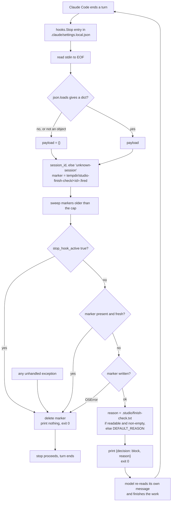

# Shipped Finish-Check Stop Hook — Architecture Spec

## In Plain Language

When an assistant finishes a turn, it often stops while work it just described is still undone —
work nothing is blocking, that it could simply have done. The instructions telling it not to do that
live in `CLAUDE.md`, which it reads *before* the work, when the loose ends are still hypothetical.

The finish-check is a small program that runs at the moment a turn ends. It refuses the first stop,
every time, with one paragraph asking the assistant to re-read its own message for work it deferred
that nothing is blocking. Then it lets the second stop through. Refusing is the whole mechanism: it
is what forces the re-read, at the one moment when the loose ends are concrete and countable.

This already exists and already works — it has run 182 times on one machine. The problem is that it
only exists *there*. It lives in this repository's `.claude/hooks/` directory, which the installer
deliberately does not ship, and it is wired up by hand in one person's global settings. Every session
on every other machine runs without it, including machines that have Studio installed. This spec
moves it from that directory into the set of files Studio ships, so installing Studio means having
it.

## Architecture at a Glance



Everything the hook needs is on stdin or derived from its own `__file__`. It reads no TOML, no
manifest, no git, no environment variable, and no Studio module. Every path that is not a clean
"block this once" ends in *allow the stop* — the invariant the whole design serves.

## How It Works (Technical)

### This is a promotion, not a new file

`.claude/hooks/finish-check.py` is already tracked in this repository, and
`~/.claude/hooks/finish-check.py` on the author's machine is a **symlink to it**. The hook that has
run 182 times is this repo's own file. Its README states the rule this spec reverses:

> Unlike `.claude/commands/` and `.claude/workflows/`, **the installer does not ship them** — nothing
> in this directory reaches a consuming repo. Installation is manual and machine-local.

So the build moves the mechanism into the shipped set and **retires the old copy and that README
paragraph in the same change**. Leaving both means two divergent copies of the mechanism and the
paragraph in one repository, one of which is what actually runs on the author's machine.

### Two artifacts, two lifetimes

| Artifact | Path | Copied by installer | In `SOURCE_FILES` / manifest | Who edits it |
|---|---|---|---|---|
| The mechanism | `.studio/source/finish_check.py` | yes | **no, deliberately** | Studio only |
| The paragraph | `.studio/finish-check.txt` | **never** | no | the repo, optionally |

**The mechanism is copied but unguarded.** `install_studio` writes it on every `init` and `update`,
and the manifest does not record it — so `update` overwrites it every run, and it can never block an
update. This is the opposite of the usual treatment and it is deliberate: issue #207 is a live case
where one deliberate edit to a shipped slash command has frozen a repository's **entire** update
stream, because `update_studio` refuses the whole update over any one drifted file. Losing an
unsanctioned edit to the hook beats freezing every other improvement Studio ships to that repo.

**The paragraph is the sanctioned edit surface**, and Studio never writes it. The default lives as a
constant inside `finish_check.py`, so it improves with every update. The override is read only if the
file exists, resolved from the module's own location — `.studio/source/finish_check.py` → up two →
`.studio/finish-check.txt` — so it depends on neither the working directory (six logged invocations
ran with `cwd` of `/`) nor an environment variable. No TOML, no schema, no loader: a text file, read
with a size cap, falling back to the default when absent, empty, unreadable or oversized.

### The stdin / stdout / exit-status contract

| | Contract |
|---|---|
| **stdin** | Read to EOF once, parsed with `json.loads`. Anything that is not a JSON **object** becomes `{}` — including `[]` and `"x"`, which parse successfully and would otherwise make `payload.get` raise. |
| **Fields read** | `session_id` (string, defaulted) and `stop_hook_active` (truthiness). **Nothing else.** |
| **stdout, allow** | Nothing. |
| **stdout, block** | Exactly one line: `{"decision": "block", "reason": <text>}`. |
| **stderr** | Nothing, ever. A Stop hook's stderr is surfaced to the user as an error. |
| **Exit status** | **Always 0**, on every path. Blocking is expressed in stdout, never in the exit code, so a crashed hook can never be mistaken for a deliberate block. |
| **Top-level guard** | `try: main() except Exception: sys.exit(0)`. `SystemExit` derives from `BaseException`, so the intentional `sys.exit(0)` calls pass through. |

### Two loop guards, and why both

`stop_hook_active` on stdin is the primary guard: it is true on the retry the block itself caused.
The per-session marker file is the backstop for that field being absent or renamed, and it is what
makes "block at most once per session per turn" true rather than hoped for. If a retry ever arrives
later than the marker's cap, `stop_hook_active` is true on it and the stop is allowed regardless.

The marker is `<tempdir>/studio-finish-check/<session_id>.fired`, in one place always. `scratchpad_dir`
appears in the payload but is **per-session, not per-invocation** — present in 92 of 182 real
payloads and in only 6 of 47 sessions, with none mixed — so a branch reading it would be two code
paths for one outcome. The temp directory also sidesteps `.studio/` being tracked in some installs
(one tracks 134 files there, another 101), where per-turn state would dirty `git status` forever.

### Interfaces

```python
# studio/finish_check.py — stdlib only, zero Studio imports
DEFAULT_REASON: str            # the shipped paragraph
MARKER_MAX_AGE_SECONDS = 600   # marker debris older than this is swept and ignored
OVERRIDE_MAX_BYTES: int        # a paragraph, not a document

def marker_path(session_id: str) -> str: ...
def reason_text() -> str:       # override if readable and non-empty, else DEFAULT_REASON
def main() -> None: ...         # reads stdin, exits 0 on every path
```

```python
# studio/install.py — beside _install_sessionstart_hook
_FINISH_CHECK_MARKER = "finish_check.py"        # our script's basename, as "check-updates" is for the nudge
FINISH_CHECK_SENTINEL = "finish-check.off"      # in .studio/, beside update-check.off

def _install_stop_hook(target: Path, *, enabled: bool) -> None: ...
```

The entry written into `<target>/.claude/settings.local.json` is
`{"type": "command", "command": '"<sys.executable>" "$CLAUDE_PROJECT_DIR/.studio/source/finish_check.py"',
"timeout": 10, "statusMessage": "Finish-check: anything left undone?"}`. The interpreter is absolute
for the reason `_hook_command` already documents: on a stock macOS only `python3` exists, so a bare
`python` silently never runs. `settings.local.json` is the machine-local, gitignored file — the same
one and the same reasoning as the existing SessionStart entry.

### Install path

`_install_stop_hook` mirrors `_install_sessionstart_hook` exactly: find our entry by marker
substring, remove it, re-add when enabled, drop emptied `Stop` and `hooks` containers, and reproduce
the three shape guards — a settings file that is not a JSON object, a non-dict `hooks`, a non-list
`hooks.Stop` each print one warning and leave the file untouched. It never raises.

In `update_studio` the call sits **immediately after the existing SessionStart call**, not later. The
early returns for *no source*, *up to date* and *blocked on local edits* all sit below that point, so
a call placed after them would make `update --no-finish-check` a silent no-op on a current repo,
leaving the hook running.

`--no-finish-check` is its own flag on both `init` and `update`; `.studio/finish-check.off` is its own
sentinel. Neither shares with the update nudge, because someone who wants update nudges but not a
blocking finish-check is a real person.

### Dependencies

`json`, `os`, `sys`, `tempfile`, `time`. No `pathlib` — `os.path` throughout, matching the reference
and saving an import. No Studio module, which is the property that rules out making this a
`run_phase.py` subcommand: that module imports `config_loading`, `tomllib`, `stats` and `obligations`,
any of which can raise at import time, *before* argparse could reach a handler that exits 0.

### Failure modes

| Condition | Behaviour | Outcome |
|---|---|---|
| Empty or malformed stdin | `json.loads` raises → `payload = {}` → `unknown-session` | exit 0, never raises |
| Valid JSON that is not an object (`[]`, `"x"`, `3`) | `isinstance` check → `payload = {}` | exit 0. Without the check this is a traceback on stderr — a real defect in the current reference, which has no top-level guard either |
| `stop_hook_active` true | marker deleted, nothing printed | **stop allowed** — the primary loop guard |
| Missing `session_id` | keyed on `unknown-session`, so concurrent such invocations share one marker and one can suppress another's check for up to the cap | **fails open — the stop is allowed.** Never observed in 182 real invocations |
| Marker directory unwritable | cannot record that we fired, so cannot promise not to loop | **stop allowed**, exit 0 |
| Sweep fails (`os.listdir` raises) | caught and skipped | decision unaffected |
| Override file unreadable, empty, or over the cap | falls back to `DEFAULT_REASON` | block proceeds with the shipped paragraph |
| Any other exception | top-level `except Exception` | exit 0, nothing printed |
| Hook process hangs | harness `timeout` on the entry | stop proceeds |
| `.studio/source/` hand-deleted | Python cannot open the file; the harness surfaces one error | the one case not swallowable from inside. `update` rewrites the command every run and `--no-finish-check` removes the entry |

Every row but the last ends in *allow the stop*. The tests assert one row each.

## Key Decisions

**It blocks every turn rather than on evidence of deferral.** A keyword matcher deciding when a turn
is finished is a worse judge than the model re-reading its own message, and the deferrals worth
catching are the ones phrased in ways no list holds. `last_assistant_message` is present on every real
payload and is **deliberately unread**: making the paragraph specific about an offer means first
finding the offer, which is that same rejected matcher wearing a smaller blast radius.

**On by default, not an opt-in wizard step.** Measured: 3 of 11 installs have no `SETUP.json` at all,
and wizard step v5 reached 5 — three of them within the same minute, under a scripted sweep, and one
producing only an empty template. An opt-in ships a feature enabled nowhere, which is indistinguishable
from cutting it. Consent is an easy documented exit instead: a flag and a sentinel.

**The mechanism is unguarded, which is the reverse of everything else Studio ships.** See above: #207
is the live case, and a frozen update stream is worse than a lost edit.

**The payload log is cut.** The current reference keeps a 200-line ring of raw stdin — 340 KB holding
whole assistant turns. Two reasons to drop it. It never measured what it was credited with: "99
blocked / 101 passed" is a ratio the design *guarantees*, so it can never come back surprising, and
the one question it genuinely answered (what shape is the payload) is now answered permanently in this
spec. And shipping it to eleven installs would accumulate whole assistant messages from every repo in
one per-user file, which is a data-handling decision nobody asked for taken as a side effect of a
debugging aid. If a future unit wants a cross-install hit rate, the durable shape is a counters-only
file under `~/.studio/` — named here so the cut is not a dead end, and deliberately not built.

**Why the `obligation-queue` Non-Goal does not apply.** That spec cut a Stop hook on three objections,
all of them objections to *deriving* a blocking condition: an unreachable legality predicate, a
session baseline compaction rewrites, and nothing to fire on. This hook has no predicate, holds no
baseline — its only state is a marker written seconds ago and deleted on the next stop — and blocks on
everything by design. That Non-Goal cut a judge; this is a metronome. `specs/obligation-queue.md` gets
a pointer line so the reversal is discoverable from the document that recorded it.

## Non-Goals / Cut Scope

- **No use of `last_assistant_message`, `transcript_path`, `cwd`, or `scratchpad_dir`.** The hook reads
  two fields.
- **No payload log**, for the two reasons above.
- **No wizard step.** It ships on by default or it does not ship.
- **No TOML config.** A loader and a schema for one string; it is a text file.
- **No detection of whether the turn did any work.** That needs the transcript, which is real fragility
  in a file whose whole job is never to break a session.
- **No third build unit.** The override read is six lines in the same module, and separating it would
  ship the guarded mechanism before its escape hatch exists.

## Risks & Open Questions

**A global registration already exists and will double-fire.** `~/.claude/settings.json` on the
author's machine registers this hook under `hooks.Stop` for *every* project. Once a per-repo entry is
installed, both fire on the same stop: two processes racing one marker, one writing it while the other
reads it fresh and deletes it. **Removing the global entry is the first step of the rollout**, not an
afterthought, and the docs must say so. Note the two paths differ by a hyphen (`finish-check.py`
registered globally, `finish_check.py` shipped), so the installer's marker substring cannot detect the
global one — it must be removed by hand.

**The value is one paragraph and the evidence for it is thin.** "Roughly 6–8 real items from ~25
bounces" is n=1, self-reported and unblinded, and this spec removes the only instrumentation. That is
why it carries a Verification section rather than a claim.

**Every repo gains one extra model round-trip per turn.** That is the cost, it is not small, and the
rollout note must lead with it rather than bury it.

**Whether the harness honours `timeout` on a hook entry could not be established.** The reference
carries it, and it costs nothing if ignored, but the spec does not claim it as a guarantee.

## Verification

This feature is **prompt-shaped**: its entire value is whether one paragraph changes what an assistant
does at the end of a turn, and no failing test can tell us it stopped working. The mechanics are
testable and are covered by the Build Plan; this section is about the only thing they cannot settle.

- **Pass criterion.** This feature works if and only if, across 30 consecutive blocked stops in repos
  other than the Studio source repo, **at least 8 produce a concrete change to the working tree or to
  a tracked artifact** — a file edited, a command run, an issue or PR created, a decision recorded —
  in the turn that follows the block. Anything less and the hook is a tax that buys a reworded message.
- **Baseline.** The same sessions with the hook off, via `.studio/finish-check.off`. Reproduce on
  demand by touching that sentinel and re-running `update`. The baseline expectation is that work
  deferred at a stop stays deferred: the whole claim is that nothing else catches it.
- **Where the evidence goes.** `specs/shipped-finish-check-eval-results.md`, created from the skeleton
  when this spec is approved.
- **Stop condition.** While that file still says `FILL_ME`, nobody may call this feature working and
  this spec stays `status: approved`.

## Build Plan

### 1. `finish_check_ships_with_studio` — the hook lives in the shipped set, with one copy in the repo

Move the mechanism to `studio/finish_check.py`, hardened: the `isinstance` stdin check, the top-level
exit-0 guard, the marker under the temp directory, the override read, and the log removed. Retire
`.claude/hooks/finish-check.py` and rewrite `.claude/hooks/README.md`, which currently states that
nothing in that directory reaches a consuming repo. Tests in `studio/tests/test_finish_check.py`.

**Acceptance criteria:**

- [ ] `studio/finish_check.py` imports only `json`, `os`, `sys`, `tempfile` and `time`, and a test asserts directly that it imports no Studio module — not by way of `test_stdlib_only.py`, whose `_is_local` deliberately permits them.
- [ ] Given a payload with a `session_id` and `stop_hook_active` false, the process exits 0 and stdout is exactly one JSON object whose `decision` is `block`; given the same `session_id` again it exits 0 with empty stdout, and the marker file is gone from disk.
- [ ] Each of `""`, `"not json"`, `"[]"`, `"\"x\""`, `"3"` and 8 KB of binary noise exits 0 with empty stderr, and a test that forces an exception inside `main` also exits 0.
- [ ] Every marker resolves under the temp directory and no test run writes any file inside the repository — the override cases copy the module into a temporary `.studio/source/` rather than writing at the repo root.
- [ ] With a readable non-empty override beside the copied module the printed `reason` equals that file's text, and for each of absent, empty, unreadable and over-cap it equals `DEFAULT_REASON`.
- [ ] `.claude/hooks/finish-check.py` is deleted, its README no longer claims the installer ships nothing from that directory, and no file in the repo other than `studio/finish_check.py` contains the default paragraph.

**Out of scope:** the installer, the settings entry, the flag, the sentinel, and any use of payload fields beyond `session_id` and `stop_hook_active`.

### 2. `finish_check_install_entry` — every install gets it on its next update

`install_studio` copies `finish_check.py` into `.studio/source/` without recording it in the manifest;
`_install_stop_hook` merges or removes the `hooks.Stop` entry; `--no-finish-check` and the sentinel
switch it off; docs cover the flag, the sentinel, the override file, the per-turn cost, and the
global-registration removal step.

**Acceptance criteria:**

- [ ] After `init`, `.claude/settings.local.json` holds exactly one `hooks.Stop` entry containing the marker substring, with absolute interpreter and script paths; a second and third `init` leave exactly one, and none of them alters the SessionStart entry.
- [ ] `init --no-finish-check` writes no entry, and `update --no-finish-check` removes one a previous install wrote **including when the install is already up to date**; the `.studio/finish-check.off` sentinel produces the same result as the flag on both subcommands.
- [ ] A `settings.local.json` that is a JSON array, one whose `hooks` is a string, and one whose `hooks.Stop` is a dict each produce one warning and a byte-identical file from both `init` and `update`, raising nothing.
- [ ] `init` writes `.studio/source/finish_check.py`, and `MANIFEST.json` records no entry for it; a subsequent `update` overwrites a locally-edited copy of it and reports no BLOCKED state over that file.
- [ ] `.studio/finish-check.txt` and `.studio/finish-check.off` are written by neither `init` nor `update`, and appear in no manifest.
- [ ] README, `studio/docs/CLAUDE_CODE_USAGE.md`, `studio/docs/API.md` and `studio/docs/ARCHITECTURE.md` document the flag, the sentinel, the override file, the one-extra-round-trip-per-turn cost, and the instruction to remove any global `Stop` registration of this hook before rollout; `studio/tests/test_doc_parity.py` passes.

**Out of scope:** removing anyone's global registration automatically, and any cross-install measurement.
