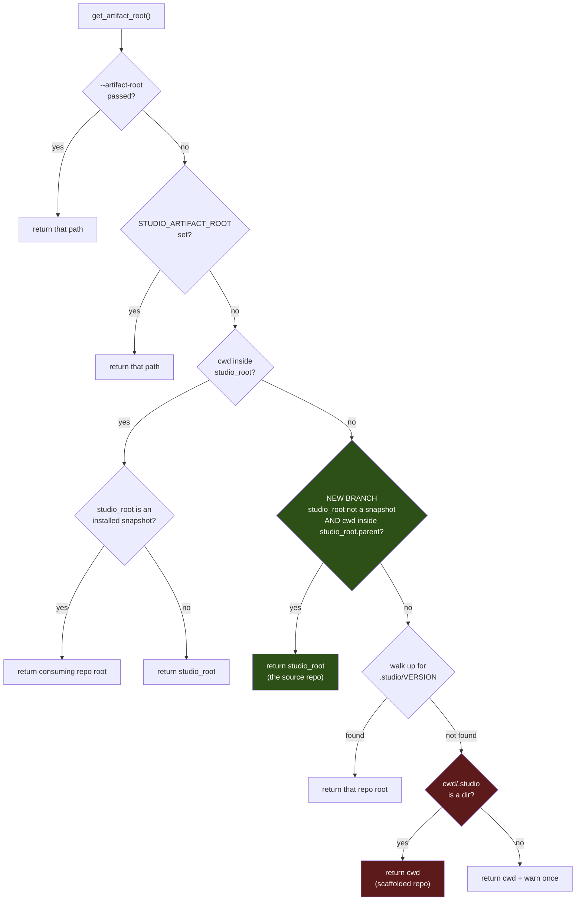

# Studio Recognizes Its Own Source Repo — Architecture Spec

## In Plain Language

Studio writes its run artifacts into different places depending on where it's being used. In a
project that installed Studio, artifacts go into that project's `.studio/` folder. In Studio's own
source repo, they go into `studio/output/`. To pick between them, Studio has to answer one question:
*am I running inside my own source repo, or inside somebody's project?*

It gets that question wrong. Studio decides "this is somebody's project" partly by looking for a
`.studio/` folder — and Studio's own repo has one, because that's where a couple of its own settings
live. So when you run Studio from its repo root, which is exactly what the README tells you to do,
Studio concludes it's a guest in a stranger's project. It files its work in the wrong drawer and
leaves behind a welcome note (`docs/studio-bridge.md`) addressed to a project that is actually
itself.

Nothing crashes, which is why this went unnoticed since July 8th. But sixteen runs' worth of history
is sitting in the wrong folder, `studio/output/` is empty, and a stray file keeps reappearing. This
fixes the question so Studio can tell its own house from a guest room, and moves the misfiled work
back where the rest of the code already expects to find it.

## Architecture at a Glance



Green is the new branch. Red is the branch that swallows the source repo today: with no
`.studio/VERSION` anywhere in the tree, a run from the repo root falls all the way down to the
bare-`.studio/` check, finds the directory that holds `update.toml` and `usage.log`, and concludes
this is a scaffolded consuming repo.

The new branch sits **above** the `VERSION` walk-up, so a source repo is identified as a source repo
before any consumer heuristic gets a chance to claim it. Everything above it — the explicit flag and
the environment variable — still wins, because those are deliberate overrides.

## How It Works (Technical)

### Components

| Component | Responsibility | Change |
|---|---|---|
| `get_artifact_root()` (`studio/run_phase.py:303`) | Resolve where artifacts and project-local config live | **One new branch** |
| `_installed_repo_root()` (`:280`) | Recognize the `<repo>/.studio/source` snapshot layout | Reused, unchanged |
| `_is_within()` | Path-containment test | Reused, unchanged |
| `get_output_root()` / `get_knowledge_log_path()` / `_project_name()` / `get_outcomes_ledger_path()` (`:342-385`) | Derive concrete paths from the artifact root | **Unchanged — they already handle this case** |

### The predicate

The source repo is *the repo whose `studio/` directory is the running `get_studio_root()`*. In code
terms: `studio_root` is not an installed snapshot, and `cwd` is inside `studio_root.parent`.

This needs nothing new on disk — no marker file, no manifest sniff. It is exact, because
`studio_root` is derived from `__file__`: the only tree that satisfies it is the one this very
module was loaded from.

### Why this is a restoration, not an invention

Every downstream path function already branches on `artifact_root == studio_root` meaning "this is
the source repo," and `_project_name`'s docstring states the invariant outright:

> *"In this tool repo the artifact root is the `studio/` dir, so use its parent (the repo root)
> rather than the literal 'studio'."*

`impl_loop.py:75-89` resolves the source repo this same way already, with no cwd test at all.
`run_phase.get_artifact_root()` is the outlier. The fix makes the two agree.

### Data flow after the fix

```
cwd = <repo>            →  artifact_root = <repo>/studio  (== studio_root)
                        →  get_output_root()        = <repo>/studio/output
                        →  get_knowledge_log_path() = <repo>/studio/knowledge/run_log.md
                        →  _project_name()          = "_TheGameStudio"   (studio_root.parent.name)
                        →  artifact_root == studio_root, so _scaffold_external_repo never fires
```

### The side effect that must be handled

`studio/.studio/` **already exists** (gitignored at `.gitignore:10`) and contains
`integrations.toml` with `[slack] enabled = true`, plus a `usage.log` and two `impl_loop` unit dirs.

Today nothing reads it, because the artifact root never resolves to `studio/`. After the fix,
`load_integrations_config(get_artifact_root())` (`run_phase.py:402`) and
`get_configured_ledger_path()` start reading it — so **repo-root runs would begin firing Slack
digests on finalize**, silently, as a side effect of a path fix. This is not acceptable as an
unannounced change and is handled explicitly in the build plan below.

### What is provably unaffected

`install.py:_source_auto_pull_enabled` (`:370`) resolves `.studio/update.toml` through
`git rev-parse --show-toplevel`, not the artifact root — its docstring calls the location
load-bearing. The repo-root `.studio/update.toml` keeps working untouched.

## Key Decisions

**1. A new branch, not a marker file.** *(P1, assumption — unchallenged in the debate)*
Identify the source repo structurally rather than by planting a file. A marker is state that can go
missing, get committed by accident, or drift.

**2. Insert above the `.studio/VERSION` walk-up.** *(settled on evidence, not preference)*
The theoretical cost is hijacking an `init`-installed project nested *inside* the Studio source
tree. The contrarian checked: no `.studio/VERSION` exists anywhere in the tree, and all 17 worktrees
are siblings under `_TheGameStudio-wt/*`, which `_is_within` never matches. The cost is currently
zero and the alternative leaves `init --target .` able to recreate the bug.

**3. Migrate the history; no legacy fallback.** *(P0, answered by the user)*
Move the runs rather than teaching `stats` to read two locations. A compatibility branch would have
to be carried forever to avoid a one-time move of gitignored files.

**4. Both zero-code alternatives are dead — recorded so nobody reopens this.**
- *Delete the source repo's `.studio/`*: does not work. Resolution falls through to the default
  branch, still returns `cwd`, and `_scaffold_external_repo` recreates the directory and the bridge
  doc on the next `prepare`.
- *Add `.studio/VERSION` to the source repo*: actively harmful. The installer reads `VERSION` as
  "this repo is an installed consumer," so `check-install` and `update` would treat the source repo
  as a consumer of itself.

**5. Keep the two existing branches separate.** The "Don't merge" comment at `:321-323` stands; the
new branch is added beside them, and neither is touched.

**6. Slack goes off as part of this change.** *(decided 2026-07-30)*
The fix newly exposes `studio/.studio/integrations.toml`, which carries `[slack] enabled = true`.
Digests will be switched off so that turning them on stays a deliberate act rather than a side effect
of a path fix.

There is a wrinkle worth stating plainly: **`studio/.studio/` is gitignored** (`.gitignore:10`), so
that file is machine-local. Editing it fixes this machine and ships nothing — a fresh clone has no
such file at all, so a different developer would see no integrations config and nothing would fire.
That makes the *file edit* a one-line local chore and the *test* the durable part of this unit: the
only way this stops being invisible is an assertion that pins which `integrations.toml` path a
source-repo run resolves to.

## Non-Goals / Cut Scope

- **No `stats` legacy-path fallback.** Decision 3.
- **No `index.md` migration.** Cut by the contrarian: the index is derived, gitignored, and rebuilt
  wholesale at finalize. Regenerate it; do not move it.
- **No config knob** to choose the artifact root in the source repo. `--artifact-root` and
  `STUDIO_ARTIFACT_ROOT` already exist and still win.
- **No refactor of the resolution chain.** It is documented as deliberately branchy; this adds one
  case and leaves the shape alone.
- **No change to how consuming repos resolve anything.** A repo that vendors Studio at `<repo>/studio/`
  is unaffected: its `studio_root` is its own `.studio/source` snapshot, so the predicate is false.

## Risks & Open Questions

- **The wrong-reason test trap (high confidence, from the contrarian).** Every existing test routes
  through a helper that points `studio_root` at a `.studio/source` snapshot, so nothing exercises a
  non-snapshot studio root with cwd at its parent. Worse: a test that `chdir`s into `studio/` instead
  of the repo root **passes today, unfixed** — it hits the existing `cwd == studio_root` branch. The
  regression test must `chdir` to the repo root specifically, and must be shown to fail before the fix.
- **`usage.log` merges rather than moves.** Both `.studio/usage.log` (6 entries) and
  `studio/.studio/usage.log` (1 entry) exist. Migration has to concatenate in timestamp order, not
  overwrite.
- **`impl_loop` history is split 11/2** across the two locations, not 11/0.
- **The Slack side effect** is the highest-risk item; see unit 3.
- **Four specs carry `studio_run:` frontmatter** pointing into `.studio/output/` at run dirs that
  still exist. They need updating in the same change or they become dangling.

## Build Plan

> No `## Verification` section: this feature is not prompt-shaped. A failing pytest can tell us
> precisely when it breaks, so a pass criterion in prose beside that test would be theatre.

1. **`source_repo_detection` — Studio run from its own repo root files artifacts in `studio/output/`.**
   Add the branch to `get_artifact_root()` above the `.studio/VERSION` walk-up, using
   `_installed_repo_root()` and `_is_within()` as they stand. Add regression tests in
   `studio/tests/test_run_phase.py`.
   - **Acceptance criteria:**
     - [ ] With a non-snapshot `studio_root` and cwd set to `studio_root.parent`, `get_artifact_root()` returns `studio_root`.
     - [ ] That test fails on the pre-fix code — demonstrated by reverting the branch and showing it red, not assumed.
     - [ ] A test pins that cwd at `studio_root.parent` is what's covered, distinct from the pre-existing `cwd == studio_root` case, so the new test cannot pass for the old reason.
     - [ ] An installed-layout repo (`<repo>/.studio/source`) still resolves to the consuming repo root, and a repo with a bare `.studio/` and no `VERSION` still resolves to cwd.
     - [ ] `prepare --phase tech` run from the repo root creates no `docs/studio-bridge.md`.
     - [ ] `ruff check .` is clean and the full suite is green.
   - **Out of scope:** moving any existing file; anything about `integrations.toml`.

2. **`artifact_history_migration` — the 18 stranded run directories are visible in `stats` again from one location.**
   Eighteen is 5 tech runs plus 13 `impl_loop` unit dirs — two different kinds of run directory, not
   two counts of the same thing. They sit in two places: 11 of the `impl_loop` dirs and all 5 tech
   runs under `.studio/output/`, the other 2 `impl_loop` dirs under `studio/.studio/output/`.
   A one-time move of `.studio/output/*` and `studio/.studio/output/*` into `studio/output/`, and
   `.studio/knowledge/run_log.md` into `studio/knowledge/`, merging the two `usage.log` files in
   timestamp order. Update the four specs' `studio_run:` frontmatter. Regenerate the index.
   - **Acceptance criteria:**
     - [ ] `studio/output/` contains all 5 tech runs and all 13 `impl_loop` unit dirs, and no run directory remains under either old location.
     - [ ] The merged `usage.log` holds every entry from both files, ordered by timestamp, with none dropped or duplicated.
     - [ ] `stats` run from the repo root reports a run count matching the directories on disk.
     - [ ] No spec's `studio_run:` frontmatter points at a path that does not exist.
     - [ ] `git status` is clean apart from the spec frontmatter edits — everything moved is gitignored.
   - **Out of scope:** deleting the now-empty `.studio/output/`; `index.md` is regenerated, never moved.

3. **`integrations_side_effect` — the path fix does not silently turn on Slack.**
   Set `[slack] enabled = false` in `studio/.studio/integrations.toml` (per Key Decision 6), and —
   the part that actually lasts — add a test pinning which `integrations.toml` path a source-repo run
   resolves to. The file is gitignored, so the edit fixes this machine and the test is what carries
   the knowledge forward.
   - **Acceptance criteria:**
     - [ ] A test asserts that a source-repo run resolves its integrations config to `studio/.studio/integrations.toml`, and that test fails if the resolution changes.
     - [ ] A test covers the fresh-clone case: with no `integrations.toml` present at the resolved path, `load_integrations_config` yields a disabled config and `finalize` attempts no webhook post.
     - [ ] `[slack] enabled = false` in this machine's `studio/.studio/integrations.toml`, verified by a `finalize` from the repo root posting no digest.
     - [ ] `CHANGELOG.md` names this behavior change in the same entry as the path fix, including that the config file is gitignored and therefore machine-local.
   - **Out of scope:** any change to the webhook code itself, to `INTEGRATIONS.md`'s schema, or to whether Slack is enabled in any *consuming* repo.

4. **`docs_and_invocation` — the documented invocation is the one that works.**
   Update `CLAUDE.md`, `README.md`, and `studio/docs/API.md` where they describe artifact
   locations, and record the resolution chain's source-repo case in
   `studio/docs/ARCHITECTURE.md`.
   - **Acceptance criteria:**
     - [ ] Every doc stating where source-repo artifacts land says `studio/output/`.
     - [ ] `studio/docs/ARCHITECTURE.md` describes all four branches of the chain in order, including the new one.
     - [ ] No doc still implies the source repo scaffolds itself a bridge doc.
     - [ ] The doc-parity suite passes.
   - **Out of scope:** the `/unstale` pass already on PR #93.
