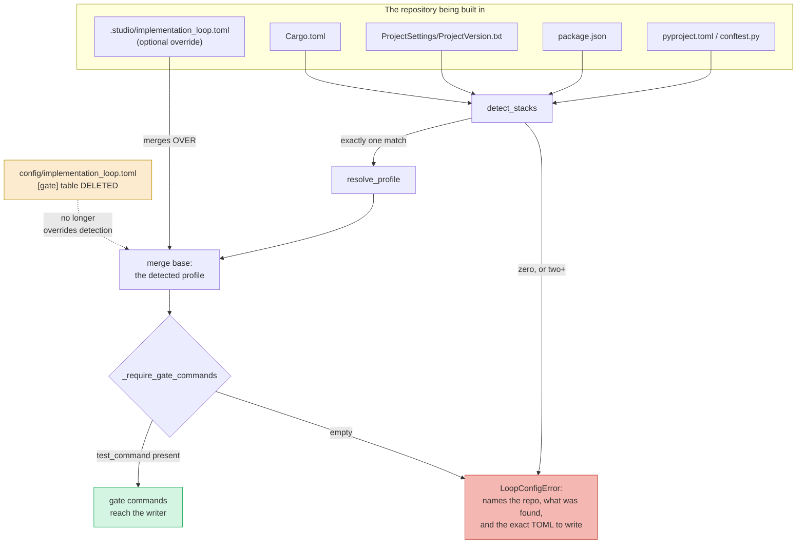

# Stack-Aware Quality Gates for the /forge Loop — Architecture Spec

## In Plain Language

When `/forge` builds a unit of work, it checks the result before calling it done: it runs the tests,
runs a linter, and runs a mutation check. Which commands it runs comes from a config file Studio
ships — and that file names `pytest`, `ruff` and `mutmut`. Those are Python tools.

Studio is installed in ten repositories. Three are Node projects, one is a Rust game, one is Unity,
and several are neither. In every one of those, `/forge` runs `pytest`, `pytest` isn't there, the
command fails, and the unit is marked failed — not because the work was wrong, but because the gate
was asking the wrong question. Orkid Garden's config file says so in its opening comment: the shipped
defaults assume a Python project, so *"every unit fails the gate for the wrong reason."*

This change makes the gate look at the repository first. If it finds `package.json` with a test
script, it runs `npm test`. If it finds `pyproject.toml`, it keeps running `pytest`. And when it
finds nothing it recognises — or two things at once — it stops and says so, naming the file to edit
and the exact lines to write, instead of guessing and failing later for a reason that has nothing to
do with your code.

Two things worth saying plainly at the start. **This does not auto-fix the repository that reported
the problem**: Orkid Garden keeps its Unity project in a `unity/` subdirectory, so nothing at its
root identifies it, and Unity has no honest test command to ship anyway — its hand-written override
stays the right answer, and this change is careful not to break it. And **six of the ten repos will
still get no automatic answer**; five of them will newly refuse where they used to fail confusingly.
That refusal message is therefore not an edge case. It is this feature's main interface, and it is
specified here as carefully as the detection is.

## Architecture at a Glance



Marker files at the repo root feed `detect_stacks`, which returns *every* stack that matches rather
than the first. Exactly one match resolves to a profile; zero or two both refuse, with different
messages. The profile becomes the merge base an override layers over — so a Unity repo that sets only
`test_command` no longer inherits `ruff` and `mutmut` through the gap. Finally `_require_gate_commands`
refuses at load time if the resolved test command is still empty, rather than letting an empty command
reach the writer agent.

The dotted line is the part that makes any of it reachable: the shipped config's `[gate]` table is
deleted. Without that, it wins over everything detection computes.

## How It Works (Technical)

### The root cause, which is not where you'd expect

The Python-shaped values in the `LoopConfig` dataclass are not what breaks the ten repos. The shipped
file is.

- `studio/config/implementation_loop.toml:11-15` is a `[gate]` table that hard-sets all four keys.
- `install.py:67` lists that file in `SOURCE_FILES`, so it is copied into every installed repo.
- `impl_loop.py:143-145` falls back to it whenever `<repo>/.studio/implementation_loop.toml` is absent
  (`:140-142`).

**Nine of the ten consuming repos have no override file.** So in nine repos the shipped file wins over
anything detection computes, and detection without this deletion is dead code. Deleting the `[gate]`
table is what fixes all ten via an ordinary `/studio-update`, with no wizard re-run.

**Delete the table, never the file.** There is no prune for `.studio/source/` — `_retired_claude_files`
is scoped to `.claude/` and says so at `install.py:865-867`. Drop the file from `SOURCE_FILES` instead
and all ten repos keep their existing copy, `[gate]` table intact, forever. This is not a style
preference; it is the only version that reaches the installed repos, and it is written here so nobody
tidies it up later.

### Components

Everything lands in `studio/impl_loop.py`, which already owns the gate defaults and already ships.
**No new module.** A new file would have to be added to `install.SOURCE_FILES` or all ten repos hit an
`ImportError` on their next `/forge` — which is an argument against creating one.

### The marker table

```python
# Marker files that identify a stack. `rust` is recognised but unserved: we ship no gate
# commands for it, which is how the loader says "I know what this is and still have no
# command" instead of guessing. Deliberately NOT shared with the three
# suggest_*_from_stack ladders in setup.py — those must return a best guess, this one
# must refuse. Same markers, opposite failure policy. See impl_loop.STACK_MARKERS.
STACK_MARKERS: list[tuple[str, tuple[str, ...]]] = [
    ("unity",  ("ProjectSettings/ProjectVersion.txt", "*.csproj")),
    ("rust",   ("Cargo.toml",)),
    ("python", ("pyproject.toml", "setup.py", "requirements.txt", "conftest.py")),
    ("node",   ("package.json",)),
]
```

A pattern containing `*` is globbed; everything else is an exact path test.

Unity keys on `ProjectSettings/ProjectVersion.txt`, narrower than the bare `ProjectSettings` directory
check the existing helpers use (`setup.py:358`, `:409`, `:539`) — a directory by that name is a
plausible thing for a non-Unity repo to have; that file is not.

`conftest.py` is in the Python list for a specific repo: `_Cerebro` has a root `conftest.py` and none
of the other three Python markers. Without it, a Python project is undetectable.

**`rust` is load-bearing and stays.** Without it, `cemetery-security` matches only `package.json` and
gets `npm test` — which runs its CI release-gate tooling and reports green while testing none of the
game. That wrong-reason *pass* is worse than the failure being fixed. **`go` was proposed and cut**:
no consuming repo is Go, and the row can be restored in one line the day one appears.

### Detection, and why there is no precedence

```python
def detect_stacks(root: Path) -> list[str]:
    """Every stack whose markers are present at ``root``, in STACK_MARKERS order."""
```

Zero matches and two matches are both refusals, with different messages. Ranking one marker above
another is exactly the choice the three existing `setup.py` ladders made inconsistently, and every
ranking is wrong for some real repo:

- Rank `package.json` first and `cemetery-security`, a Rust/wasm game, gets a green gate over its
  release-gate tooling and nothing else.
- Rank `Cargo.toml` first and a Node repo vendoring a Rust helper crate is refused for the wrong
  reason.

Refusing on ambiguity costs one repo in ten a one-time override, and it is the repo where every
automatic answer would have been wrong. `STACK_MARKERS` order survives only as the order the ambiguity
message lists things in — never as a tiebreak.

```python
def resolve_profile(root: Path) -> StackProfile:
    """The gate defaults for the repo at ``root``. A profile whose test_command is
    None is a valid result meaning "recognised, no command known" — the loader
    decides whether that is fatal, because an override may still supply one."""
```

Node is the one stack whose profile is a function of the repo rather than a constant: it reads
`package.json` and offers `npm test` only when a `test` script is declared, and `["eslint"]` only when
a `lint` script or an `eslint` devDependency is present. A `package.json` with no `test` script makes
`npm test` exit with *"missing script: test"* — the wrong-reason failure this feature exists to
remove. Verified across all three Node consumers: `miresu` and `OrcPunk-dotcom` declare
`"test": "vitest run"`, `Arkadium/solitaire-game` declares a `node --test` script; all three declare
`lint` and carry `eslint`.

The wizard computes nothing of its own — it calls `resolve_profile` and serializes the result. One
function, two callers. Decision 1's shared-source requirement is discharged by construction rather
than by discipline.

### What `load_loop_config` does differently

```python
# was: defaults = LoopConfig()                      (impl_loop.py:200)
detected = resolve_profile(_project_artifact_root(root))
defaults = LoopConfig(
    test_command=detected.test_command or "",
    static_checks=list(detected.static_checks),
    require_mutation_check=detected.require_mutation_check,
    mutation_command=detected.mutation_command or "",
)
...
_require_gate_commands(resolved, detected, root)   # raises LoopConfigError
return resolved
```

| Gate | Refuse when | Why |
|---|---|---|
| `test_command` | resolved value is empty | The writer is told to run it (`implementation-loop.js:205`) and the entry gate trusts `writer.tests.passed` (`:325`) — an empty command means the agent invents one and self-reports a pass. |
| `mutation_command` | `require_mutation_check` is true **and** resolved command is empty | Only fires when a user turned the check on without giving it a command. |
| `static_checks` | never | `[]` already means *skip* (`implementation-loop.js:314`), and the command that runs is authored per-unit by `/forge` (`forge.md:111`). |

This does **not** add a branch to `LoopConfig.__post_init__` (`:86-106`). That checks types; this
checks whether a resolved config is *runnable*, which needs detection context to explain itself. Note
that `""` passes `__post_init__` today (`:99-100`) and would otherwise flow all the way to the writer —
which is why the refusal is at load, not a sentinel in a string field.

Keep `LoopConfig`'s gate defaults as **literals**, not references into the profile table. A
`default_factory` lambda trades a readable literal for indirection to prevent a drift that the equality
test below catches anyway.

### The override merges over the detected profile

An override layers over the *detected* defaults, not the built-in Python ones. Without this, a Unity
repo overriding only `test_command` still inherits `ruff` and `mutmut` — the same failure this feature
removes, one level down.

**This deliberately diverges from `scopes.toml`, which is read instead of the shipped file.** The
divergence is worth it because a partial gate override is a normal thing to write and a partial scopes
override is not: the gate keys describe one repo's toolchain, where "the rest stay as detected" is the
only sensible reading.

**A known, unchanged wrinkle:** `_resolve_config_path` returns the first file it finds and stops
(`:140-146`). Once a project file exists, the shipped `[loop]` and `[editor]` tables are never read,
and those four keys fall back to dataclass defaults — identical values today, so the harm is latent.
This design multiplies the shadow, because the wizard writes that file and the error message tells
users to create one. The fix is not a merge rewrite: it is **one test asserting the shipped file's
`[loop]`/`[editor]` values equal `LoopConfig()`'s defaults**, so a future edit to either fails loudly
instead of going dark, plus one sentence in both file headers.

### The error text — five variants, not four

```
gate.test_command is not set, and Studio has no default for this repository.

  Looked in:  /Users/x/Repos/Multica
  Detected:   nothing — no marker file Studio recognises is present here.

/forge runs a test gate; without a command it would ask the writer agent to invent
one and then believe whatever it reported back. It will not do that.

Set the command in /Users/x/Repos/Multica/.studio/implementation_loop.toml:

    [gate]
    test_command = "<the command that runs this repo's tests>"

Or run /studio-setup, which writes that file for you.
```

Only the `Detected:` line varies, across five shapes:

1. **nothing** — as above. It must not enumerate a stack list; the table knows more stacks than it
   serves, and naming three while recognising four reads as a contradiction.
2. **unity** — *"Studio ships no test command for Unity — a batchmode run needs a wrapper that reads
   the result file, because Unity reports success even when it discovered no tests at all."*
3. **ambiguous** — *"rust (Cargo.toml) and node (package.json) both match. Pick one by writing the
   command yourself; guessing here would gate one language's code with the other's test runner."*
4. **node, no test script** — *"package.json declares no "test" script. `npm test` in this repo exits
   with "missing script: test", which would fail your unit for the wrong reason."*
5. **recognised but unserved** (rust) — *"rust (Cargo.toml). Studio ships no test command for Rust."*

Every variant names the repo path, what was found, and the exact file and key. **No escape hatch**: do
not offer a "skip the gate" value, because the only value satisfying it is a no-op command, which
recreates the hole the load-time refusal closes.

### What each repo actually gets

Eleven rows — the ten consumers, plus the Studio source repo, which is listed because its detection
root is `studio/` rather than the repo root (`_project_artifact_root` returns the source root when the
layout is not `.studio/source`, `impl_loop.py:120-126`).

| Outcome | Count | Repos |
|---|---|---|
| Detects cleanly | 4 | `miresu`, `OrcPunk-dotcom`, `Arkadium/solitaire-game` (node); `_Cerebro` (python, via `conftest.py`) |
| Matches nothing | 5 | `Orkid Garden`, `_Alfred`, `Multica`, `CREA`, `OrcPunk-biz` |
| Ambiguous | 1 | `cemetery-security` (Cargo.toml + package.json) |
| Source repo | — | `_TheGameStudio`, detected python at `studio/pyproject.toml` |

So **six of ten get no automatic answer, and five newly refuse** — Orkid's existing override spares it
from the refusal.

### Does it still earn its keep?

Yes, and not marginally. Three Node repos go from a guaranteed wrong-reason fail to a working gate.
Six go from a silent wrong-reason fail to a refusal naming the file to edit. The merge fix removes a
second-order copy of the same bug. Orkid keeps working unchanged. The motivating repo not being
auto-fixed is a real dent, said out loud here — but it is one repo in ten and it already has its
answer.

## Key Decisions

- **The table lives in `impl_loop.py`; no new module.** A new file would need adding to
  `install.SOURCE_FILES` or every installed repo hits an `ImportError` — an argument against creating
  one.
- **Refuse on ambiguity rather than rank markers.** Established by a real repo: `cemetery-security`
  carries `Cargo.toml` and `package.json` side by side, its `package.json` describing itself as CI
  tooling for a Rust/wasm game. Any ranking gives some real repo a wrong answer, and the
  `package.json`-first ranking gives that one a green gate over nothing.
- **Refuse at config load, not via an empty-string sentinel.** `""` passes `__post_init__` today and
  reaches the writer as an empty command where the gate trusts a self-reported pass.
- **Empty the shipped `[gate]` table; do not remove the file from `SOURCE_FILES`.** There is no prune
  for `.studio/source/`, so removal would strand the old copy in all ten repos forever.
- **`require_mutation_check` defaults false where no mutation command exists.** A gate that always
  passes with "unavailable" is decorative. Python keeps its working mutation gate.
- **An override merges over the detected profile**, diverging from `scopes.toml`'s read-instead-of
  semantics, because a partial gate override is a normal thing to write.
- **Keep `rust`, drop `go`.** `rust` prevents a wrong-reason green in a live repo; `go` earns nothing
  by the same standard and costs one line to restore.
- **Leave the three `setup.py` marker ladders alone.** They disagree today — `cemetery-security`
  resolves as Rust to the unstale ladder and Node to the smoke ladder — so unifying them is a live
  behaviour change to two working features, ridden in on an unrelated spec. A pointer comment at
  `setup.py:326` naming `impl_loop.STACK_MARKERS` and the one-clause reason the policies differ (best
  guess versus refusal) is the right size of fix.
- **Root-only detection, no subdirectory search.** Orkid Garden already has a working override, and
  searching subdirectories would start matching `tools/package.json` in unrelated repos.

## Non-Goals / Cut Scope

- **A `stack_profiles.py` module** — cut; the table goes in `impl_loop.py`.
- **A `go` profile** — cut; no consumer would exercise it.
- **Collapsing the three `setup.py` ladders into one** — cut; live behaviour change, unrelated spec.
- **Subdirectory marker search** — cut; would not help Orkid and would create false matches.
- **Rewriting `_resolve_config_path` into a two-file merge** — cut in favour of one equality test.
  The moment the shipped and dataclass values need to diverge, that becomes its own small spec.
- **The wizard writing a commented-out file when detection fails** — cut. It changes no behaviour and
  duplicates an error message that already prints the path and the exact TOML. Both steps it is
  modelled on write nothing when they have nothing to say (`setup.py:474`, `:610`).
- **Any "skip the gate" value in the refusal message.**

## Risks & Open Questions

- **The motivating repo is not auto-fixed.** Orkid Garden is undetectable at its root and Unity has no
  shippable test command. Its override remains the answer. If more Unity repos appear with the same
  shape, a `unity/` convention might earn its place — not yet.
- **Five repos newly refuse.** That is intended (a loud refusal beats a confusing failure), but it
  means five repos cannot run `/forge` until someone writes three lines. The refusal text is the
  mitigation, which is why it is specified this precisely.
- **`Arkadium/solitaire-game` will lint twice per unit** — its `npm test` already runs `eslint .`, and
  the Node profile also declares `["eslint"]`. Harmless, just slower; the array gates only *whether* a
  static check is required.
- **The `[loop]`/`[editor]` shadowing is mitigated, not removed.** The equality test catches divergence
  loudly; it does not make a project file stop shadowing the shipped one.
- **`StackProfile` as a frozen dataclass with a list field** — frozen does not make the list immutable
  and `PROFILES` is module-level shared state. Use `tuple[str, ...]` so nobody has to remember to copy.

## Build Plan

### 1. `detected_gate_defaults` — `/forge` reads its gate commands from the repo's stack, or refuses with instructions

**Includes:** `STACK_MARKERS`, `StackProfile`, `PROFILES`, `detect_stacks`, `resolve_profile`,
`LoopConfigError`, the `load_loop_config` merge-base change, `_require_gate_commands`, the `_cli` error
handler, deletion of the `[gate]` table from `config/implementation_loop.toml` (the file stays in
`SOURCE_FILES`), the equality test pinning the shipped `[loop]`/`[editor]` values to `LoopConfig()`,
and header sentences in both config files about merge-over-detected and about a project file replacing
the shipped one wholesale.

**This unit turns seven existing tests red — repair them as specified, do not weaken the refusal.**
`test_impl_loop.py` at `:159`, `:192`, `:212`, `:228`, `:247`, `:259`, `:271` all call
`load_loop_config` against a marker-less `tmp_path`. Six get a one-line `_python_repo(tmp)` helper
writing `pyproject.toml`. **`:159` is rewritten to assert the refusal**, because its docstring is now
the wrong contract. Also correct `load_loop_config`'s own docstring at `:155-160`, which states the
contract this change reverses (*"absence is not a failure"*). The cheapest way to green these is to
narrow the refusal to "only when a config file exists" — that would restore the original bug in the
six repos with no config file, which are the repos this feature is for.

**Acceptance criteria:**
- [ ] `load_loop_config` against a fixture containing only `package.json` with a `test` script returns `test_command == "npm test"` and `require_mutation_check is False`.
- [ ] `load_loop_config` against a fixture containing only `pyproject.toml` returns `test_command == "pytest -q"`, `static_checks == ["ruff"]` and `require_mutation_check is True`.
- [ ] `load_loop_config` against a fixture whose override sets only `gate.test_command`, in a repo detected as Unity, returns that command with `static_checks == []` and `require_mutation_check is False` — no Python value inherited through the gap.
- [ ] A marker-less fixture raises `LoopConfigError` naming the fixture path and `.studio/implementation_loop.toml`; a fixture with both `Cargo.toml` and `package.json` raises one naming both markers; a `Cargo.toml`-only fixture raises the recognised-but-unserved variant. All five `Detected:` variants have a test.
- [ ] A fixture reproducing Orkid Garden's shape and its exact override resolves to its wrapper command with `static_checks == []` and `require_mutation_check is False`, and raises nothing.
- [ ] `config/implementation_loop.toml` parses with no `gate` table, `install.py:SOURCE_FILES` is unchanged from `origin/main`, and a test asserts the shipped `[loop]`/`[editor]` values equal `LoopConfig()`'s defaults.
- [ ] The full suite is green — including the seven repaired loader tests — and `IMPLEMENTATION_LOOP_SPEC.md` still carries all four gate keys as TOML assignments (reframed as what a repo may set, not what ships) so `test_doc_parity.TestLoopConfigParity` passes; `CLAUDE_CODE_USAGE.md` no longer presents `pytest`/`ruff` as shipped defaults.

**Out of scope:** the setup wizard step, `CURRENT_SETUP_VERSION`, any edit to the three
`suggest_*_from_stack` helpers beyond the pointer comment, and any `go` profile.

### 2. `wizard_writes_loop_config` — `/studio-setup` writes the resolved commands into a file you can edit

**Includes:** `apply_implementation_loop_config`, the `implementation_loop_config` step at
`introduced_at: 5`, `CURRENT_SETUP_VERSION` 4→5, the TOML formatter, wiring into `apply_defaults` and
`apply_from_answers`, the `show_status` row, the pointer comment at `setup.py:326`, and the
`/studio-setup` command doc.

The step asks no questions. **It writes nothing when detection has no answer** — on a no-match or an
ambiguity it prints the same refusal text the loader would, matching the two steps it is modelled on,
both of which write nothing when they have nothing to say.

**Acceptance criteria:**
- [ ] Against a Node fixture it writes `.studio/implementation_loop.toml` containing `test_command = "npm test"`, and feeding that file back through `load_loop_config` yields a config equal to what detection alone produced.
- [ ] Against a marker-less fixture and against an ambiguous one it writes no file at all, and `load_loop_config` on those repos still raises `LoopConfigError`.
- [ ] An existing `.studio/implementation_loop.toml` is never overwritten — proven with a fixture holding Orkid Garden's file, compared byte-for-byte after the step runs.
- [ ] `pending_steps` on a state at `setup_version: 4` with all v1–v4 steps complete returns exactly one step, named `implementation_loop_config`.
- [ ] `apply_defaults` marks the new step complete, `show_status` prints a row for it, and no `.claude/commands/*.md` or `studio/docs/*.md` still describes the loop's gates as Python-only.

**Out of scope:** any change to detection or refusal behaviour, and writing a commented-out file when
detection fails.
