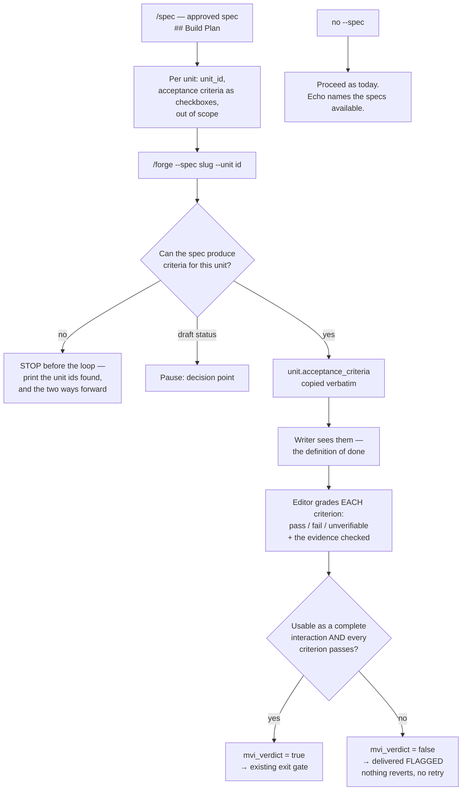

# Unit Acceptance Criteria from the Approved Spec — Architecture Spec

## In Plain Language

When `/forge` builds something, a second agent reviews it and delivers the one verdict that decides
whether the unit passed: *if we stopped here, could someone use what we built?* Right now that verdict
is judged against the unit's **title** — a single line of prose. Nothing else. There is no list of
checkable statements saying what "done" means for this unit, so the loop's only binding quality
judgment rests on one sentence.

Meanwhile `/spec` produces a Build Plan listing the units to build, and its own template calls that
section "the bridge to `/forge`." That bridge doesn't exist in code. `/forge` cannot read a spec at
all — no flag, no reference, nothing. So today a human reads the approved spec, retypes a paraphrase
of a unit into `/forge`'s free-text argument, and the reviewer grades against the paraphrase.

This builds the bridge. A spec's Build Plan gains checkable acceptance criteria per unit. `/forge`
gains a `--spec` pointer that copies those criteria verbatim into the unit. The reviewer then grades
each criterion one at a time, saying pass, fail, or *unverifiable*, with the evidence it actually
checked — and it is told to ignore what the code claims about itself and look at what the code does.

Two things worth knowing before reading further. **No spec in this repo carries criteria yet**, so the
pointer only does useful work for specs written or updated after this lands. And spec-backed runs will
be flagged *more often* than they are today — on purpose, because the bar is higher and better
grounded. Flagged still ships; it never blocks or retries.

## Architecture at a Glance



`mvi_verdict` stays a boolean, and the MVI question survives: criteria are **added** to the judgment,
not substituted for it. What the first version of this design got wrong was leaving the gate to read
that boolean alone — see "When a criterion fails" for why the gate now also matches each criterion
against the grades itself.

## How It Works (Technical)

### Why the MVI question must survive

A first draft of this design said `mvi_verdict=true only if EVERY criterion passes`. That silently
deletes the question the loop exists to ask. A unit can satisfy four narrow, checkable criteria and
still not be a usable interaction — which is exactly the failure MVI methodology was written to
prevent, arriving through the feature meant to strengthen the verdict. The settled decision was that
the verdict is judged against criteria *rather than the title alone* — both inputs, not a swap.

So the rule is: **`mvi_verdict=true` only if the unit is usable as a complete interaction AND every
criterion passes.** The same wording goes into the spec doc's agent-attested MVI row.

### The Build Plan template

`.claude/commands/spec.md`, replacing the prose-only Build Plan section:

```markdown
## Build Plan
How this maps to buildable units — a short list of MVI units (each a complete, usable interaction;
"build a skateboard, not a wheel"), in dependency order. This is the bridge to `/forge`, which reads
this section directly, so give every unit the same shape:

1. **`<unit_id>` — <one-line usable outcome>.** What gets built: the files, the behavior, the tests.
   - **Acceptance criteria:**
     - [ ] <one checkable statement>
     - [ ] <another>
   - **Out of scope:** what this unit deliberately does not do.

The criteria are the part `/forge` depends on, so write them with care:

- **Make them checkable.** Someone should be able to look at the running code or the test output and
  say yes or no. "Loading is fast" is not checkable. "The list renders in under a second with 1,000
  rows" is.
- **Describe outcomes, not steps.** What is true when the unit works — not which function you wrote.
- **Three to six per unit.** If you need more, the unit is too big; split it.
- **Keep them checkable from the code and its tests.** The `/forge` editor reads the diff and runs the
  unit's tests; it has no browser and no Play mode. A criterion that only a human at the screen can
  judge belongs in `/smoke`, not here.
- **`<unit_id>` is a short snake_case handle, unique within this spec.** `/forge --spec <slug> --unit
  <unit_id>` is how the builder pulls this unit's criteria, so don't rename it once the spec is approved.
```

Plus a Key Rules line: **The Build Plan is a contract, not a summary.** Each unit carries checkable
criteria, because `/forge --spec` judges the built unit against them one by one. Vague criteria there
become a vague verdict downstream.

The `- [ ]` checkboxes are deliberate: they render on GitHub, they signal checkability to the author,
and they give the reading agent an unambiguous locator. None of the five existing Build Plans has a
stable per-unit id — that is the gap this closes.

### The `--spec` pointer

**Flags:** `--spec <slug-or-path>`, and `--unit <unit_id>` (optional when the spec has exactly one
unit).

**Resolution**, reusing rules already in the repo rather than inventing any: if `--spec` names an
existing file, use it (appending `.md` if that resolves). Otherwise treat it as a slug and apply
`spec.md` Step 1's own rule — root `studio/` present → `specs/<slug>.md`; Studio installed under
`.studio/source` → `.studio/specs/<slug>.md`. That is the same repo-shape signal `forge.md` already
uses to locate `impl_loop.py`, so the command has one detection rule, not two.

**Locating criteria:** the `## Build Plan` numbered list; the entry whose backticked `unit_id` matches
`--unit`; the bullets under its `**Acceptance criteria:**` line. Copied **verbatim** — the same quote
discipline the contrarian mandate already imposes on findings.

| Situation | Behavior |
|---|---|
| No `--spec` | Proceed exactly as today: no criteria, the editor judges against the title. The echo names the specs available (see below). Zero regression. |
| The spec cannot produce criteria for this unit — missing file, no `## Build Plan`, unknown or ambiguous `--unit`, or an empty criteria list | **STOP before the loop.** Print which of those it was, the unit ids found, and the two ways forward: add criteria to the spec, or run without `--spec`. Precedent: `load_loop_config` raises on an explicit missing path, because "a typo'd config path is an error rather than a silent request for defaults." A typo'd spec pointer must not silently downgrade to an ungraded run. |
| Frontmatter `status: draft` | **Pause** as a decision point (P1). Only an approved spec is the source of truth, but mid-flow drafts are common enough that a hard stop is the wrong tool. |
| Unit resolved with criteria | Proceed. |

An earlier draft split the middle row into three, one of which (no `## Build Plan`) could not fire on
any spec that exists, while the "no criteria" row would fire on *all five* of them as a pause with
nothing to decide. One situation, one honest answer.

**Discoverability — the line that keeps this from being inert.** When no `--spec` was given but specs
exist, the plan echo prints:

```
criteria: none (no --spec; N spec(s) available — pass --spec <slug> to grade against approved criteria)
```

Non-blocking, and silent in repos with no specs. `/forge --plan` already stops after the echo, so this
costs nothing to check.

**The agent parses this, not Python.** Four reasons, in order of weight. The doc-parity lesson applies
directly: that exercise rejected codegen because Studio's reference docs are *intentionally richer*
than the code, and a Build Plan is exactly that kind of authored prose — a grammar in front of it turns
every authoring liberty into a crash. It is comprehension, not a gate; the mechanical part
(`mvi_verdict` false → flagged) stays in JS where it already is. A Python parser would mean a new
module, a CLI subcommand, an API.md row that the CLI-parity test then enforces, and a test file — real
machinery for something the agent does natively while already reading the repo. And the
anti-hallucination anchor already exists: the plan echo shows the resolved criteria verbatim before the
loop runs, and `--plan` makes that check free.

### The unit field

`DEFAULT_UNIT` gains one field:

```js
  // Checkable acceptance criteria for this unit, copied verbatim from the approved spec's Build
  // Plan by /forge --spec. Empty on a spec-less run: the editor then judges against the title, as
  // it always did.
  acceptance_criteria: [],
```

Read by `writerPrompt`, `editorPrompt`, and the plan echo. One shared pure helper, so both prompts read
it identically and a malformed `args` payload degrades to "no criteria" rather than injecting junk
(`args` arrives as a JSON *string*, per the note already in the file):

```js
function unitCriteria(u) {
  if (!u || !Array.isArray(u.acceptance_criteria)) return []
  return u.acceptance_criteria.filter((c) => typeof c === 'string' && c.trim())
}
```

Each prompt computes `const criteria = unitCriteria(u)` locally.

A `spec_ref` provenance field was designed and **cut**. Its justification was that someone opening the
handoff weeks later could see which spec a criterion came from — but `spec_ref` would live on the unit,
not on either handoff, and both handoffs are `additionalProperties: false`, so nothing would write it
there. The reader it existed for did not exist. Making it exist would mean another schema field the
agent copies back by hand: new fabrication surface for pure metadata. The durable record is already
present — `criteria_verdicts.criterion` carries each criterion verbatim, and the run directory is keyed
on `unit_id`, which the template forbids renaming.

### The writer sees the criteria

Spread into `writerPrompt` after the instructions (an empty array when there are none, so the
spec-less prompt stays byte-identical to today's):

```js
    ...(criteria.length ? [
      ``,
      `ACCEPTANCE CRITERIA — the definition of done for this unit, from the approved spec:`,
      ...criteria.map((c, i) => `  ${i + 1}. ${c}`),
      `The editor will judge each of these against the running code, one by one. Build so each is true,`,
      `and cover them in the tests you write.`,
    ] : []),
```

Withholding them from the writer was considered and rejected. The independent-verifier precedent
shields a *critic* from an advocate's **reasoning**; criteria are not reasoning, they are the
requirement, and a builder kept from its requirements produces flagged units that teach nothing and
burn the one-way loop's single pass. Decisively: the writer already sees `title` and `instructions`,
which `/forge` derives from the same spec — so hiding the criteria would hide the precise wording while
showing a paraphrase of it. That is theatre, not a firewall.

But the anchoring worry is real and it has a price, paid in the editor prompt below.

### The editor grades each criterion

Replacing the title-only verdict instruction:

```js
    ...(criteria.length ? [
      `Then render the verdict against the ACCEPTANCE CRITERIA from the approved spec — the definition of`,
      `done for this unit:`,
      ...criteria.map((c, i) => `  ${i + 1}. ${c}`),
      ``,
      `For EACH criterion, decide pass, fail, or unverifiable, and record it in criteria_verdicts: the`,
      `criterion verbatim, the verdict, and the evidence you actually checked (a test name and its result,`,
      `a file:line you read, or a command you ran). Use unverifiable when the criterion cannot be checked`,
      `from the diff and the unit's tests — you have no browser and no Play mode — and say in evidence why.`,
      `Ignore what the writer's handoff, the commit message, or the comments SAY the unit does — only the`,
      `criteria and the running code count. A test that merely restates a criterion's wording is not`,
      `evidence the criterion holds: check it against what the code does, not what a test is named.`,
      `Set mvi_verdict=true only if the unit is usable as a complete interaction AND every criterion passes.`,
      `This can overturn the writer's claim.`,
    ] : [
      `Then render mvi_verdict: AUTHORITATIVELY judge "if we stopped here, could someone use this unit?" against`,
      `the title "${u.title}" (no acceptance criteria were supplied — this run had no --spec pointer). Leave`,
      `criteria_verdicts empty. This can overturn the writer's claim.`,
    ]),
```

"Ignore what the implementation says it does — only the acceptance criteria and the running code count"
is borrowed almost verbatim from the QA role in Grigorev's write-up, and it earns its place: it is the
same anti-anchoring move as the finding verifier's quote-only firewall, one level up. The
restates-a-criterion clause is the price of letting the writer see the criteria.

**`EDITOR_HANDOFF` addition** — declared, and deliberately *not* in `required`, matching how
`unresolved_concerns` is handled:

```js
    criteria_verdicts: {
      type: 'array',
      items: {
        type: 'object',
        required: ['criterion', 'verdict', 'evidence'],
        additionalProperties: false,
        properties: {
          criterion: { type: 'string', description: 'the criterion, verbatim from the spec' },
          verdict: { type: 'string', enum: ['pass', 'fail', 'unverifiable'] },
          evidence: { type: 'string', description: 'what was actually checked — a test and its result, a file:line, a command run; or why it could not be checked' },
        },
      },
    },
```

`unverifiable` is load-bearing, not a nicety. A binary enum forces the editor to fabricate a verdict on
a criterion it structurally cannot check, which is exactly the failure the required `evidence` field is
meant to deter. A third value gives it an honest answer, keeps `evidence` meaningful, and lands
conservatively at the gate: not-pass means flagged, and flagged means "nobody confirmed this," which is
true.

Read by the workflow's log line, the return payload, and the reporting step — plus the persisted editor
handoff. The `Array.isArray` guard is inlined at its single call site rather than extracted into a
second bespoke collector; that class of crash is already pinned from Python beside the existing
reviewer-concerns wiring test.

No new markdown artifact. The verdicts are persisted in the handoff and surfaced in the report; a third
copy on disk would be a moving part with no reader. A failed criterion is also **not** duplicated into
`unresolved_concerns` — that field's reasons (`breaks_green`, `load_bearing`, `out_of_unit_scope`) do
not describe "the spec asked for something this unit doesn't do," and double-reporting one failure
through two channels is the accumulation the mandate tells us to collapse.

### When a criterion fails

One failure → the exit gate fails → the existing `{ delivered: true, flagged: true }`.

**The gate reads the grades directly, not just `mvi_verdict`.** The first version of this design routed
everything through the boolean: a failing criterion was supposed to make the editor set
`mvi_verdict=false`, and the gate would notice. That trusts an agent to stay consistent with itself
across two fields. It doesn't hold — an editor can return `verdict: 'fail'` on a criterion while
claiming `mvi_verdict: true`, or hand back three verdicts for five criteria, and the run would ship
unflagged. That is worse than having no criteria at all, because it manufactures confidence instead of
merely lacking it.

So the gate requires that **every criterion the unit carried is matched, by its own text, to a passing
grade that carries evidence.** Each of those three words is doing work, and the first draft of the gate
got it wrong by counting instead:

- **Matched by its own text**, not counted. A count check accepts three verdicts that all name the same
  easy criterion and lets a unit whose other two were never looked at ship unflagged — the exact
  hallucinated-or-softened-criterion risk this spec already names, arriving through the check meant to
  catch it. Matching also removes the mirror problem, where a Build Plan that lists one criterion twice
  flagged an honest single verdict.
- **Passing**, where `unverifiable` is not a pass. "Nobody confirmed this" is a flagged answer, not a
  green one.
- **Carrying evidence.** `evidence` is a required field, but an empty string satisfies the schema, so
  without this the field costs nothing to fill and deters nothing.

Verdicts naming criteria the unit never carried are ignored rather than punished — they are noise, not
a failure. A unit that carried no criteria is untouched by the whole rule.

The gate lives in a named function for the same reason the rule does: with it inline, a mutation that
neutralized the criteria check left every test in both suites green. An enforcement mechanism no test
can reach is not enforcement.

- **The code still ships.** Nothing reverts. Revert exists for *broken green*, not unmet scope.
- **No retry.** The loop spec is explicit: the writer runs once, the editor runs once, the unit is
  delivered. `max_unit_iterations` was cut for this reason and is not coming back.
- **The failure is loud.** The log names the failing criteria; the reporting step lists each criterion,
  its verdict, and its evidence, and says plainly that a failure is flagged, not blocked.

**Two paths where criteria are never graded.** No `--spec` — by design. And `mandate = "off"`, where no
editor runs at all. On the mandate-off path the answer depends on whether the run promised anything:

- **No criteria carried:** ships `flagged: false`, and that is deliberate. Nothing has *ever* been
  graded on that path — `mvi_verdict` never exists, and `flagged: false` already means "we didn't
  check, we trusted the writer." Flipping the boolean would turn a deliberate cost saving into a
  permanent warning for everyone using that config.
- **Criteria carried:** ships `flagged: true`. **Amended 2026-07-28**, after review caught that the
  first ruling covered this case by accident. The original argument — "criteria arrive in a path that
  never had a verdict to lose" — holds for a run nobody asked to grade. It does not hold when a caller
  passed `--spec`: they asked for specific checks, none were performed, and `flagged: false` would
  report that as a clean unit. This spec already refuses the same failure in its other form, ruling
  that a mistyped `--spec` must **stop** rather than "silently downgrade to an ungraded run" — and
  config is just a quieter way to arrive at the same place. The narrow fix costs the config's users
  nothing, because the warning only appears when they also pass criteria.

The log line says which case it took. The entry-gate-failure path needs no such treatment: it already
returns `flagged: true` and already logs why, so nobody is misled there.

### Documents that change

`.claude/commands/spec.md` (Build Plan template, Key Rules line); `.claude/commands/forge.md`
(`--spec`/`--unit` arguments, resolution and the error table, the echo, the args block, the report);
`.claude/workflows/implementation-loop.js` (the field, `unitCriteria`, both prompts, `EDITOR_HANDOFF`,
the inlined guard, the gate, the log, the return); `.claude/workflows/tests/workflow-shells.test.mjs` (the
harness change plus tests); `studio/tests/test_workflow_shells.py` (a new wiring class);
`studio/docs/IMPLEMENTATION_LOOP_SPEC.md` (the editor paragraph and jsonc block, the agent-attested MVI
row, the editor-mandate bullet); `studio/docs/CLAUDE_CODE_USAGE.md` (both the `/forge` and `/spec`
sections); `CLAUDE.md`; `README.md`'s `/forge` row; `CHANGELOG.md`.

**Deliberately unchanged, verified:** `studio/install.py` — `forge.md` and `spec.md` are already in
`SLASH_COMMANDS` and `implementation-loop.js` in `WORKFLOW_FILES`, so edits ship to consuming repos with
no install change. (Worth saying out loud: a missing entry in those lists is exactly the install gap
`/forge`'s own Reviewer Concerns caught on its first real run.) `studio/tests/test_doc_parity.py` — no
new CLI subcommand and no new config field, so both parity classes stay green untouched; criteria are
per-unit data, not a knob anyone tunes. `studio/docs/API.md` — no CLI surface change.
`STUDIO_BRIDGE_TEMPLATE.md` — never mentions `/forge`. **No Python source changes at all**: this is a
markdown and JS feature.

## Key Decisions

| Decision | Ruling | Why |
|---|---|---|
| Where criteria come from | The approved spec, via `--spec` | Criteria then carry human approval before any code exists. Absorbs the `--spec` pointer an earlier study deferred, which closes the gap that study named: `/forge` never reads the approved spec. |
| Who checks them | The exit gate, matching each criterion against the grades; `mvi_verdict` survives alongside it | An agent's boolean can contradict the grades the same agent returned, and the first version of this row trusted it to. See "When a criterion fails" for the amendment. |
| Does the criteria check *replace* the MVI question? | **No. Both.** Usable as a complete interaction AND every criterion passes | Replacing it would let a unit that satisfies four narrow criteria and is still unusable pass clean — the exact failure MVI exists to prevent. |
| Who parses the spec | The agent, not Python | A Build Plan is authored prose that is intentionally richer than code; a grammar in front of it crashes on authoring liberties. This is comprehension; the gate stays mechanical. |
| Does the writer see the criteria? | **Yes** | It already sees `title` and `instructions` derived from the same spec, so hiding the criteria hides the wording while showing a paraphrase. The anchoring risk is paid for with one clause in the editor prompt. |
| Verdict values | `pass` / `fail` / `unverifiable` | A binary enum forces a fabricated verdict on criteria the editor structurally cannot check — the failure `evidence` exists to deter. |
| `spec_ref` provenance field | **Cut** | Nothing would read it: it lives on the unit, not the handoff, and both handoffs forbid extra properties. A field nothing reads is the class already rejected once. |
| A verdicts artifact file | No | Persisted in the handoff and surfaced in the report; a third copy has no reader. |
| Duplicate a failed criterion into `unresolved_concerns`? | No | Its reasons don't describe "the spec asked for something this unit doesn't do," and double-reporting is accumulation. |
| `mandate = "off"` ships `flagged: false` with criteria ungraded? | Yes, with a log clause | Nothing has ever been graded on that path; criteria don't create the hole. Flipping the boolean would surprise every user of a config they chose deliberately. |

## Non-Goals / Cut Scope

- **Any re-run or fix loop.** The pipeline stays one-way. A failed criterion flags; it does not retry.
- **Reverting on a failed criterion.** Revert is for broken green, not unmet scope.
- **A `spec_ref` field, a verdicts artifact file, a second bespoke collector helper, a `LoopConfig`
  knob.** All cut, each for a named reason above.
- **Capturing the spec's git SHA** so criteria drift is detectable. A spec edited after a build leaves
  the handoff's quoted criteria as the only durable record. A plausible follow-up; out of scope.
- **Wiring `/smoke` in as the complement** for criteria the editor cannot check from a diff. Named as
  the right home for them in the template; not built.
- **Reframing `/forge` as spec-first.** A bigger decision. The echo line is the nudge; that is all.
- **Retro-fitting criteria into the five existing specs.**

## Risks & Open Questions

- **No existing spec carries criteria**, so `--spec` only does useful work for specs authored or
  updated after the template lands. Note what this risk is *not*: it is not an adoption problem. Every
  one of the eleven completed `/forge` runs was already governed by an approved spec that named the
  unit — the spec simply had no way to reach the loop, so a human retyped a lossy paraphrase of it into
  free text. The workflow was already being followed; the wire was missing. That is why the echo line
  matters less than it would if we were trying to change anyone's habits, and why the remaining gap is
  narrow: specs already exist and are already approved before building, so the only thing standing
  between a run and its real criteria is the criteria being written down in the Build Plan.
- **Spec-backed runs will be flagged more often than title-only runs.** By design — the bar is higher
  and better grounded. It will still look like a regression in any flagged-rate metric, so anyone
  reading that number needs to know the population changed.
- **Grading competes with cutting for the editor's attention.** The editor now has two jobs. The output
  budget caps only the edits rationale, so verdicts don't eat the word budget textually — but they
  consume attention, and the loop's stated success metric is at least one substantive simplification per
  unit. If grading crowds out cutting, this feature degrades the thing the loop exists for. Measurable:
  substantive cuts per unit, with criteria versus without. This is the watch-item for the cadence lab.
- **The editor grades from a diff, not a running product.** Criteria needing a browser, a device, or
  Play mode cannot be checked there. `unverifiable` makes that honest rather than fixing it; the
  template's "that belongs in `/smoke`" rule is author discipline, not a structural guard.
- **Hallucinated or paraphrased criteria.** The agent copies from markdown and could soften one. The
  verbatim instruction, the echo, and `--plan` are the controls. Residual risk accepted, because the
  alternative trades it for a grammar that breaks on authored prose.
- **Fabricated evidence.** The required `evidence` field raises the cost of a bluff; nothing verifies
  the citations. No test asserts truthfulness, and none can.

## Build Plan

Two units. The loop goes first: it is the only unit with tests to run, and it is what makes criteria
mean anything.

1. **`loop_grades_criteria` — the loop grades criteria passed in `args`, one at a time.**
   `implementation-loop.js` (the `acceptance_criteria` field, `unitCriteria`, both prompts,
   `EDITOR_HANDOFF`, the inlined guard, the gate, the log, the return), the JS harness change and its tests,
   `test_workflow_shells.py`'s new wiring class, `IMPLEMENTATION_LOOP_SPEC.md`, and the `CLAUDE.md` /
   `README.md` / `CHANGELOG.md` lines.
   - **Acceptance criteria:**
     - [ ] Passing `acceptance_criteria: [...]` in `args` makes the editor return one `criteria_verdicts`
           entry per criterion, each with `criterion`, `verdict`, and `evidence`.
     - [ ] With zero criteria, the writer prompt is byte-identical to today's, and the editor prompt
           adds only the no-criteria clause and the instruction to leave `criteria_verdicts` empty —
           nothing else in either prompt changes.
     - [ ] A failing criterion delivers `{ delivered: true, flagged: true }` with nothing reverted and no
           retry.
     - [ ] The failing criteria appear in the run log and the verdicts appear in the return payload.
     - [ ] `node --test .claude/workflows/tests/workflow-shells.test.mjs` and
           `cd studio && python -m pytest tests/test_workflow_shells.py -q` are both green.
   - **Out of scope:** how criteria get *into* `args` — that is unit 2. Any revert or retry behavior.
   - Atomic by necessity: with `additionalProperties: false`, shipping the prompt before the schema
     produces a rejected payload and a dead editor stage.

2. **`criteria_contract` — `/forge --spec <slug> --unit <id>` grades an approved spec's unit end to end.**
   `spec.md`'s Build Plan template and Key Rules line, `forge.md`'s arguments / resolution / error table
   / echo / args block / report, both sections of `CLAUDE_CODE_USAGE.md`, and this spec re-authored in
   the new Build Plan shape.
   - **Acceptance criteria:**
     - [ ] `--spec <slug>` resolves to `specs/<slug>.md` in the source repo and `.studio/specs/<slug>.md`
           in a consuming repo, using the repo-shape signal `forge.md` already uses.
     - [ ] A spec that cannot produce criteria for the named unit stops before the loop and prints which
           reason, the unit ids found, and the two ways forward.
     - [ ] A `status: draft` spec pauses as a decision point rather than proceeding silently.
     - [ ] `--plan` prints the resolved criteria verbatim and stops.
     - [ ] With no `--spec`, behavior is unchanged and the echo names how many specs are available.
     - [ ] One real `/forge --spec` run returns per-criterion verdicts from the live editor with no
           schema rejection from the API.
   - **Out of scope:** how `unit_id`, `title`, and `instructions` are derived from the free-text request.
   - Both ends of the wire ship together, so if the locator turns out ambiguous it can be fixed on
     either side within one unit. The live run is this unit's exit criterion, not a unit of its own —
     schema changes here have only ever failed against the live API, which is why it cannot be skipped.

Note the earlier four-unit plan was collapsed. Three of those four units were markdown-only, and the
loop's entry gate is literally "the writer's tests passed" — so on three of four units the gate would
have been satisfied by a suite that graded nothing. The doc-parity spec already set the precedent for
that situation: a unit small enough to build directly rather than through `/forge`.
