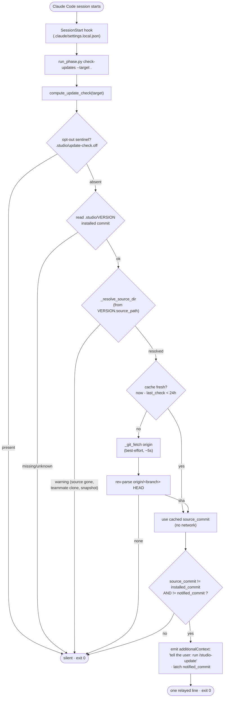

# Proactive Update-Availability Nudge — Architecture Spec

## In Plain Language

When a project installs Studio (via `studio init`), it gets a frozen copy of Studio's commands
and source. Studio keeps moving upstream — new commands, fixes — but the installed copy doesn't,
and nothing tells you. Today the only way to find out you're behind is to *remember* to run
`/studio-update` and check. Most people don't, so they quietly run an old Studio for weeks.

This feature makes the project tell *you*, instead of waiting to be asked. When you start a Claude
Code session in a project that has Studio installed, a small check runs in the background. It asks
one cheap question — "has the Studio source moved past the commit I installed from?" — and if so,
it surfaces a single line: *an update is available, run `/studio-update`*. If you're current, it
says nothing. Once it has nudged you about a particular update, it stays quiet until either a newer
update appears or you actually update.

It's built to be invisible when it has nothing to say and impossible to be annoying. It checks the
network at most once a day (and works fine offline), never changes your files, and never slows down
or breaks a session — if anything goes wrong, it just stays silent. One honest fact worth knowing:
the check can only work on the machine where Studio source actually lives — the computer you ran
`studio init` on. A teammate who clones the project but never had Studio source gets a safe no-op,
never a false nudge and never an error.

## Architecture at a Glance



**Walk-through.** Installing Studio drops a SessionStart hook into the project's *per-user*
`.claude/settings.local.json`. On each new session, Claude Code runs the hook, which calls a new,
lightweight `check-updates` subcommand. That command resolves the Studio source it was installed
from, and — at most once a day — fetches that source's `origin` and reads the current `origin/main`
HEAD commit. If that commit differs from the one recorded in the install's `VERSION`, an update is
available. It surfaces exactly one line, phrased so the model relays it to you, and then latches
that commit so it won't nudge again for the same update. Every branch that can't answer cleanly —
offline, no source on this machine, not a git repo, already current — falls through to silence and
exit 0. The check never mutates your files and never fails the session.

## How It Works (Technical)

All new code lands in the two files that already own this surface: git/version plumbing and the
check logic go in `studio/install.py` (reusing its shipped staleness helpers); the CLI subcommand,
parser, and handler go in `studio/run_phase.py`. No new module. Stdlib only.

### Components / modules

- **`check-updates` subcommand** (`run_phase.py`) — the entry point the hook calls. Thin handler
  `_do_check_updates(args)`: calls `compute_update_check`, and on a positive result emits the
  structured SessionStart output. Wrapped in `try/except Exception: pass` and **always exits 0** —
  a SessionStart hook that hard-fails would degrade the user's session, so a broken check must
  degrade to silence, never to an error.

- **`compute_update_check(target, *, now=None, fetch_timeout=5.0) -> UpdateCheck`**
  (`install.py`) — the whole decision, best-effort, never raises. `now` is injectable for
  deterministic TTL tests. Returns a two-field value object.

- **`UpdateCheck`** — a frozen dataclass trimmed to exactly what the caller and tests read:
  - `should_notify: bool` — surface the banner this session.
  - `reason: str | None` — why it stayed silent (diagnostics/tests only).

- **The TTL cache** — `.studio/update-check.json`, machine-written, three fields only:
  - `last_check: float` — `time.time()` at the last *network fetch attempt*; governs the TTL.
  - `source_commit: str` — `origin/<branch>` HEAD seen at that fetch; the value compared on a
    cache hit.
  - `notified_commit: str` — the upstream SHA the banner was last shown for; the notify-once latch.

  Nothing else is persisted. The installed commit and the "update available" verdict are recomputed
  live every call — persisting them would do nothing and would invite a future stale-cache bug.

- **`_install_sessionstart_hook(target, *, enabled)`** (`install.py`) — merges or removes our hook
  entry in the consumer's `.claude/settings.local.json`, identifying our own entry by the
  `check-updates` substring. Idempotent; refuses to touch an unparseable file.

- **Reused, unchanged:** `_resolve_source_dir`, `_git_fetch` (bounded, best-effort, never raises),
  `_default_branch_ref_local`, `_git_out`. No new git plumbing.

### Data / control flow

`compute_update_check` runs these steps; every "can't tell" branch returns
`should_notify=False` with a `reason`:

1. `now = now if now is not None else time.time()`.
2. **Opt-out:** if `<target>/.studio/update-check.off` exists → silent (`"disabled"`).
3. **Installed commit:** read `<target>/.studio/VERSION`; `installed_commit = version["commit"]`.
   Missing / `"unknown"` → silent.
4. **Resolve upstream:** `source_dir, warning = _resolve_source_dir(target, None)`. Any warning
   (source path gone — the teammate-clone case — moved, or VERSION unreadable) → silent. This is
   the exact upstream resolution `check-install`/`update` already use.
5. **Branch:** `branch = _default_branch_ref_local(source_dir) or "main"`;
   `remote_ref = f"refs/remotes/origin/{branch}"`.
6. **Cache / fetch:** load the cache. If fresh (`now - last_check < 24*3600` and `source_commit`
   present) → reuse cached `source_commit`, **no network**. Else `_git_fetch(source_dir, branch,
   timeout=fetch_timeout)` (best-effort; ignore its bool) then
   `source_commit = _git_out(source_dir, "rev-parse", "--verify", "--quiet", remote_ref)`.
7. `source_commit is None` (offline first run, no `origin`, not a git repo, detached) → silent,
   **write no cache** so the next online session retries.
8. `update_available = source_commit != installed_commit` — the settled cheap SHA compare, against
   the *live* installed commit.
9. `should_notify = update_available and source_commit != cache.notified_commit`.
10. **Write cache** (swallow write failures): `last_check = now` if we fetched else its prior value;
    `notified_commit = source_commit` if `should_notify` else its prior value; store `source_commit`.

Because the installed commit is read live and the verdict recomputed every call, **running
`/studio-update` clears the banner immediately** — even inside the TTL window, with no fetch: the
freshly-read installed commit now equals the cached source commit, so `update_available` is False.

### Interfaces & contracts

- **The hook** (written into `.claude/settings.local.json`):
  ```json
  {
    "hooks": {
      "SessionStart": [
        { "hooks": [
          { "type": "command",
            "command": "<sys.executable> \".studio/source/run_phase.py\" check-updates --target \"$CLAUDE_PROJECT_DIR\"" }
        ]}
      ]
    }
  }
  ```
  Two deliberate choices: the command uses the **absolute `sys.executable`** captured at install
  time (not bare `python`, which is `command not found` on a stock macOS with only `python3` — an
  invisibly dead feature for exactly the one user it targets); and it lands in the **per-user,
  gitignored** `settings.local.json` (not the shared `settings.json`), because the whole check is
  machine-local — both the source path and the interpreter path are absolute to the installer's box.

- **The surfaced output.** On `should_notify`, the handler emits the structured SessionStart form
  so intent is explicit and the model relays it, rather than relying on a bare stdout line being
  rendered:
  ```json
  {"hookSpecificOutput": {"hookEventName": "SessionStart",
    "additionalContext": "A Studio update is available upstream. Tell the user: run /studio-update to refresh the installed Studio copy."}}
  ```

- **Exit code:** always 0. No `sys.exit(1)` on this path (unlike `check-install`, which exits 1 on
  a stale source). A SessionStart hook must not fail the session.

- **`--no-hook`** on both `init` and `update` parsers: a one-shot skip for that invocation.
- **`install_studio(install_hook=True)`** gains the flag; both `init` and `update` route through it,
  so the hook is installed on init and refreshed (idempotently, by the marker scan) on every update.

### Data model

No persistent schema beyond the three-field cache JSON and the opt-out sentinel file. `UpdateCheck`
is an in-memory per-invocation value object. No changes to `VERSION` or `MANIFEST.json`. The cache
file should be added to the consumer's gitignore (a doc note — install.py does no gitignore
management today).

### Dependencies

- Existing `install.py` helpers (above) and `git` on `PATH` (already assumed). Network only on a
  cache miss, and always best-effort.
- Claude Code's SessionStart hook mechanism and its `$CLAUDE_PROJECT_DIR` variable.

## Key Decisions

1. **SessionStart hook is the trigger** (settled with the user). It's the only surface that fires
   *without* the user reaching for a Studio command — the point of the feature. Piggybacking on
   `prepare` was rejected: it only ever nudges people already using Studio.
2. **Hook lives in `.claude/settings.local.json`, not `settings.json`** (contrarian). The check is
   inherently machine-local — `VERSION.source_path` and `sys.executable` are both absolute paths to
   the installer's box. Committing the hook would inflict an unresolvable command and a
   machine-specific diff on every teammate. Per-user + gitignored keeps it personal; teammates
   simply never get the hook.
3. **`sys.executable` in the hook command, not bare `python`** (contrarian). Bare `python` is a
   silent `command not found` on common setups → an invisibly dead feature for the one user it can
   help. Baking the resolving interpreter also closes the `python` vs `python3` question outright.
4. **TTL-cached best-effort fetch, 24h, hardcoded** (settled; knob cut by contrarian). A network
   fetch is required to catch an *unfetched* origin; a 24h TTL bounds it to ~once a day; offline
   degrades to silence. Nobody tunes the window, so `ttl_hours` and the whole `.studio/update-check.toml`
   config file were cut — a one-bit opt-out sentinel (`.studio/update-check.off`) replaces them.
5. **Cheap commit-SHA compare** (settled). Installed `VERSION.commit` vs source `origin/main` HEAD.
   Advisory only — the nudge just says "run `/studio-update`"; the update itself runs the precise
   manifest diff. A repo-level SHA can occasionally nudge when an upstream commit didn't touch
   installed files; harmless for an advisory nudge, and far cheaper than materializing the tree.
6. **Notify once per new upstream commit** (settled). The `notified_commit` latch in the cache is
   the single enforcement point; it re-arms only when upstream advances or the user updates.
7. **Structured `additionalContext`, phrased as a relay directive** (contrarian). SessionStart
   stdout reaches the *model as context*, not guaranteed to the terminal, and the notify-once latch
   burns on emit whether or not the user saw it — so the surfacing has to be as reliable as we can
   make it. The structured form states intent explicitly; **merge is gated on a `/smoke` check that
   the nudge actually reaches the user** (see Risks).
8. **Cache trimmed to three fields; `UpdateCheck` to two** (contrarian). Persist only what a later
   call can't recompute (`last_check`, `source_commit`, `notified_commit`); return only what the
   caller reads (`should_notify`, `reason`). Dead persistence invites stale-cache bugs.
9. **Distinct from the shipped `_source_staleness`.** That helper compares the source's *local*
   main vs origin (for `check-install`/`update`). This compares the *installed snapshot* vs origin
   HEAD — a different question that also catches "the source clone advanced but the user never ran
   update." It shares the low-level git helpers, not the dataclass.

## Non-Goals / Cut Scope

- **Nudging teammates who cloned the consuming repo.** By design impossible — the check needs Studio
  source on the local machine, which only the installer has. Safe no-op for everyone else. Stated,
  not solved.
- **Auto-updating.** The nudge never runs `/studio-update` for you and never mutates files.
- **A precise "what changed" list in the nudge.** That's `/studio-update`'s job; the nudge is a
  one-line pointer.
- **Cut by the contrarian:** the `ttl_hours` knob; the `.studio/update-check.toml` config file and
  its loader (→ opt-out sentinel); cache fields `update_available` and `installed_commit`; three of
  `UpdateCheck`'s five proposed fields.
- **Multiple remotes, non-`origin`, shallow clones, non-`main`/`master` default branches** — resolve
  to "can't tell" → silent, as with the shipped staleness feature.

## Risks & Open Questions

- **Does the nudge actually reach the user? (the load-bearing risk).** SessionStart output is
  injected as model context; whether the user learns of it depends on the model relaying it, and the
  once-per-commit latch is spent on emit regardless. Mitigation: the structured `additionalContext`
  form phrased as an explicit relay directive. **This must be verified with `/smoke` against a live
  Claude Code session before the feature merges** — if it proves invisible, the surfacing form is
  the thing to change, not the rest of the design.
- **Fetch moves `origin/<branch>` in the user's live Studio source checkout.** A remote-tracking-ref
  update only (no working tree, no local branch), TTL-bounded to once/24h — the same
  non-destructive side effect the shipped staleness feature already accepted. Worth one line of
  awareness; not a blocker.
- **Concurrent sessions race on the cache write.** Last-writer-wins; worst case a duplicate banner.
  Not worth a lock.
- **Default-branch assumption.** Keys on `main`/`master`; anything else resolves to silent.

## Build Plan

Build as MVI units, in dependency order. Studio is stdlib + pytest; tests build hermetic temp git
repos against a **local bare remote** (no network), and inject `now` for TTL determinism.

1. **Signal + cache + command (runnable on its own).** `UpdateCheck`, `compute_update_check`, the
   three-field cache load/write, the opt-out sentinel check, the `check-updates` parser,
   `_do_check_updates` (structured output + always-exit-0), and dispatch. Tests: update-available,
   up-to-date, offline fallback, TTL cache-hit-skips-fetch, notify-once, re-arm on new commit,
   updated-inside-TTL-clears, exit-0-on-garbage-target. *Usable outcome:* a working manual
   `check-updates` that prints when behind, nothing when current.
2. **Hook install/merge (makes it automatic).** `_hook_command` (using `sys.executable`),
   `_install_sessionstart_hook` (merge into `settings.local.json`, idempotent, marker-scanned,
   skip-unparseable, remove-on-disable), `install_hook` on `install_studio`, `--no-hook` on
   `init`/`update`. Tests: merge doesn't clobber existing hooks/keys, idempotent (no duplicate),
   opt-out removes the hook, unparseable file left untouched. *Usable outcome:* `init` now nudges
   automatically.
3. **Docs + the surfacing verification gate.** Update `CLAUDE_CODE_USAGE.md` (the hook + the
   `/studio-update` nudge), the bridge template, and `API.md` (`check-updates`, the sentinel
   opt-out, `--no-hook`, the gitignore note). **Run `/smoke` to confirm the nudge reaches a live
   session** (Key Decision #7 / the top risk). *Usable outcome:* documented, and verified to
   actually surface.
