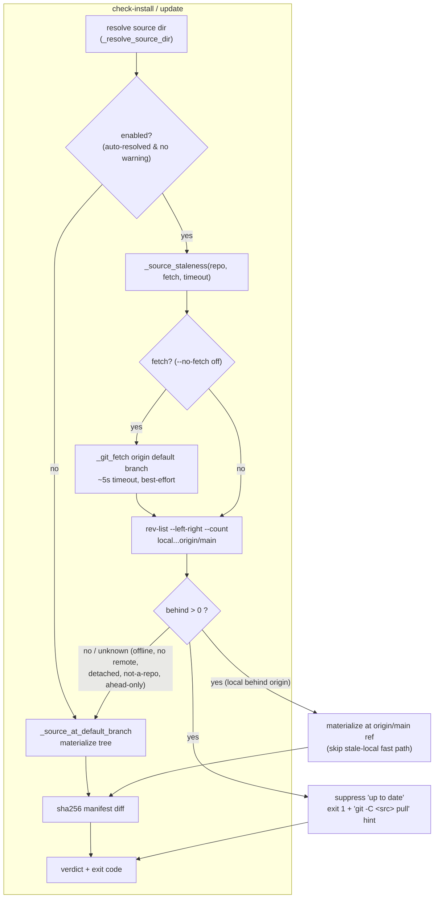

# Source-Staleness Detection for `/studio-update` — Architecture Spec

## In Plain Language

When you run `/studio-update` in a project, it checks your installed Studio copy against
the "real" Studio source and tells you whether you're up to date. The problem: it measures
"up to date" against **your local Studio folder**, and it never checks whether that folder is
itself behind. If your Studio checkout hasn't pulled the latest commits, the files it compares
look identical to what your project already has — so the tool confidently says "up to date"
when it isn't. You then can't get new commands like `/spec` no matter how many times you update.

This feature teaches the updater to first ask a second question: **"is the source I'm about to
compare against itself behind its own remote?"** It does a quick network fetch of the Studio
source's remote (with a short timeout, and a `--no-fetch` escape hatch for offline use), and if
your local `main` is behind `origin/main`, it refuses to print "up to date." Instead it compares
against the fresher `origin/main`, shows you what's actually new, and tells you the one command to
run to catch your source up. A false "up to date" over a stale source becomes impossible.

It never touches your Studio checkout for you — no silent `git pull`. It just tells you the exact
command. And it degrades quietly: offline, no remote, or a source that isn't a git repo all fall
back to today's behavior rather than crashing.

## Architecture at a Glance

**Walk-through.** Both `check-install` and `update` resolve the source directory as they do today.
When staleness detection is *enabled* (the source was auto-resolved and isn't a broken snapshot), a
new helper `_source_staleness` runs before the source tree is materialized. Unless `--no-fetch` is
set, it does a short, best-effort `git fetch` of the source's default-branch remote, then measures
how far local `main` is ahead/behind `origin/main`. If local is **behind**, the run is stale: the
updater materializes and diffs against `origin/main` instead of the stale local tree, suppresses the
"up to date" verdict, exits non-zero, and prints the one-line pull command. Every "can't tell" case
(offline, no remote, detached HEAD, not a git repo, or local merely *ahead* of origin) falls through
to today's behavior — the feature only ever *adds* a block, never a false one.

## How It Works (Technical)

All changes are in `studio/install.py` and the two CLI handlers in `studio/run_phase.py`.
Stdlib only; git is driven through the existing `_git_out` subprocess helper.

### Components / modules

- **`_source_staleness(repo, *, fetch=True, timeout=5.0) -> SourceStaleness`** — new helper in
  `install.py`, placed right after `_default_branch_ref` (~line 236). Best-effort, **never raises**.
  Verifies the local default branch and `origin/<branch>` exist, optionally fetches, then computes
  divergence. The single place the `is_stale` rule is decided, so it can't be re-derived (and
  mis-derived) at each call site.
- **`SourceStaleness`** — a frozen dataclass returned by the helper. Fields:
  - `is_stale: bool` — True **only** when the local default branch is strictly *behind* origin.
  - `behind: int` — commits local is behind origin (0 when unknown).
  - `remote_ref: str | None` — e.g. `origin/main`; the ref to materialize/diff against when stale.
  - `fetched: bool` — whether the fetch actually ran and succeeded.
  - `reason: str | None` — human line when staleness could not be determined (offline, no remote,
    detached, not-a-repo), for the caveat message.
  - (`ahead` is **not** exposed — it never affects the verdict; cut per the editor pass.)
- **`_git_fetch(repo, branch, *, timeout) -> bool`** — a small, bounded sibling to `_git_out`
  (own `timeout`, swallows failure, returns success). Kept separate because `_git_out` is called
  everywhere with `check=True` and no timeout; adding a network timeout to it would ripple.
- **`_default_branch_ref_local(repo) -> str | None`** — the *local-only* half split out of
  `_default_branch_ref`. Staleness needs the local branch specifically; the existing
  `_default_branch_ref` (which falls back to `origin/main`) is left untouched for its worktree
  callers — using it here would resolve straight to origin and report a false "even".

### Data / control flow

**`check_studio` (install.py ~575):** resolve source → if `enabled` and the source is a git repo,
call `_source_staleness` **before** `_source_at_default_branch` → build the sha256 manifest as today
→ `up_to_date = (no changes) and not staleness.is_stale`. When stale, the tree is materialized at
`staleness.remote_ref`, so the diff the user sees is the honest "what origin/main has that you don't"
list, alongside the pull hint.

**`update_studio` (install.py ~670):** **staleness is computed here, in update's own scope — not
inherited from the delegated `check_studio`.** This is the load-bearing correction from the debate
(see Key Decisions). `update_studio` computes `enabled = auto_resolved and warning is None` itself,
so it must call `_source_staleness(source_dir, ...)` in that scope *before* opening
`_source_at_default_branch` at ~line 702, thread `remote_ref` into the materialization (skip the
clean-tree fast path when stale), and fold `is_stale` into the `up_to_date` short-circuit at
~line 706. Routing it through `check_studio(target, effective_dir)` would silently disable it,
because that call passes an explicit dir → `check_studio`'s own `enabled` is `False`.

### Interfaces & contracts

- **`_source_at_default_branch` (install.py ~239):** its clean-tree fast path (~line 272) today
  materializes the *stale local* `main`. New contract: when the caller knows the source is stale,
  it passes the target ref (`origin/main`) and the fast path is skipped, so
  `git worktree add --detach <wt> <ref>` (~line 289, already ref-agnostic) checks out origin. The
  existing `source_note` channel carries the "read from origin/main instead of local main" line —
  no new output plumbing.
- **`--no-fetch` flag:** added to both the `check-install` and `update` subparsers
  (run_phase.py ~2042 / ~2052). Threaded as a new `fetch: bool = True` kwarg on `check_studio` /
  `update_studio`. Default fetches; `--no-fetch` compares against cached refs only.
- **Verdict / exit code:** the handlers (run_phase.py ~3058 / ~3092) print a staleness block and
  call `sys.exit(1)` directly when stale. `SystemExit` derives from `BaseException`, so it is *not*
  caught by `main`'s `except Exception` (~line 3284) — it propagates with the intended code and no
  spurious `Error:`/traceback line. (Verified against the code.)
- **Result dicts:** `check_studio`'s returned dict gains a `staleness` entry (or reuses the existing
  `warning`/`source_note` strings) so the handler can render the block. No caller outside the two
  handlers depends on the new field.

### Data model

No persistent data. `SourceStaleness` is an in-memory, per-invocation value object. No changes to
`.studio/VERSION`, `MANIFEST.json`, or any on-disk format.

### Dependencies

- Existing `install.py` helpers: `_resolve_source_dir`, `_source_at_default_branch`,
  `_default_branch_ref`, `_git_out`, `_git_info`, `_build_manifest` / `_sha256`.
- `git` on `PATH` (already assumed). Network only when fetching, and only ever best-effort.

### Failure-mode matrix

| Situation | Behavior |
|---|---|
| **Unfetched origin (the bug)** | Default fetch updates `origin/main`; `behind > 0` → block, exit 1, pull hint. |
| Offline / fetch times out | `fetched=False` + caveat; fall back to cached refs. Blocks *only* if cached refs already show behind (a real signal); otherwise proceeds. Never crashes. |
| `--no-fetch` given | Skip network; compare against cached `origin/main`. |
| No git remote configured | `origin/<branch>` missing → `is_stale=False`, `reason` set → proceed as today. |
| Detached HEAD / not a git repo | `_git_out`/`_default_branch_ref_local` → `None` → `is_stale=False`, `reason` set → proceed. |
| Local **ahead** of origin (unpushed WIP) | `behind=0` → **not** stale → green allowed. Must not be blocked. |
| Running from installed snapshot | When `_resolve_source_dir` returns a `warning`, `enabled=False` → staleness skipped (already warned). When it resolves live upstream cleanly, `enabled=True` → staleness runs on that resolved upstream (correct, single fire). |

## Key Decisions

1. **Staleness is a separate question from the file diff.** The sha256 manifest answers "does the
   consumer match the source tree I read?"; staleness answers "is that source tree itself behind its
   remote?" Two cheap checks, kept distinct, combined into one verdict.
2. **`update_studio` computes staleness in its own scope — NOT via the delegated `check_studio`.**
   *This is the correction the debate's contrarian caught and the reason the design is safe.* Because
   `update_studio` calls `check_studio(target, effective_dir)` with an explicit dir, `check_studio`'s
   own `enabled` is `False` there; a staleness check living only in `check_studio` would silently
   never run on `/studio-update` — the exact command in the bug report. Verified against
   `install.py`. So both handlers compute staleness in the scope where `enabled` is genuinely derived
   from `auto_resolved`.
3. **Fetch by default, bounded, with graceful fallback** (settled with the user). The recurring bug
   is an *unfetched* origin, which refs-only cannot see, so a network fetch is required to catch it;
   a short timeout + `--no-fetch` keep offline runs working.
4. **Refuse the green verdict + compare against `origin/main`** (settled). A warning alone is what
   has been getting ignored; suppressing "up to date" and exiting non-zero makes a false green
   impossible, and diffing against origin gives the honest update list in the same run.
5. **Never mutate the user's source repo** (settled). Detect and print `git -C <source> pull`; no
   auto-pull. A `--pull-source` opt-in is explicitly deferred.
6. **Pre-decided boolean over raw counts:** `is_stale` is computed once inside the helper so the
   "ahead ≠ stale" rule lives in exactly one place.
7. **`sys.exit(1)` in the handler over threading return codes** through `_dispatch`/`main` — smaller
   blast radius, and `SystemExit` bypasses the `except Exception` cleanly.

### Rejected alternatives

- Refs-only, never fetch → blind to the unfetched-origin case (the actual bug). Rejected.
- Warn-but-still-report → the ignored-warning failure mode. Rejected.
- Auto-pull the source → surprising mutation of the user's checkout. Deferred behind opt-in.
- Reuse `_default_branch_ref` (with its origin fallback) for the local ref → would report a false
  "even". Rejected in favor of the `_default_branch_ref_local` split.

## Non-Goals / Cut Scope

- **Consumer vendored-snapshot self-heal** (the "snapshot too old to run the new code" layer) — out
  of scope. `studio-update.md` already carries recovery guidance; tracked as a follow-up.
- **`--pull-source`** auto-fast-forward — deferred.
- Non-`origin` remotes, multiple remotes, shallow clones — not handled; `is_stale=False` + reason.
- Cut from the design during the editor pass: exposing `ahead` on the dataclass; a second
  `rev-parse --show-toplevel` (compute the repo top once and reuse).

## Risks & Open Questions

- **Fetch moves the remote-tracking ref.** `git fetch` updates `origin/main` in the source repo.
  This is a normal, non-destructive read (it touches no working files and no local branches), but
  it *is* a side effect — worth one line in the output so it isn't surprising, consistent with
  "never mutate the user's work."
- **Test flakiness guard:** the fetch-timeout test must not depend on a real unreachable URL;
  monkeypatch `_git_fetch → False` to simulate the fallback deterministically.
- **Default-branch assumption:** detection keys on `main`/`master`. A source repo whose default
  branch is neither resolves to "unknown" (reason set) and proceeds — acceptable, but noted.

## Build Plan

Build as MVI units, in dependency order. Studio is stdlib + pytest; tests build hermetic temp git
repos against a **local bare remote** (no network).

1. **Detection helper, tested in isolation.** `_source_staleness` + `SourceStaleness` +
   `_git_fetch` + `_default_branch_ref_local`. Unit tests over git fixtures: behind, even,
   ahead-only, diverged, no-remote, not-a-repo, detached, `--no-fetch` cached-refs,
   fetch-catches-unfetched-origin, fetch-timeout-fallback — each asserting exact `is_stale`/`behind`.
   *Usable outcome:* the helper correctly classifies any source repo.
2. **Wire into `check-install`** end to end: compute → fold into `up_to_date` → materialize/diff
   against `origin/main` when stale → `--no-fetch` flag → `sys.exit(1)` + pull hint in the handler.
   Integration tests assert verdict + exit code, including a regression guard that even/clean repos
   still report green. *Usable outcome:* `check-install` never reports a false "up to date".
3. **Wire into `update`** in its *own* scope (the Key Decision #2 correction): staleness before
   materialization, `remote_ref` threaded in, `is_stale` folded into the `up_to_date` short-circuit.
   Test `test_update_stale_source_reinstalls_from_origin` (guards against the delegation trap) +
   the blocked/`--force` paths still work. *Usable outcome:* `/studio-update` refuses to no-op over
   a stale source and installs from origin.
4. **Docs:** update `studio-update.md` (the staleness block, `--no-fetch`, the pull hint) and the
   `check-install`/`update` argument docs; CHANGELOG entry. *Usable outcome:* the behavior is
   documented where users and the command-driving agent will read it.
