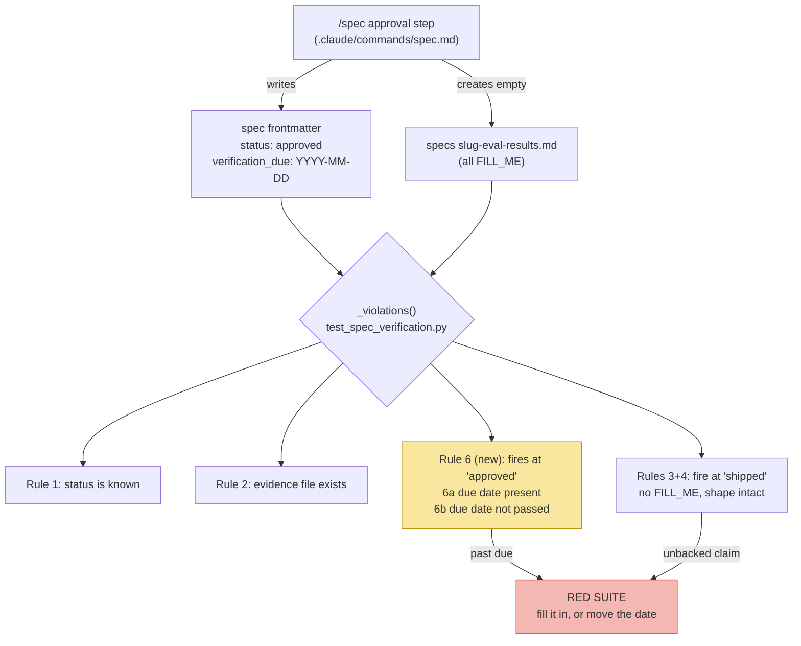

# A Deadline on the Approved-but-Unverified Tolerance — Architecture Spec

## In Plain Language

Studio has a rule for features that live in an AI's instructions rather than in code. Nothing can
test those — no failing check tells you the wording stopped working — so the rule says: before you
build one, write down what would count as proof it works, and afterwards record what actually
happened in a companion file. Only when that file is filled in may you call the feature finished.

The rule has a deliberate soft spot. A spec is allowed to sit in the "approved" state holding a
blank evidence file, because that blank file is the point: the headings get committed before anyone
knows how it turned out, so they can't be arranged afterwards to flatter the result. What the rule
never said is how long that's allowed to last. The answer turned out to be forever. The check only
refuses a spec that *claims* to be done, so a feature could be built, merged, and in daily use while
its spec quietly stayed "approved" with nothing recorded. That is not hypothetical — the rule's own
spec did exactly this for five days, and it was fixed only because someone happened to ask.

This feature puts a clock on it. When you approve a spec that promised evidence, you also write down
the date by which you expect to have it. When that date passes without the evidence, the test suite
goes red and tells you the two honest ways out: record what you found, or move the date. Moving it is
allowed and sometimes correct — the point is that it becomes a visible edit somebody can question,
rather than silence nobody notices.

## Architecture at a Glance

Rules 3 and 4 police the `shipped` end: if you claim the feature works, the evidence must be there
and intact. Rule 6 polices the `approved` end, and the two never overlap — a spec is in exactly one
status, so the branches are disjoint. Rule 1 protects all of them, since an unrecognized status would
switch every later rule off while the suite stayed green.

## How It Works (Technical)

**Components.** Two files change, and no new module appears.

- `studio/tests/test_spec_verification.py` — gains rule 6 inside `_violations()`, reading the field
  with the frontmatter parser that already exists (below). No parser work.
- `.claude/commands/spec.md` — the frontmatter template gains the field; Step 4's approval bullet
  gains the instruction to write it.

**The generalized reader already exists — this spec no longer builds one.** When this was drafted,
the test carried a private `_frontmatter_status()` that read a single named field, and the plan was to
generalize it. PR #122 did that work first: `stats.parse_frontmatter` (`studio/stats.py:20`) returns
every `key: value` line of the leading `---` block, `_frontmatter_status` is gone, and
`test_spec_verification.py` already imports and calls it. Its docstring names it "the one reader of
spec frontmatter."

So the new rule just calls it. The scoping this spec wanted is already guaranteed there — only the
*leading* block counts, so a spec transcribing `verification_due:` into its own prose or a code fence
cannot self-satisfy the rule.

This also kills a second bug before it ships. The frontmatter template writes trailing comments
(`status: draft            # draft → approved → shipped`), so a date regex anchored with `$` would
reject `verification_due: 2026-09-03   # 30 days from approval` — the template would teach a form the
gate rejects. Reading the raw token and parsing the date from it handles both.

**Rule 6.** One block in `_violations()`, gated on `promised_evidence and status == "approved"`:

- **6a — the deadline exists.** No parseable `verification_due` date → violation. Malformed counts as
  missing.
- **6b — the deadline holds.** `date.today() > due` → violation, naming both exits.

Note what 6b does **not** check: whether `FILL_ME` is still present. A spec past due with a *filled*
evidence file is a feature that did the work and forgot to flip its status — the same stale-status
bug, currently escaping forever because rules 3 and 4 need `shipped`. Dropping the clause is one
fewer moving part and strictly more coverage.

**No clock injection.** A `today` parameter was considered and cut. Fixtures express "not yet due" as
`date.today() + timedelta(days=1)` and "overdue" as `- timedelta(days=1)`; both are midnight-safe,
because a rollover moves the comparison and the fixture in the same direction and the ±1 offset
absorbs it. The only case injection would buy is the exact `today == due` boundary, which is not
worth a permanent parameter on this file's most-read helper.

**Fixture migration, which is not optional.** `_synthetic_spec()` builds frontmatter with no
`verification_due`, so rule 6a fires on it and three tests that assert exact violation counts turn
red: `test_approved_with_missing_results_file_fails`, `test_a_widened_verification_heading_is_still_gated`,
and `test_approved_with_placeholders_passes`. The fix is a `due` parameter defaulting to a valid
future date, so all three keep their existing assertions and keep proving exactly what they were
written to prove — this file is deliberately built so each case "differs from `_FILLED` in exactly one
section, so the case it proves is obvious."

**Dependencies.** `datetime.date` from the stdlib. Nothing else.

## Key Decisions

- **A date the author sets, not a build signal inferred from git.** The obvious proxy — matching a
  spec's Build Plan `unit_id`s against `writer: <unit_id>` forge commits — was measured against the
  real corpus before being proposed, and detects only 4 of 10 shipped specs. Four predate the
  `unit_id` format entirely and several units were built by hand with no matching commit. A 60%
  false-negative rate cannot carry a gate. Deriving age from git history instead was also rejected:
  CI checks out shallow, so the history isn't there to read.
- **The field is mandatory, settled by precedent rather than taste.** Rule 1 exists because an
  unrecognized status "would otherwise switch the two rules below off forever while the suite stayed
  green." A missing `verification_due` does precisely that to rule 6b. Optional means off — and the
  only writer of this field is prose an AI executes, which is exactly the thing that can forget.
- **Failing, not reporting.** Report-only was rejected because it carries the identical weakness that
  caused the original failure: it relies on someone reading and acting, which is what did not happen
  for five days. Warn-then-fail was rejected as two thresholds and two code paths for a failure mode
  seen once.
- **30 days.** Fourteen fires on legitimately in-flight work — this repo's specs routinely run one to
  three weeks from approval to shipped — and a deadline that fires on healthy work trains the reflex
  of bumping the date, which is the one behavior that destroys the signal entirely. Sixty outlives the
  working memory of whoever approved it.
- **This spec carries no `## Verification` section, deliberately.** The test is *could a failing
  pytest tell us this broke?* Here it could — rule 6 is a pytest. The prompt-shaped half (an AI
  remembering to write the field) is itself backed by rule 6a going red. A feature that fixes the
  verification tier turns out not to need it.

## Non-Goals / Cut Scope

- **Stale `approved` status generally.** Rule 6 fires only on specs that promised evidence. Specs with
  no `## Verification` section can sit at `approved` after shipping and nothing here touches them.
  That is a real and larger gap, and it is bookkeeping rather than something this mechanism handles.
  PR #112 has since cleared the backlog of eight that prompted this note; one spec sits in that state
  on `main` today.
- **A `today` injection parameter.** Cut; see above.
- **A `FILL_ME` sub-condition on 6b.** Cut; removing it is simpler and catches more.
- **Any bypass or skip flag.** Deliberately absent. A deadline that can be waved off is decorative,
  and this is a single-maintainer repo where the blast radius of a red suite is one person.
- **Specs at `draft`.** A built feature whose spec never left `draft` triggers nothing. Drafts are
  legitimately open-ended, so this is correct — but it means "park it" remains available.

## Risks & Open Questions

- **CI can red `main` on a calendar event.** The workflow runs on `push: main` and `merge_group`, not
  only `pull_request`, so a passing deadline can block the queue with no commit involved. Accepted
  with eyes open: a deadline that does not fire on its own is not a deadline. Named here so nobody
  discovers it as a surprise.
- **Deleting the `## Verification` section silences rules 2 through 6**, the new deadline rule
  included, since 6 is gated on `promised_evidence` too. That hole predates this feature — rule 6
  joins it rather than opening it — but the *incentive* to use it grows, because keeping the
  section at `approved` now costs a deadline where before it cost nothing. Nothing cheap fixes this
  without a build signal, which was measured and rejected. Named, not built for.
- **Rule 6 ships with zero live coverage.** No spec in the repo will exercise it: both specs carrying
  a `## Verification` section are already `shipped` and filled. Every assertion about it is synthetic
  until the next prompt-shaped spec exists.
- **Moving the date is defended only by review legibility.** Setting `verification_due: 2099-01-01` is
  possible and undefendable in code. The defense is that it is a visible line in a diff.

## Build Plan

1. **`due_date_rule` — the suite refuses an approved spec whose promised evidence has no live
   deadline.** Read the field with the existing `stats.parse_frontmatter`, add rule 6 (6a mandatory
   field, 6b deadline passed) to `_violations()`, give `_synthetic_spec` a `due` parameter, and correct
   the module and `_violations` docstrings in place — both currently state that the only trigger is a
   human typing `shipped`, which rule 6 falsifies.
   - **Acceptance criteria:**
     - [ ] A spec with a `## Verification` section at `status: approved` with no `verification_due` field produces exactly one violation naming the missing field.
     - [ ] A spec with a `## Verification` section at `status: approved` whose `verification_due` is in the past produces a violation naming both exits: fill in the evidence, or move the date.
     - [ ] That same past-due violation fires whether or not the evidence file still contains `FILL_ME`.
     - [ ] A spec with no `## Verification` section at `status: approved` and no `verification_due` produces no violation from rule 6.
     - [ ] `verification_due` is read only from the leading `---` block, so the same text inside the spec's prose or a code fence does not satisfy 6a.
     - [ ] A `verification_due` line carrying a trailing `#` comment parses as a valid date.
     - [ ] The three existing tests that assert exact violation counts still pass with their assertions unchanged.
     - [ ] `specs/find-before-you-grep.md` carries a `verification_due` date and the full suite is green — the rule ships with the repo passing, not with a known-red spec.
   - **Out of scope:** writing the field at approval time; any change to `.claude/commands/spec.md`.

2. **`approval_writes_the_date` — approving a spec that promised evidence records when the evidence is
   due.** Add `verification_due` to the frontmatter template in `.claude/commands/spec.md`, and a
   clause in Step 4's approval bullet setting it to 30 days out. Correct the rule inventory in
   `specs/prompt-feature-verification.md`, which describes the convention as four rules.
   - **Acceptance criteria:**
     - [ ] The frontmatter template in `.claude/commands/spec.md` includes `verification_due`, marked as required only when the spec carries a `## Verification` section.
     - [ ] Step 4's approval step instructs setting `verification_due` to 30 days from approval, in the same place it already instructs creating the evidence file.
     - [ ] No document still describes the convention as four rules, or states that the only trigger is a human typing `shipped`.
     - [ ] The full suite passes and `ruff check .` is clean.
   - **Out of scope:** backfilling `verification_due` into existing specs — unit 1 already does the one
     that needs it. (This line previously claimed no spec promised evidence at `approved`. That was
     true when this was drafted and is not now: `find-before-you-grep.md` sits at `approved` with a
     `## Verification` section, so rule 6a fires on it and the backfill moved into unit 1, the same
     way #122 shipped its rule together with the backfill that kept the suite green.)
