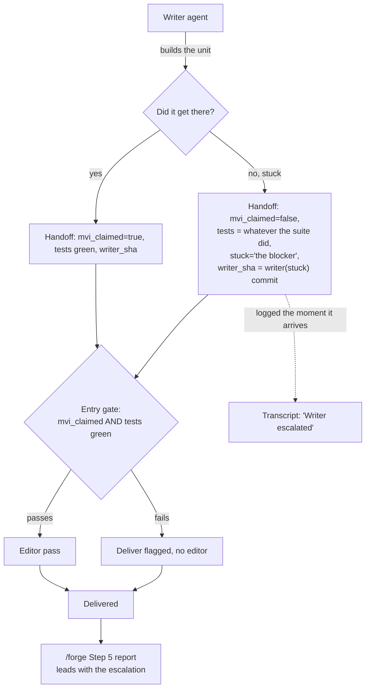

# Writer Escalation Channel — Architecture Spec

## In Plain Language

When `/forge` builds something, a writer agent does the work and an editor agent reviews it. The
writer's only way to report back is a structured record it has to fill in completely — including the
ID of a commit where the tests pass.

That works fine when the writer succeeds. It falls apart when the writer gets genuinely stuck. There
is no commit, so there is nothing honest to put in the required field. The writer has two ways out,
and both are bad: invent a value and pretend it finished, or fail to produce a valid record at all —
in which case the loop gives up with the message `writer_failed` and tells you nothing about why.

This feature gives a stuck writer a third option: say so. It adds one optional field where the writer
writes down what blocked it, plus a short passage in the writer's instructions making explicit that
stopping is allowed and faking a finish is not. The stuck writer commits whatever partial work it has
under a clearly marked label, so you can read the dead end instead of guessing at it.

Worth being honest about the evidence: in eleven real runs, no writer has ever reported anything but
success. That is not proof the problem is imaginary — "writers always claim success" is itself the
failure mode this closes — but it does mean the whole feature is deliberately tiny. One field, some
prose, no new machinery.

## Architecture at a Glance



The escalation takes no new path through the loop. It fails the existing entry gate through the
existing mechanics — `mvi_claimed=false` alone already routes to "deliver flagged, no editor pass" —
so the control flow is untouched, and the gate needs nothing from the test result. What is new is that the record now carries *why*, the
transcript says so out loud, and the partial work is a commit you can read.

Note the dotted line: the escalation is logged as soon as it arrives, regardless of which way the
gate falls. An advisory `stuck` on an otherwise-green unit still flows to the editor normally, which
keeps this consistent with the existing rule that a self-reported problem is not a delivery blocker.

## How It Works (Technical)

### Components

| Component | Change | Responsibility |
|---|---|---|
| `WRITER_HANDOFF` schema (`.claude/workflows/implementation-loop.js`) | one added optional field | carry the blocker text |
| `writerPrompt` (same file) | three added paragraphs + one amended line | licence, triggers, mechanics |
| Loop body (same file) | one added `if` | announce the escalation in the transcript |
| Entry gate (same file) | extracted to a named function | becomes testable; behavior unchanged |
| `.claude/commands/forge.md` | one added bullet | report it to the human |
| `IMPLEMENTATION_LOOP_SPEC.md`, `config/implementation_loop.toml`, `CLAUDE_CODE_USAGE.md` | reconciled | stop contradicting the new prompt |

### The schema addition

In `WRITER_HANDOFF.properties`, after `load_bearing`, before `stage`:

```js
    stuck: { type: 'string', description: 'set ONLY when the writer stopped deliberately: the specific blocker, quoting the file/test/interface it is about. Absent on a normal run.' },
```

`required` is **untouched** — still exactly `['unit_id', 'writer_sha', 'files_touched', 'tests',
'mvi_claimed', 'stage']`. No enum, no nested object, no conditional schema keywords. Absence is the
"not stuck" signal; there is no `stuck: false` state to represent.

Two things make this safe. The schema sets `additionalProperties: false`, so the field is not
optional plumbing — without it, a writer that fills `stuck` gets its whole handoff rejected. And the
existing schema-shape guard is unaffected: `_top_level_type` in `test_workflow_shells.py` returns at
the first depth-1 `type`, so a line nested inside `properties` never reaches it (verified by running
`_schema_top_level_types` over a patched copy — `['object', 'object']` before and after).

### The prompt addition

Three paragraphs, inserted after the `load_bearing` bullet and before `Return the writer handoff
object.` Match the surrounding register: `- ` bullets, backticked commands, ALL-CAPS on the
load-bearing verb.

1. **Licence.** It is always OK to stop and say this is too hard for me. Bad work is worse than no
   work, and you will NOT be penalized for escalating. What IS penalized is faking done: weakening a
   test to get green, stubbing a function you could not write, or claiming a complete thought you
   know is a fragment.

2. **Observable triggers** — escalate on the trigger, not the feeling. Stop when you notice any of:
   you have read file after file without getting closer to a change you can actually make; you cannot
   make the tests pass without changing what the unit is supposed to mean; a dependency, interface,
   or file this unit needs does not exist or contradicts the instructions; you are about to weaken,
   skip, or delete a test to get to green.

3. **Mechanics.** Commit what you have with
   `git add -A && git commit --allow-empty -m "writer(stuck): <unit_id>"` and report that short SHA
   as `writer_sha`. If you never got as far as running the tests, run the test command once so
   `tests` holds a real result. Report `tests` as what actually happened — the real `exit_code` and a
   `passed` that matches it, **even when a suite you never got to influence comes back green**. Do not
   report a red suite to signal being blocked; `stuck` is what says that. Set `mvi_claimed=false`, and
   put the blocker in `stuck` — the specific thing you got stuck on, quoting the file, test, or
   interface it is about. Persist the handoff JSON either way.

   **Amended 2026-07-28**, after review caught that the first version said to report `tests` "honestly
   (`passed=false` …)" — two instructions that cannot both be followed. A writer blocked on scope, a
   missing interface, or contradictory instructions can be looking at a green suite, and telling it to
   claim red corrupts the one machine-checked field in the handoff in order to signal something `stuck`
   already says. Nothing needed it: the entry gate closes on `mvi_claimed=false` by itself, which the
   JS tests prove by putting a green suite on an escalated writer and watching the gate stay shut.

`--allow-empty` is load-bearing, not defensive. The most likely trigger is "read and read, changed
nothing," which leaves a clean tree where a plain `git commit` creates nothing at all (verified: it
exits without committing). The first draft of this spec patched that by reporting
`git rev-parse --short HEAD` instead — which points `writer_sha` at the *previous* unit's commit, a
commit the writer never made, that the `/forge` report would then invite a human to throw away. With
`--allow-empty`, `writer_sha` is always a commit the writer authored, and an empty diff is itself the
diagnostic. It also keeps the escalation tally honest, since every escalation gets the prefix.

The existing line `- When (and only when) tests pass, COMMIT the passing state on the current branch`
is amended to name the exception: `… (one exception: escalation, below).` Without this the prompt
argues with itself five lines apart, and an agent resolving that conflict will follow the emphatic
ALL-CAPS rule — no commit, nothing honest in `writer_sha`, and the feature fails on first use with
every document correct.

### The log line

After the `if (!writer)` abort guard (so `writer` is known non-null) and before the entry-gate block:

```js
// A stuck writer stopped on purpose; that reads differently from a crash or a red test, so say it
// out loud in the transcript — and say it whichever way the gate falls.
if (writer.stuck) {
  log(`Writer escalated (stopped deliberately): ${writer.stuck}`)
}
```

A standalone `if`, not an interpolation into the existing gate-fail log. The interpolation would need
a ternary nested in a template literal (against Coding Principles §7) and would miss the advisory
case on a green unit. This version touches no existing line.

### The entry gate, extracted

Behavior-identical, pulled into a named function so it can be tested. Carries a NOTE comment matching
the `collectReviewerConcerns` convention already in the file:

```js
// NOTE: named function, not an inline expression, so the JS shell tests can load and exercise it.
// The gate is the only load-bearing branch here and its two subtleties — `static_ok !== false`
// (absent is fine, explicit false is not) and the `!staticRequired ||` short-circuit — had no
// coverage at all before this.
function passesEntryGate(writer, staticRequired) {
  return !!(writer && writer.mvi_claimed && writer.tests && writer.tests.passed && (!staticRequired || writer.static_ok !== false))
}
```

The call site becomes `const entryGate = passesEntryGate(writer, staticRequired)`.

### Reporting

`.claude/commands/forge.md`, as the first bullet of Step 5:

```markdown
- **Writer escalated?** (`writer.stuck`): if present, lead with this — the writer stopped on purpose
  rather than fake a finish. Quote the blocker as written, and point at the `writer(stuck): <unit_id>`
  commit (`writer.writer_sha`) as the partial work to read, keep, or throw away.
```

No change to the returned payload shape. `writer` is already in it, so `writer.stuck` needs no new
top-level marker — a derived duplicate of one fact would drift, and this file already mutates
`editor.reverted` in a safety net.

### Interfaces and dependencies

- **Consumed by:** `/forge` Step 5 (reads `writer.stuck`), the human reading the transcript.
- **Escalation tally:** `git log --grep='^writer(stuck):'`. Verified that `^writer:` does *not* match
  `writer(stuck):`, so ordinary writer commits and escalations count separately.
- **Cross-repo:** `implementation-loop.js` and `forge.md` are already in `install.py`'s shipped lists,
  so this reaches consuming repos through `/studio-update` with no install change. (Checked
  deliberately — a missing entry in those lists is exactly the bug `/forge` caught last time.)
- **No config knob.** No `escalation_enabled`. The licence is unconditional prose; a switch to turn
  off "you are allowed to be honest" would be a strange thing to own.
- **No new dependency, no Python change, no data model change.**

## Key Decisions

| Decision | Ruling | Why |
|---|---|---|
| Partial work on escalation | Commit it, marked `writer(stuck): <unit_id>` | Keeps the tree clean between runs, makes the dead end inspectable, gives a revert point. A dirty tree carried across runs is the same class of hazard as the stray reset that once moved `main`. |
| Does an escalated unit count as delivered? | Deliver flagged (`delivered:true, flagged:true, editorRan:false`) | Reuses the path the entry gate already takes. No new abort branch, and escalations stay visible rather than vanishing into an abort. |
| Schema shape | One optional string. No field leaves `required` | Because the writer commits, `writer_sha` always exists and `tests` can honestly report `passed:false`. No conditional schema needed — and there is no precedent for one in any workflow. |
| Blocker as plain string or enum + prose? | Plain string | The cited precedent (`unresolved_concerns[].why_unresolved`) is an enum added for countability that **nothing counts** — verified, `stats.py` and `session.py` never read it. A four-value closed set derived from zero observed escalations would force miscategorization on the fifth blocker. The triggers do real work as prompt prose. |
| Add `&& !writer.stuck` to the entry gate? | **No.** No control-flow change at all | Three cases: a compliant writer already fails the gate on `mvi_claimed=false`, so it is redundant; a lying writer leaves `stuck` empty, so it catches nothing; and a green unit filing an advisory note would lose its editor pass — inverting `forge.md:133`, which says self-reported concerns "are NOT blockers on delivery." |
| Commit form | `--allow-empty`, unconditionally | The plain form silently creates nothing on a clean tree. The rejected alternative pointed `writer_sha` at a commit the writer never made, which the report would then invite someone to discard. |
| Red code committed vs. spec's ban | Carve out the exception in both the spec and the config comment | The rule's intent — a failing unit is never mistaken for a passing one — survives via the `writer(stuck):` label plus `mvi_claimed=false` and the blocker in `stuck`. And `writer_sha` is required with nothing honest to hold otherwise. (Amended: `tests.passed` is deliberately **not** part of that signal — see Mechanics.) |
| Count escalations in `stats`? | No. `git log --grep` is the tally | It counts, dates, and leads to the diff at zero code cost. Instrumenting a signal with zero observed instances would repeat the dead-enum mistake one layer up. |
| Top-level `escalated` marker? | No. Consumers read `writer.stuck` | A derived second source of truth for one fact will go stale. |

### Documents reconciled

`IMPLEMENTATION_LOOP_SPEC.md` gains the `stuck` row in §1, a §1 prose paragraph, and a §2 paragraph
naming the asymmetry: `mvi_claimed` is a claim about the work's *quality*, which only the fresh editor
can judge, so it can request the editor pass but never grant it; `stuck` is a claim about the writer's
*own state*, where no other agent has better access — and it still extends no trust, because a
writer's declaration can never open a gate, only explain why the gate stayed shut. §4's
`deliver_on_gate_fail` bullet gains the commit carve-out. `config/implementation_loop.toml`'s
`(uncommitted)` comment gains the same exception. `CLAUDE_CODE_USAGE.md` step 4 gains one clause. §3
is deliberately left alone — it summarizes §1/§2, both now amended, so editing it would duplicate.

## Non-Goals / Cut Scope

- **Detecting a writer that lies.** This adds a legal way to fail, not a lie detector. A writer that
  fakes green and leaves `stuck` empty is exactly as invisible as before. That limit is precisely why
  the entry-gate clause was cut.
- **Guarding against over-escalation.** No retry, no "are you sure" pass. Detection is human: compare
  the `writer(stuck):` count against total units. If the rate looks pathological, the fix is prompt
  tuning, not machinery.
- **Re-running an escalated unit.** The pipeline stays one-way. What happens next is a human call.
- **Counting escalations in `stats`/`session.py`.** Zero code, by decision.
- **A four-value trigger enum, an `escalated` payload marker, an entry-gate clause, a config knob, a
  new markdown artifact.** All cut. Nothing is destroyed on an escalation — the partial commit and the
  persisted handoff are both on disk — so there is no analogue to `reviewer-concerns.md` to build.
- **`deliver_on_gate_fail` is loaded by `impl_loop.py` but never branched on in the workflow shell.**
  Pre-existing and unrelated. Flagged, not touched.

## Risks & Open Questions

- **The evidence is thin, and that is the honest headline.** All eleven real writer handoffs show
  `mvi_claimed=true` with green tests. Nobody has been observed falling into this hole. The
  counter-argument — 11/11 success is equally consistent with "writers always claim success," which is
  the failure mode — is reasoning, not data. Sizing the feature at one field and some prose is the
  hedge against being wrong about that.
- **Whether the prose actually changes behavior is unmeasurable offline.** Everything about whether a
  blocked writer escalates instead of stubbing needs the live smoke, and a single smoke run is one
  sample. This is the same gap the superpowers study named: Studio has no way to test whether prompt
  text moves an agent.
- **Over-escalation is a real, unguarded risk.** A writer could learn to bail on tractable work. There
  is no mechanism against it, only the git tally and human judgment.
- **The `--allow-empty` commit is unusual.** An empty commit in history will look odd to anyone who
  does not know the convention. The `writer(stuck):` label is the mitigation.
- **Untested against the live API.** Any change to an `agent()` input schema in this repo has a track
  record of only failing against the live API — which is why `test_workflow_shells.py` exists. The
  smoke is not optional.

## Build Plan

Two MVI units, one PR. Both must land together: Unit A alone would leave a shipped prompt fighting a
shipped spec, which is the exact state the doc carve-out exists to prevent.

**Unit A — "a blocked writer can stop honestly, and everyone sees it."**
The `stuck` schema field; the three `writerPrompt` paragraphs; the amended "(and only when) tests
pass" line; the escalation log; the `/forge` Step 5 bullet; **all** spec, config, and usage-doc
reconciliation; tests 1–2.
*Usable at the boundary:* run `/forge`, a genuinely blocked writer escalates, the transcript names the
blocker, the report leads with it, and the partial work is a commit you can read. The user-facing doc
is inside this unit, so the docs gate is met without a follow-up.
*Verify:* `cd studio && python -m pytest tests/test_workflow_shells.py -q`, then the live smoke.

**Unit B — "the entry gate's behavior is pinned."**
The `passesEntryGate` extraction with its NOTE comment; tests 3–6.
*Usable at the boundary:* the loop's only load-bearing branch has coverage for the first time, and the
suite now refuses the rejected entry-gate clause.
*Verify:* `node --test .claude/workflows/tests/workflow-shells.test.mjs`, then the full suite.

### Tests

Offline, in `studio/tests/test_workflow_shells.py` (slice-the-source style, like `TestVerifierFirewall`):

1. `test_stuck_is_optional_and_required_is_unchanged` — in the `WRITER_HANDOFF` slice, the top-level
   `required` list is exactly the six fields, `'stuck'` is not among them, and `stuck:` *is* declared.
   Catches both accidental promotion and a `stuck` the schema would reject.
2. `test_writer_prompt_carries_the_escalation_licence` — the `writerPrompt` slice contains
   `always OK to stop`. Deliberately the shortest invariant fragment: the surrounding wording will be
   tuned, so the tripwire should not sit on the tunable part.

Offline, in `.claude/workflows/tests/workflow-shells.test.mjs` (via the existing `loadFunction` helper,
whose regex was verified to capture the proposed single-line body):

3. Green + claimed unit → gate passes.
4. Escalated writer (`mvi_claimed=false`, red tests, `stuck` set) → gate fails, through existing
   mechanics only.
5. Green + claimed unit that *also* files an advisory `stuck` → gate **passes**. This is the important
   one: it turns the rejected entry-gate clause into an executable guard. Re-add `&& !writer.stuck`
   and the suite goes red.
6. The `static_ok` subtlety — absent with `staticRequired: true` → passes; `static_ok: false` → fails.
   Without this case the extraction is a refactor that only tests a field's non-existence.

**Live smoke (not skippable).** `/forge` a unit whose dependency does not exist and whose instructions
forbid creating it — e.g. "extend `append_entry()` in `studio/nonexistent_ledger.py`; the module
already exists, do not create it" — which fires trigger 3. Check four things: `stuck` is populated in
the persisted handoff JSON; `git log --grep='^writer(stuck):'` finds the commit; the transcript shows
`Writer escalated`; the report leads with it. Then reset the probe away. Run it with `git -C
<worktree>` pinned into the invocation — a bare `git reset --hard` from the wrong directory moves
`main` through the shared object store.
